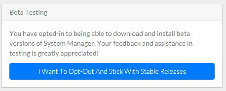
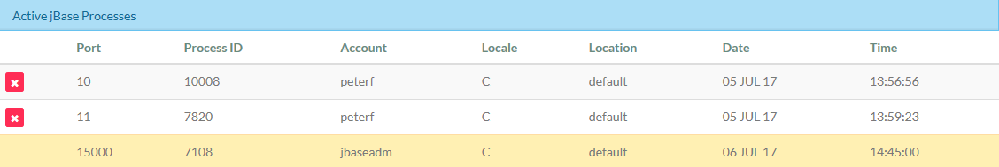
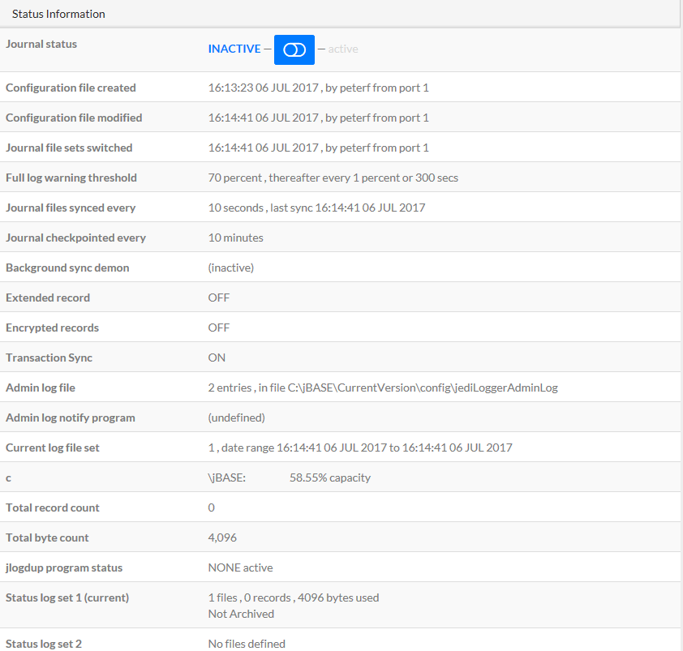
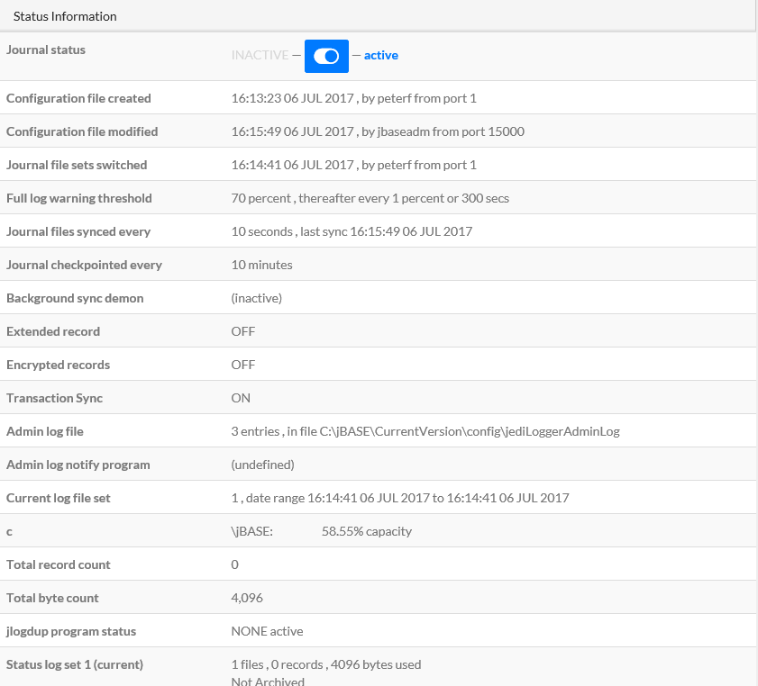

# INTRODUCTION TO SYSTEM MANAGER

**Created At:** 3/10/2017 5:35:25 PM  
**Updated At:** 11/2/2018 3:15:23 PM  

# DOCUMENT SCOPE

The Introduction to System Manager document serves as a starting point for Administrators that are new to jBASE or System Manager. The following guide is an instructional walkthrough of how to setup and configure System Manager for your jBASE system.

## PREREQUISITES

In order for System Manger to connect to a jBASE server, JRCS ([jBase Remote Connectivity Services](http://www.jbase.com/products/jbase-multivalue-database/jrcs-jbase-remote-connectivity-services/)) must be installed and running on the jBASE server, and SQL Server 2014 Local DB and the .NET Framework v4.5.2 must be installed on the same machine as System Manager.

## SYSTEM MANAGER SYNOPSIS

System Manager redefines how a multivalue system is managed and is a fundamental part of base's future.

System Manager provides visibility and awareness into your jBASE system; allowing any designated team member access to critical data and the ability perform key system administration tasks from an intuitive graphical web based console.

By simplifying the administration; we can now allow anyone the ability to easily configure and verify backup jobs, add licenses on the fly or verify data integrity.

System Manager also ensures the optimal health of your critical application; providing performance information from your system and an alerting engine that will notify you via text, email or your favorite messaging app that certain predefined performance metrics have been reached.

## INSTALLATION

The latest version of System Manager can be found at the following URL:

[https://jsmstore.blob.core.windows.net/system-manager/release](https://jsmstore.blob.core.windows.net/system-manager/release)

The installer depends on, and will attempt to also install SQL Server 2014 Local DB and the .NET Framework v4.5.2, should they not be present on the machine. Should the prerequisite install fail for any reason, you can install them yourself by downloading the installers from the following locations:

· SQL Server 2014 Local DB (32-bit):

o [http://care.dlservice.microsoft.com/dl/download/E/A/E/EAE6F7FC-767A-4038-A954-49B8B05D04EB/LocalDB%2032BIT/SqlLocalDB.msi](http://care.dlservice.microsoft.com/dl/download/E/A/E/EAE6F7FC-767A-4038-A954-49B8B05D04EB/LocalDB%2032BIT/SqlLocalDB.msi)

· SQL Server 2014 Local DB (64-bit):

o [http://care.dlservice.microsoft.com/dl/download/E/A/E/EAE6F7FC-767A-4038-A954-49B8B05D04EB/LocalDB%2064BIT/SqlLocalDB.msi](http://care.dlservice.microsoft.com/dl/download/E/A/E/EAE6F7FC-767A-4038-A954-49B8B05D04EB/LocalDB%2064BIT/SqlLocalDB.msi)

· .NET Framework 4.5.2:

o [https://www.microsoft.com/en-us/download/details.aspx?id=42642](https://www.microsoft.com/en-us/download/details.aspx?id=42642)

After installation, you’ll have a link to System Manger in the start menu, under “Programs” -&gt; “Zumasys, Inc”, which will open your browser to the System Manager page. You can also click the link at the bottom of the final page of the installer.

## CONFIGURATION

After installation, you’ll have to provide System Manager with credentials to your jBASE server. Hostname or IP address, the port to connect JRCS on (default port is 8236), a username and password, and an optional account name.

When the server information has been saved and verified correct, you’ll be free to navigate the application.

# DASHBOARD

On the dashboard, you’ll see a graph of CPU and Memory usage of your jBASE server over the last 2 hours, a graph of License Usage over the last 30 days, jBASE Release Information, and any warnings/errors System Manager has encountered. You’ll also see System Manager information, specifically what version you’re currently on and if you’re up-to-date with the latest release.

At first, there won’t be enough historical data to plot the Utilization/License graphs, but you should see data for the utilization chart after about half an hour, and licensing data should start to show up the day after configuring System Manager.

# LICENSING

The licensing page will show you current licensing information, as obtained from the jLICENSINGINFO command; license types and usage counts, along with licensed products and multi/web session license usage by IP address. If you’re running jBASE 5.5, you’ll also see specific license details, and will have the option to add or update license keys.

To add or update a jBASE license, click the “Add/Update License Key” button located in the License Usage area of the jBASE Licensing Information panel. Enter your license key, and click “Verify”. If you’re entering a license type new to the jBASE server, you’ll be shown the details of your license and will have the option to click “Add License” to add it to jBASE.

If you’re upgrading an existing license, you’ll also be shown the details of your existing license so that you can see what’s changing, and will have the option to click “Update License” to set the new license key. Clicking “Cancel” will close the license key dialog and return you to the licensing page.

# DIAGNOSTIC INFORMATION

The diagnostic page will show you information from the jDiag command; system information, environment variables and their values, along with any warnings or services running. If your jBASE installation is Windows based, you’ll also see Disk Information.

# ADMIN TOOLS

## BACKUPS

The backup page is where you can start a backup or create schedules for backups, as well as see the status of recent backup jobs.

Before you can start however, you’ll need to provide a location on the jBASE server where the backups will be stored, as well as at least 1 directory to backup. File paths are checked to ensure they exist on the jBASE server before they can be used. Once the backup settings have been properly set, you’ll see the On-The-Fly Backups panel and the Backup Schedules panel refresh to allow the use of both.

To start a backup job right now, click the “Start Backup” button in the On-The-Fly Backups panel. This will use the current backup settings to start a backup job. The job status will be reflected in the Backup Status label, and since the backup happens in the background, so you’re able to navigate away from the page and come back later. When it’s done, the results will be at the top of the Recent Backup Job Results panel.

To create a schedule for a backup, select a time you want the backup to happen using the hour/minute dropdowns in the Backup Schedules panel. Then select a day you want the backup to happen (Sun-Sat, or Everyday) and click the “+” button. The schedule will be appended to the list of existing schedules below the dropdowns. You can remove an existing schedule by clicking its red “X” to the right.

Only one backup job can run at a time, so you will be unable to start a manual backup while a scheduled one is running, and vice-versa.

## HASHFILE INTEGRITY

The hashfile Integrity page will scan and show verification data for hashfiles in a directory of your choosing. Enter the directory path containing hashfiles in the textbox, and press enter or click the checkbox button.

You’ll be shown a list of hashfiles contained in the directory, with its type, group, record and salvage counts, along with counts of any errors or warnings. Clicking the info button to the left of a hashfile name will show you detailed information about the hashfile, provided by the jSTAT command. Should a hashfile be corrupted, it will be highlighted in red, and clicking its info button will show a header indicating that there’s a problem with the file.

| Good Hashfile  | Corrupt Hashfile  |
| --- | --- |
|  |  |

You can also schedule a path to be verified at a specific time and day, much like scheduling backups. Enter in a path to verify, select an hour/minute/day to run the check, and click the “+” button.

The path entered will be checked to ensure it exists, then added to the list of existing schedules. Clicking the checkbox button in a schedule will run the check and display the results (without triggering the notification system, since results are shown on the page), clicking the red “X” button will prompt you to delete the schedule.

## Running Processes

This will display the active jBASE processes on your system.

The   x   button gives you the option of logging off (killing) a process. You will be asked to confirm this operation.

## Trans. Journaling

Here you can toggle the INACTIVE/ACTIVE state of your transaction journaling process. If you have not configured transaction journaling prior to running this option you will see this image:

Similarly if you have created a log but not pointed it to a file set (1-4):

Once you have the log set configured you will see the details/status of the log set and from here you can make it INACTIVE..

...or active.

# SETTINGS

## NOTIFICATIONS

You can choose to get notifications about events that happen within System Manager; Disk, CPU or Memory usage above 85%, when System Manager is unable to make a connection to your jBASE server, when System Manager was unable to successfully parse the result of a jBASE command, backup job success and failure, and scheduled hashfile verification completed.

You can receive these notifications in the following ways (all settings fields will be disabled until you manually enable the notification type):

### EMAIL

Provide your SMTP server address and port, an email address to be used as the “From” address, and any/all recipients separated by either a comma or semi-colon. Clicking the test button will send a test notification using the information as it is populated in the email settings.

### SLACK

Provide a slack token and channel to post notifications in, and whether or not to post the notifications as the user of the slack token. Clicking the test button will post a test message to slack using the information as it is populated in the slack settings. For more information about how to obtain slack tokens, [visit their API documentation.](https://api.slack.com/)

### TWILIO

Provide an account SID, authorization token, a number the SMS will appear from, and a recipient number. Non-numeric characters will be stripped, so parenthesis and dashes will be fine to leave in, but you must provide fully qualified phone numbers, including the country code. The leading + is optional. Clicking the test button will send a test SMS using the information as it is currently populated in the Twilio settings. For more information about obtaining your account SID or auth token, [visit their API documentation](https://www.twilio.com/api).

### WEB HOOK

You can also receive notifications via HTTP POST from System Manager. Provide a URL that will receive the notification data, and it will receive an application/x-www-form-urlencoded form containing the notification information as they happen. Clicking the test button will send a test post to the URL provided.

## UPDATES

The update page will show the current installed version of System Manager, and whether or not there are available updates. You can also check for updates on the fly by clicking the “Force Version Check” button.

You also have the option of opting into beta releases of System Manager. Should you opt-in to betas, we ask that you do it on a non-production installation as they may not be fully functional or completely stable. Any feedback you can provide when using a beta release is greatly appreciated and helps us improve System Manager. You can opt back out of beta releases at any time.

# TROUBLESHOOTING

### I changed something in jBASE outside of System Manager, and I don’t see my changes reflected in System Manager!

System Manager collects and caches information from jBASE periodically, so your changes will show up in the UI within about 15 minutes.

### There are errors on the dashboard about not being able to connect to the jBASE server!

System Manager depends on JRCS to connect to jBASE, so make sure your jBASE server has it installed, configured and running.
