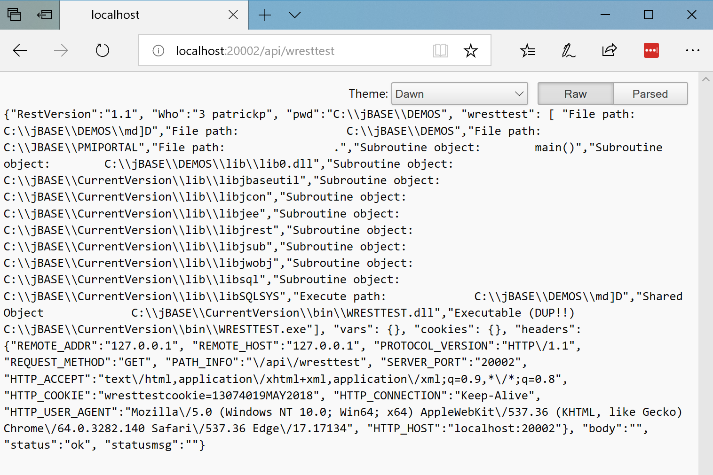

# TROUBLESHOOTING WEB SERVER


**Created At:** 5/18/2018 8:46:02 PM  
**Updated At:** 1/2/2019 5:19:39 PM  


This document explains how the MV Connect web server works and how to diagnose when things are not working.

First you must determine what port the MV Connect web server is listening on.  MV Connect must have been started and pointed at a configuration file.  Review that configuration file and look for the port definition.

## Services

First verify that http is specified in the services line.  This tells this instance of MV Connect what services to respond to.

```
[MAIN]

; List the services that this instance of jagent will honor.
; Separate selections with commas. Possible choices are jremote,
; jodbc and http.
services=jremote,jodbc,http
```


## IP Address and Port

The second section to review is the port and ip address assignment.  If commented out as below then by default jagent will listen on port 20002 and listen on all ports.

```
; Specify the port that jagent will listen on for incoming connections.
; The default port is 20002. This option duplicates the -p (--port)
; command line option.
;port = 20002

; If the server has multiple network interfaces, specify the IP address
; where jagent will listen for incoming connections. This duplicates
; the -b (--bind_address) command line option.
;bind_address = <IP address to listen on>
```


## Try and connect

Since jAgent/MVConnect is a web server you can connect to it with any browser.  Due to firewalls it is usually best to use a local tool such as curl to test the webserver.  Curl is usually included with all linux distributions.  If you are on a windows server you can log into the main server desktop and use IE or Chrome.  You can also download dos versions of curl for windows [here](https://curl.haxx.se/dlwiz/).

If you are using curl you can do the following

```
C:\jBASE\DEMOS>curl http://localhost:20002/api/wresttest
{"RestVersion":"1.1", "Who":"3 patrickp", "pwd":"C:\\jBASE\\DEMOS", "wresttest": [ "File path:                C:\\jBASE\\DEMOS\\md]D","File path:                C:\\jBASE\\DEMOS","File path:                C:\\JBASE\\PMIPORTAL","File path:                .","Subroutine object:        main()","Subroutine object:        C:\\jBASE\\DEMOS\\lib\\lib0.dll","Subroutine object:        C:\\jBASE\\CurrentVersion\\lib\\libjbaseutil","Subroutine object:        C:\\jBASE\\CurrentVersion\\lib\\libjcon","Subroutine object:        C:\\jBASE\\CurrentVersion\\lib\\libjee","Subroutine object:        C:\\jBASE\\CurrentVersion\\lib\\libjrest","Subroutine object:        C:\\jBASE\\CurrentVersion\\lib\\libjsub","Subroutine object:        C:\\jBASE\\CurrentVersion\\lib\\libjwobj","Subroutine object:        C:\\jBASE\\CurrentVersion\\lib\\libsql","Subroutine object:        C:\\jBASE\\CurrentVersion\\lib\\libSQLSYS","Execute path:             C:\\jBASE\\DEMOS\\md]D","Shared Object             C:\\jBASE\\CurrentVersion\\bin\\WRESTTEST.dll","Executable (DUP!!)        C:\\jBASE\\CurrentVersion\\bin\\WRESTTEST.exe"], "vars": {}, "cookies": {}, "headers": {"REMOTE_ADDR":"127.0.0.1", "REMOTE_HOST":"127.0.0.1", "PROTOCOL_VERSION":"HTTP\/1.1", "REQUEST_METHOD":"GET", "PATH_INFO":"\/api\/wresttest", "SERVER_PORT":"20002", "HTTP_ACCEPT":"*\/*", "HTTP_USER_AGENT":"curl\/7.55.1", "HTTP_HOST":"localhost:20002"}, "body":"", "status":"ok", "statusmsg":""}
C:\jBASE\DEMOS>
```

If you get any successful requests then the actual web server is up and running (it may still not be configured correctly but it is running).  A failed request would look like

```
C:\>curl http://localhost:20002/api/wresttest
curl: (7) Failed to connect to localhost port 20002: Connection refused
```

For mvConnect environments, if you receive a message stating that there is no "api" resource that most likely means you have an invalid license and will need to contact [Zumasys](mailto:mvconnect@zumasys.com "Zumasys").

Here is the same thing with Microsoft Edge.


A failed request from Edge looks like


If you get any type of page response then jAgent is running.  If you are not getting a connection you should go to the next section and run jAgent in the foreground.  You should also review the jAgent [documentation](https://jbase.helpjuice.com/30312-jagent/introduction-to-jagent)

## Run jAgent in the Foreground

When doing develpment and testing it is usually best to run jAgent directly in a dos or unix box (command line).  This allows you to directly see what jAgent is saying.

To do this log into your jBase system and logto a account from where you normally can run programs, compile code, work with your data.  From there jump out to tcl if you are on windows type CMD to get to a dos prompt and on linux type bash in lower case to get to a bash.

Next lets run a test server on a different port from the default

Windows

```
C:\Users\patrickp>jb
Account name or path: DEMOS
jsh DEMOS ~ -->cmd
Microsoft Windows [Version 10.0.17134.48]
(c) 2018 Microsoft Corporation. All rights reserved.

C:\jBASE\DEMOS>jbase_agent --port 20003
(20544|19132) NOTICE starting up jAgent, Process Per Connection mode, listening on port 20003, c:\petes\src\international\5.7.0\jagent\SocketAcceptor.h +63
```

Linux

```
jsh DEV ~ -->bash
bash-4.2$ jbase_agent --port 20003
(31400|140710873688128) NOTICE starting up jAgent, Process Per Connection mode, listening on port 20003, SocketAcceptor.h +63
```


In both cases we have fired up the jAgent on port 20003.  Because we have not defined a configuration file http is actually disabled.  That is ok because the web server will still respond but tell us http is disabled.  Now test the web server again

Curl

```
C:\Users\patrickp>curl http://localhost:20003/wresttest
<!DOCTYPE html>
.... chopped out a bunch of output as it is all html/css stuff ....
<body>
<div class="cover">
<h1><small>Error 500</small></h1>
<p class="lead">Service Disabled</p>
</div>
<footer>
<p>Please contact the system administrator.</p>
</footer>
</body>
</html>

C:\Users\patrickp>
```

Or with the browser


Both represent we are talking to the web server which is a good thing.  If this is still not working you may need to review your firewall rules.  Verify you have put in the right port number (in this test it was 20003).  Also verify when jAgent fired up it did not throw any errors.  The primary one you may run into is that something is already listening on the port chose (20003 in this example).  If that happens try another port (20004 and on).

## Logging Level

Now that you know you can hit jAgent it is best to learn about logging.  You need to go back to using a config file.  In the log area of the config file. It is also best to continue to run jAgent in the foreground to allow you to directly see the logging.

Launching jagent in the foreground with your config file.

```
C:\jBASE\DEMOS>jbase_agent --config=.\jagent_config
```

In your jagent config file find the log level section under [OPTIONS]

```
[OPTIONS]

; Set the log level to a value from 0 to 7. Each lower level (except 0)
; includes all of the higher levels. This duplicates the -L (--logLevel)
; command line option.
;  0 = no logging
;  1 = trace - show code execution flow
;  2 = debug - mainly useful for debugging jagent
;  3 = info - show interesting information
;  4 = notice - show notices
;  5 = warning - show warnings
;  6 = errors - show any error conditions
;  7 = critical - show critical errors only
loglevel = 1
```

Log levels of info, debug, and trace produce the most information.  Import information produced at this level is a repeat of the jBase environment.  This is often helpful to verify jBase is loaded with the right environment information

Here you can see the INFO log level showing all the environment information used to launch jAgent.

```
C:\jBASE\DEMOS>jbase_agent --config=.\jagent_config
(24708|25272) INFO setting environment variable HOME = C:\jBASE\DEMOS, JAgentSocketServer.cpp +275
(24708|25272) INFO setting environment variable JBASE_ERRMSG_DIVIDE_ZERO = 2, JAgentSocketServer.cpp +275
(24708|25272) INFO setting environment variable JBASE_ERRMSG_NON_NUMERIC = 2, JAgentSocketServer.cpp +275
(24708|25272) INFO setting environment variable JBASE_ERRMSG_TRACE = 0, JAgentSocketServer.cpp +275
(24708|25272) INFO setting environment variable JBASE_ERRMSG_ZERO_USED = 2, JAgentSocketServer.cpp +275
(24708|25272) INFO setting environment variable JBCDATADIR = C:\jBASE, JAgentSocketServer.cpp +275
(24708|25272) INFO setting environment variable JBCEMULATE = jbase, JAgentSocketServer.cpp +275
(24708|25272) INFO setting environment variable JBCGLOBALDIR = C:\jBASE\CurrentVersion, JAgentSocketServer.cpp +275
(24708|25272) INFO setting environment variable JBCOBJECTLIST = C:\jBASE\DEMOS\lib;C:\JBASE\PMIPORTAL\LIB, JAgentSocketServer.cpp +275
(24708|25272) INFO setting environment variable JBCRELEASEDIR = C:\jBASE\CurrentVersion, JAgentSocketServer.cpp +275
(24708|25272) INFO setting environment variable JBCSPOOLERDIR = C:\jBASE\jspooler, JAgentSocketServer.cpp +275
(24708|25272) INFO setting environment variable JEDIFILENAME_MD = C:\jBASE\DEMOS\MD, JAgentSocketServer.cpp +275
(24708|25272) INFO setting environment variable JEDIFILENAME_SYSTEM = C:\jBASE\SYSTEM]D, JAgentSocketServer.cpp +275
(24708|25272) INFO setting environment variable JEDIFILEPATH = C:\jBASE\DEMOS;C:\JBASE\PMIPORTAL, JAgentSocketServer.cpp +275
(24708|25272) INFO setting environment variable PATH = C:\jBASE\DEMOS\bin;C:\JBASE\PMIPORTAL\BIN;C:\jBASE\DEMOS\bin;C:\Program Files\Docker\Docker\Resources\bin;C:\Program Files (x86)\Microsoft Visual Studio 9.0\VC\Bin\amd64;C:\Program Files (x86)\Microsoft Visual Studio 9.0\Common7\IDE;C:\Program Files\Microsoft SDKs\Windows\v7.0\Bin\x64;C:\Program Files\Microsoft SDKs\Windows\v7.0\Bin;C:\jBASE\CurrentVersion\bin;C:\WINDOWS\system32;C:\WINDOWS;C:\WINDOWS\System32\Wbem;C:\WINDOWS\System32\WindowsPowerShell\v1.0\;C:\Users\patrickp\.dnx\bin;C:\Program Files\Microsoft DNX\Dnvm\;C:\Program Files\Microsoft SQL Server\130\Tools\Binn\;C:\Program Files\Git\cmd;C:\Program Files\Docker;C:\WINDOWS\system32;C:\WINDOWS;C:\WINDOWS\System32\Wbem;C:\WINDOWS\System32\WindowsPowerShell\v1.0\;C:\Program Files\dotnet\;C:\Program Files (x86)\GitExtensions\;C:\Program Files\OpenVPN\bin;C:\Program Files\nodejs\;C:\Program Files\jBASE ODBC Connector\;C:\WINDOWS\System32\OpenSSH\;C:\Users\patrickp\AppData\Local\Programs\Python\Python36-32\Scripts\;C:\Users\patrickp\AppData\Local\Programs\Python\Python36-32\;C:\Users\patrickp\AppData\Local\Programs\Python\Python35\Scripts\;C:\Users\patrickp\AppData\Local\Programs\Python\Python35\;C:\Users\patrickp\AppData\Local\Microsoft\WindowsApps;C:\Users\patrickp\AppData\Roaming\npm;C:\Program Files\West Wind WebSurge;;C:\Program Files\Microsoft VS Code\bin, JAgentSocketServer.cpp +275
```

The debug level and trace level give high levels of individual steps being done.  Often when data is not being passed into MVConnect, such as a header you know you sent but are not seeing in in MVConnect via WGETHEADER these levels help give more information on what is actually being passed into Pick.

## Where is my Header

Here you can see all the headers jAgent sees, what subroutine in jBase it is calling and all the parameters being sent.  In the below example you can see the POSTMAN-TOKEN header is seen by jagent but wet it set all the headers (paramNum=4) you don't see it.  This is because only headers defined in the jagent config file are actually sent.

```
(6148|25024) DEBUG  HTTP request headers:, HTTPAction.cpp +287
(6148|25024) DEBUG    CONTENT-TYPE: application/json, HTTPAction.cpp +299
(6148|25024) DEBUG    CACHE-CONTROL: no-cache, HTTPAction.cpp +299
(6148|25024) DEBUG    POSTMAN-TOKEN: 0c76a548-e27c-46bf-855b-f10390c0a43a, HTTPAction.cpp +299
(6148|25024) DEBUG    USER-AGENT: PostmanRuntime/7.1.1, HTTPAction.cpp +299
(6148|25024) DEBUG    ACCEPT: */*, HTTPAction.cpp +299
(6148|25024) DEBUG    HOST: localhost:20002, HTTPAction.cpp +299
(6148|25024) DEBUG    COOKIE: Cookie_1=value; sessionid=151863803281736003-18308-50032; Authorization=123412345123412341234; wresttestcookie=16022719MAY2018, HTTPAction.cpp +299
(6148|25024) DEBUG    ACCEPT-ENCODING: gzip, deflate, HTTPAction.cpp +299
(6148|25024) DEBUG    CONTENT-LENGTH: 22, HTTPAction.cpp +299
(6148|25024) DEBUG    CONNECTION: keep-alive, HTTPAction.cpp +299
(6148|25024) INFO Calling JBC 'JAGENTWDBINIT', HTTPAction.cpp +453
(6148|25024) DEBUG  Subroutine::Subroutine: Locate the subroutine., StoredProcedure.cpp +39
(6148|25024) DEBUG  Subroutine::Subroutine: argType='VVVVVVVVV', StoredProcedure.cpp +73
(6148|25024) DEBUG  Subroutine::setParam(paramNum=0, *p= (@00000000021E5A20)), StoredProcedure.cpp +228
(6148|25024) DEBUG  Subroutine::setParam(paramNum=1, *p=0 (@00000000021E5D60)), StoredProcedure.cpp +228
(6148|25024) DEBUG  Subroutine::setParam(paramNum=2, *p=REMOTE_ADDR■REMOTE_HOST■PROTOCOL_VERSION■CONTENT_TYPE■CONTENT_LENGTH■REQUEST_METHOD■PATH_INFO■SERVER_PORT (@00000000021E5F60)), StoredProcedure.cpp +228
(6148|25024) DEBUG  Subroutine::setParam(paramNum=3, *p=127.0.0.1■127.0.0.1■HTTP/1.1■application/json■22■POST■/api/wresttest■20002 (@00000000021E5E60)), StoredProcedure.cpp +228
(6148|25024) DEBUG  Subroutine::setParam(paramNum=4, *p=HTTP_ACCEPT■HTTP_COOKIE■HTTP_CONNECTION■HTTP_USER_AGENT■HTTP_HOST (@0000000002204410)), StoredProcedure.cpp +228
(6148|25024) DEBUG  Subroutine::setParam(paramNum=5, *p=*/*■Cookie_1=value; sessionid=151863803281736003-18308-50032; Authorization=123412345123412341234; wresttestcookie=16022719MAY2018■keep-alive■PostmanRuntime/7.1.1■localhost:20002 (@0000000002203890)), StoredProcedure.cpp +228
(6148|25024) DEBUG  Subroutine::setParam(paramNum=6, *p=urlvar (@0000000002203E90)), StoredProcedure.cpp +228
(6148|25024) DEBUG  Subroutine::setParam(paramNum=7, *p=urvarvalue (@0000000002203B90)), StoredProcedure.cpp +228
(6148|25024) DEBUG  Subroutine::setParam(paramNum=8, *p={ "name": "patrick" }
```

Going into the config file and adding POSTMAN-TOKEN to the config file resolves the issue.  You can now see HTTP\_POSTMAN\_TOKEN passed.  Most non-standard headers get HTTP\_ appended to them in jBase.

```
; Specify the HTTP headers to pass to a JBC subroutine. The header names
; are converted to upper-case, prefixed with "HTTP_" and any dashes (-)
; are converted to underscores (_). For example, "User-Agent" is passed
; as "HTTP_USER_AGENT".
http_headers = Accept,Cookie,Connection,User-Agent,Referer,Host,Authorization,POSTMAN-TOKEN

(19136|16264) DEBUG  Subroutine::setParam(paramNum=4, *p=HTTP_ACCEPT■HTTP_COOKIE■HTTP_CONNECTION■HTTP_USER_AGENT■HTTP_HOST■HTTP_POSTMAN_TOKEN (@00000000021633F0)), StoredProcedure.cpp +228
(19136|16264) DEBUG  Subroutine::setParam(paramNum=5, *p=*/*■Cookie_1=value; sessionid=151863803281736003-18308-50032; Authorization=123412345123412341234; wresttestcookie=16093719MAY2018■keep-alive■PostmanRuntime/7.1.1■localhost:20002■4324b85c-3113-4a30-97f4-1b9b943093eb (@00000000021634B0)), StoredProcedure.cpp +228]
```

In postman with WRESTTEST you can how see HTTP\_POSTMAN\_TOKEN that can be retrieved via WGETHEADER(KEY,"HTTP\_POSTMAN\_TOKEN")


## Data is missing

If you are passing in large variables to your rest service and some is missing it is probably because it exceeded the payload limit size defined in the config file.  This is a security feature especially for other pick platforms that may not handle very large strings very well.  It is recommend you go in and increase the size of this on jBase since jBase can handle large strings.  You still want to limit to a reasonable number.  Hacks/Bots could cause some memory issues on your system by sending junk to your services and send large payloads in trying to find a buffer exploit in your system.

```
; By default, when a JBC subroutine is used as the resource for
; an HPPT request, the query string included on the URL (or in the
; body when an HTML form is POSTed) is parsed and the query string
; or form variables are passed in the request_vars and request_vals
; arguments. If this is not desired, set no_parse_qstring to 'true'.
no_parse_qstring=false

maxrequest = 100000000
```

## WRESTTEST

Once you have the webserver responding there is a testing rest api called WRESTTEST to assist you in debugging your environment.  You should be able to browse to http://&lt;your ip&gt;:20002/api/wresttest and you should see the following page.



If this page does not come up, then verify that wresttest is in the WDB.RESOURCE FILE.  When you first run jAgent with http it looks in your current path for a WDB.RESOURCE file. If it cannot find one it will create one and automatically build the API\*WRESTEST resource.  If this file already exists none of this will happen.  Therefore if you already have a WDB.RESOURCE file with no API\*WRESTTEST item you will have to add it manually.

```
ED WDB.RESOURCE API*WRESTTEST
1>P
2>TEST
3>WRESTTEST
4>
5>
6>1
7>1
```

Also make sure it runs from jsh

```
jsh DEMOS ~ -->WRESTTEST
{"RestVersion":"1.1", "Who":"1 DEMOS", "pwd":"C:\\jBASE\\DEMOS", "wresttest": [ "File path:                C:\\jBASE\\DEMOS\\MD]D","File path:                C:\\jBASE\\DEMOS","File path:                .","Subroutine object:        main()","Subroutine object:        C:\\jBASE\\DEMOS\\lib\\lib0.dll","Subroutine object:        C:\\jBASE\\CurrentVersion\\lib\\libjbaseutil","Subroutine object:        C:\\jBASE\\CurrentVersion\\lib\\libjcon","Subroutine object:        C:\\jBASE\\CurrentVersion\\lib\\libjee","Subroutine object:        C:\\jBASE\\CurrentVersion\\lib\\libjrest","Subroutine object:        C:\\jBASE\\CurrentVersion\\lib\\libjsub","Subroutine object:        C:\\jBASE\\CurrentVersion\\lib\\libjwobj","Subroutine object:        C:\\jBASE\\CurrentVersion\\lib\\libsql","Subroutine object:        C:\\jBASE\\CurrentVersion\\lib\\libSQLSYS","Execute path:             C:\\jBASE\\DEMOS\\MD]D","Shared Object             C:\\jBASE\\CurrentVersion\\bin\\WRESTTEST.dll","Executable (DUP!!)        C:\\jBASE\\CurrentVersion\\bin\\WRESTTEST.exe"], "vars": {}, "cookies": {}, "headers": {}, "body":"", "status":"ok", "statusmsg":""}
jsh DEMOS ~ -->
```

If wresttest is coming up you now want to use a extension for your browser that will prettify the json result or use postman.

Edge - JSON Formatter

Chrome - JSON Viewer

Viewing the json there is a lot of nice debugging information

The primary one is a jshow -v WRESTEST is shown.  This allows you to see your full environment.  All file pathing is shown as where it look for any code.  This is key to determining why jAgent cannot find a program or file.

```
{
   "RestVersion": "1.1",
   "Who": "3 patrickp",
   "pwd": "C:\\jBASE\\DEMOS",
   "wresttest": [
      "File path:                C:\\jBASE\\DEMOS\\md]D",
      "File path:                C:\\jBASE\\DEMOS",
      "File path:                C:\\JBASE\\PMIPORTAL",
      "File path:                .",
      "Subroutine object:        main()",
      "Subroutine object:        C:\\jBASE\\DEMOS\\lib\\lib0.dll",
      "Subroutine object:        C:\\jBASE\\CurrentVersion\\lib\\libjbaseutil",
      "Subroutine object:        C:\\jBASE\\CurrentVersion\\lib\\libjcon",
      "Subroutine object:        C:\\jBASE\\CurrentVersion\\lib\\libjee",
      "Subroutine object:        C:\\jBASE\\CurrentVersion\\lib\\libjrest",
      "Subroutine object:        C:\\jBASE\\CurrentVersion\\lib\\libjsub",
      "Subroutine object:        C:\\jBASE\\CurrentVersion\\lib\\libjwobj",
      "Subroutine object:        C:\\jBASE\\CurrentVersion\\lib\\libsql",
      "Subroutine object:        C:\\jBASE\\CurrentVersion\\lib\\libSQLSYS",
      "Execute path:             C:\\jBASE\\DEMOS\\md]D",
      "Shared Object             C:\\jBASE\\CurrentVersion\\bin\\WRESTTEST.dll",
      "Executable (DUP!!)        C:\\jBASE\\CurrentVersion\\bin\\WRESTTEST.exe"
   ],
   "vars": {},
   "cookies": {},
   "headers": {
      "REMOTE_ADDR": "127.0.0.1",
      "REMOTE_HOST": "127.0.0.1",
      "PROTOCOL_VERSION": "HTTP/1.1",
      "REQUEST_METHOD": "GET",
      "PATH_INFO": "/api/wresttest",
      "SERVER_PORT": "20002",
      "HTTP_ACCEPT": "text/html,application/xhtml+xml,application/xml;q=0.9,*/*;q=0.8",
      "HTTP_COOKIE": "wresttestcookie=13074019MAY2018",
      "HTTP_CONNECTION": "Keep-Alive",
      "HTTP_USER_AGENT": "Mozilla/5.0 (Windows NT 10.0; Win64; x64) AppleWebKit/537.36 (KHTML, like Gecko) Chrome/64.0.3282.140 Safari/537.36 Edge/17.17134",
      "HTTP_HOST": "localhost:20002"
   },
   "body": "",
   "status": "ok",
   "statusmsg": ""
}
```

This should handle most connection issues you will run into.  If you have your rest service being called but is generating errors please refer to the documentation on debugging your Rest Service.


