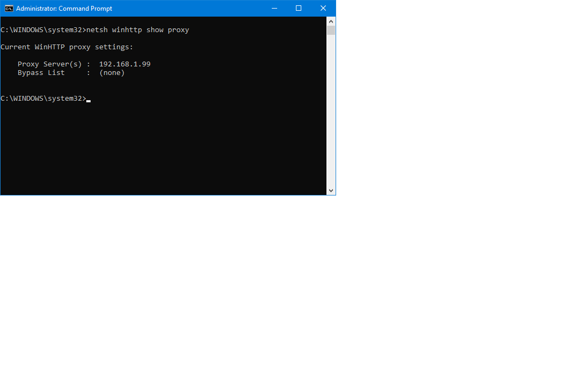
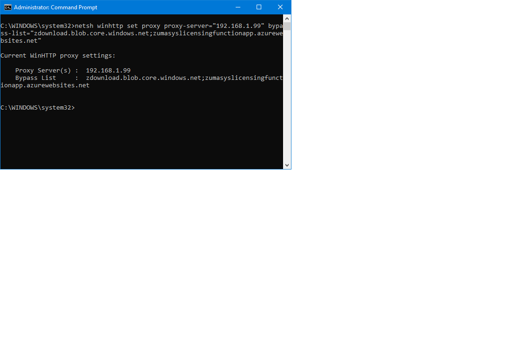
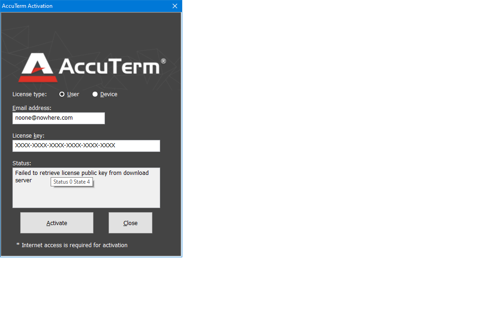

# License Activation

<PageHeader />

<iframe width="640" height="360" src="https://www.youtube.com/embed/oU6MMTJneso?&wmode=opaque" frameborder="0" allowfullscreen="" class="fr-draggable"></iframe>

One of the changes in AccuTerm 8 is how it is now licensed, by the user. In order to activate AccuTerm 8 Desktop, a user first needs to be provisioned in the [Customer Portal](./../license-and-user-management/creating-users/README.md). Upon being provisioned, the user will receive the license key by email and the administrator can view it in the Customer Portal by selecting the user.

## Warning

If you have an AccuTerm 8 Desktop device license, please do not enter an email address when activating the license key.


After installing Accuterm 8 Desktop, the License Activation prompt will display and you will enter the user's email and license key that is associated with the user's email address and select the Activate AccuTerm button.

## Note

You can download the latest version of AccuTerm by visiting [https://www.zumasys.com/downloads/](https://www.zumasys.com/downloads/)  and selecting the AccuTerm section.

The Internet is required for activation and if the install is not activated, AccuTerm will enter evaluation mode until the license can be activated. Once activated, AccuTerm will validate the license daily. If, after 30 days, the license has not been validated, the premium features will be disabled until the license is re-activated.


  
## Proxy Information

If your organization uses a _proxy server_ to redirect or block access to certain web sites, this may interfere with AccuTerm's ability to connect with the Zumasys license servers. If you are encountering problems activating or validating the AccuTerm license, it may be due to the proxy server configuration.

Windows has (at least) two independent services that may use a proxy server: WinInet, which is used by most web browsers, and WinHTTP, which is used for many non-interactive processes like Windows Update.

This means that a simple test to verify if a URL is blocked by a proxy server using a web browser is meaningless if the program that is having trouble uses WinHTTP for its Internet access.

AccuTerm uses WinHTTP to contact the license servers and activate and validate the license. 

To view the WinHTTP proxy configuration, open a command prompt with administrator privileges, then type

```
netsh winhttp show proxy
```



If the proxy server is blocking the Zumasys license server URLs you can add those URLs to the proxy configuration _bypass list_ so that they will be not be redirected through the proxy server(s). For example, if your proxy server is 192.168.1.99, you could add the Zumasys servers to the bypass list by typing:

```
netsh winhttp set proxy proxy-server="192.168.1.99" bypass-list="zdownload.blob.core.windows.net;zumasyslicensingfunctionapp.azurewebsites.net"
```



Often when there is a problem connecting with the Zumasys license server, if you hover the mouse over the Status box, it will show some error codes. Please send these to Zumasys when requesting support for licensing problems.



<PageFooter />