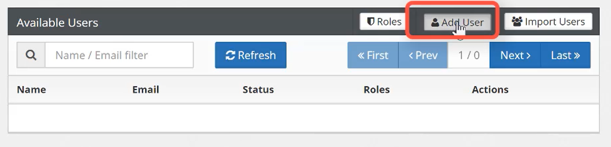

# Creating AccuTerm Users

<PageHeader />

**Created At:** 7/31/2019 10:49:05 PM  
**Updated At:** 10/29/2019 4:56:39 PM  
**Original Doc:** [accuterm-8-adding-users](https://docs.zumasys.com/accuterm/accuterm-8-adding-users)  
**Original ID:** 412551  
**Internal:** No  

Each AccuTerm user, whether a Desktop or Web user (and eventually Mobile users), needs to be registered in the customer's Zumasys Customer Portal account. Users are identified by email address. Each user can activate up to 2 Windows computers for AccuTerm 8 Desktop. Users can be granted access to the Web version (and eventually the Mobile version). Each user has a unique License Key, which, along with the email address, is used to activate AccuTerm 8 Desktop on their computer.

## Adding a Single User

### Info

Prior to creating a user, you will need to have already created your [Customer Portal User](./../../../customer-portal/registration/README.md) and be assigned as an Administrator to your company's account.

1. Expand the AccuTerm module from the main navigation page in the Customer Portal and select Users & Licenses.

2. Select the Add User button.

3. Enter the user's First Name, Last Name and Email address and select the Add button. After a few seconds, the user's account will be provisioned and display in the Available Users table.

## Bulk User Import

### Info

Prior to creating a user, you will need to have already created your [Customer Portal User](./../../customer-portal/customer-portal-registration) and be assigned as an Administrator to your company's account.

If you are looking to export users from Microsoft Active Directory, Microsoft Exchange or Office 365, please refer to the following link: [https://www.codetwo.com/admins-blog/export-users-from-active-directory/](https://www.codetwo.com/admins-blog/export-users-from-active-directory/)

1. Expand the AccuTerm module from the main navigation page in the Customer Portal and select Users & Licenses.

2. Select the Import Users button.

3. Step 1 - Download the CSV template by selecting the link and hit the Next button.

4. Step 2 - Fill in the First Name, Last Name and Email Address for the users being imported and save on your PC.

5. Step 2 - Upload your completed CSV file.

6. Step 3 - Verify the upload looks correct and select the Complete button. After a few seconds, the user's accounts will be provisioned and display in the Available Users table.

