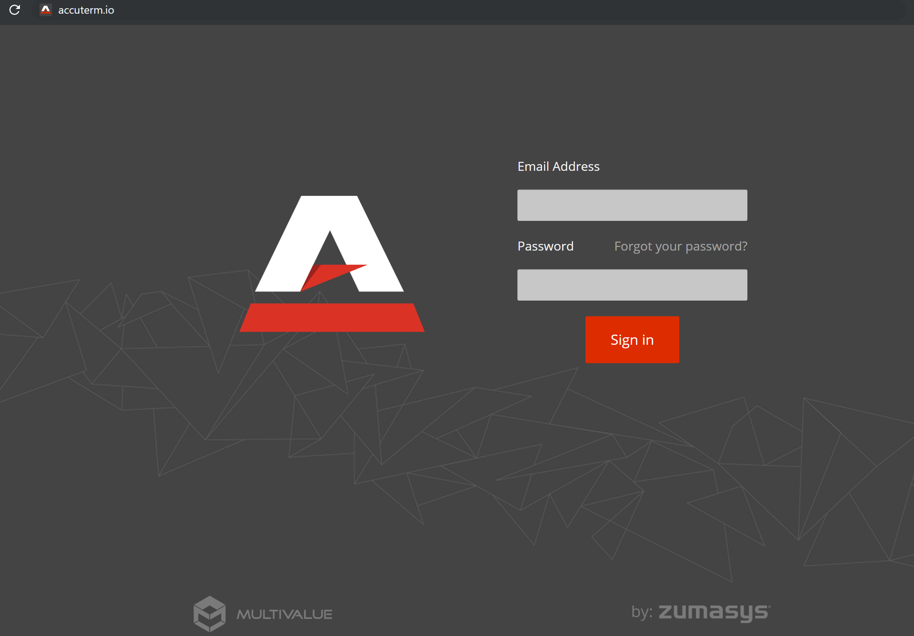
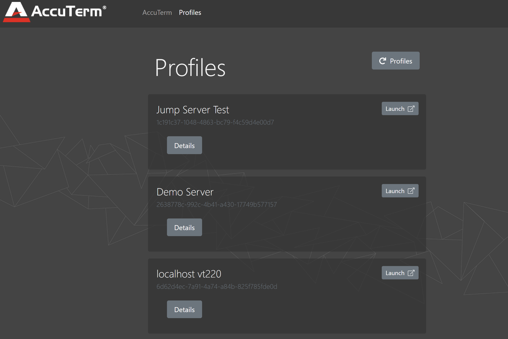

# Web

<PageHeader />

**Created At:** 8/16/2019 6:32:58 PM  
**Updated At:** 8/16/2019 9:01:45 PM  
**Original Doc:** [accuterm-8-web-introduction](https://docs.zumasys.com/accuterm/accuterm-8-web-introduction)  
**Original ID:** 444208  
**Internal:** No  
  
After AccuTerm Web access has been provisioned, visit [accuterm.io](https://accuterm.io) and login with the provided credentials.  
  
  
  
If you have multiple profiles, you will be prompted to select which profile you wish to launch.  
  
  
  
After launching your session and connecting to the server, you will have four options on the top menu bar; AccuTerm, Profiles, Keyboard and Disconnect.  
  
  
  
| <!----> | <!----> |
| --- | --- |
| AccuTerm: |  Is the default screen, which is AccuTerm Web. |
| Profiles: |  Brings you to the Profiles page to select another profile. |
| Keyboard: |  Brings up the Keyboard, select Hide button to hide the keyboard. |
| Disconnect: |  Disconnects your current session. After you disconnect, a "connect" option will appear and allow you to reconnect to the session. |
  
## Table of Contents

* [Installing AccuTerm IO Server](./installing-accuterm-io-server/README.md)
* [Creating Profiles](./creating-profiles/README.md)  
* [Profiles](./profiles/README.md)
  * [Change AccuTerm.IO Password](./profiles/clipboard-settings/README.md)  
  * [Clipboard Settings](./profiles/clipboard-settings/README.md)  
  * [Connection Settings](./profiles/connection-settings/README.md)  
  * [Font and Character Settings](./profiles/font-and-character-settings/README.md)  
  * [Keyboard Options](./profiles/keyboard-options/README.md)  
  * [Mouse Settings](./profiles/mouse-settings/README.md)  
  * [Sound Settings](./profiles/sound-settings/README.md)  
  * [Terminal Screen Options](./profiles/terminal-screen-options/README.md)  
  * [Terminal Settings](./profiles/terminal-settings/README.md)
