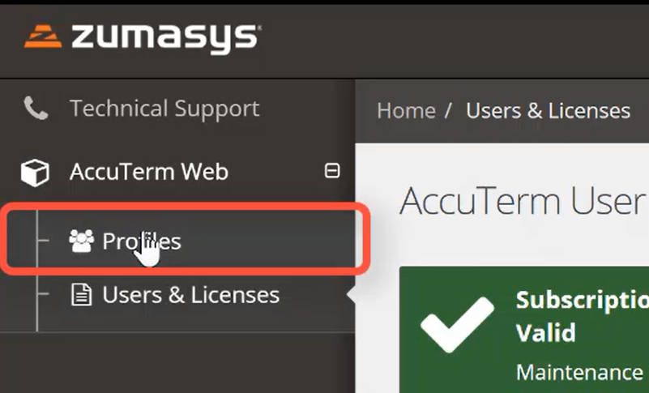
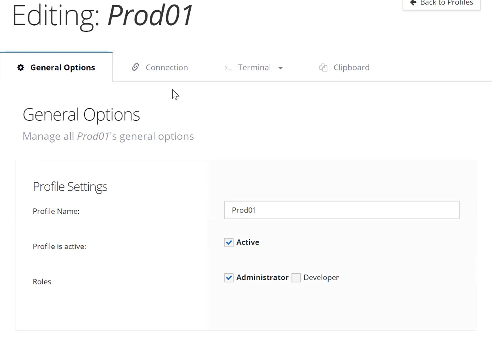

# Creating AccuTerm Profiles

**Created At:** 8/17/2019 12:37:49 AM  
**Updated At:** 9/3/2019 11:00:23 PM  
**Original Doc:** [creating-accuterm-profiles](https://docs.zumasys.com/accuterm/creating-accuterm-profiles)  
**Original ID:** 444385  
**Internal:** No  

Profiles define a terminal session, and are analogous to the session configuration files (.atsp, .atcf) used by AccuTerm Desktop. A profile defines the server name or IP to connect to, terminal type, color theme, function keys, screen size, and other settings. The .atsp file used by AccuTerm 8 Desktop is essentially a profile, and in the future you will be able to upload an .atsp file created by AccuTerm 8 Desktop as a profile to use with AccuTerm Web. Each profile must be assigned to one or more roles.

### Info

Prior to creating a user, you will need to have already created your [Customer Portal User](./../../customer-portal/customer-portal-registration) and be assigned as an Administrator to your company's account.

1. Expand the AccuTerm module from the main navigation page in the Customer Portal and select Profiles.

2. Select the Create Profile button.

3. Enter the name of the Profile and select which Roles will have access to the Profile. Continue through the remaining tabs to configure your AccuTerm Web Profile.

### Info

Profiles save automatically after you have edited a field.

