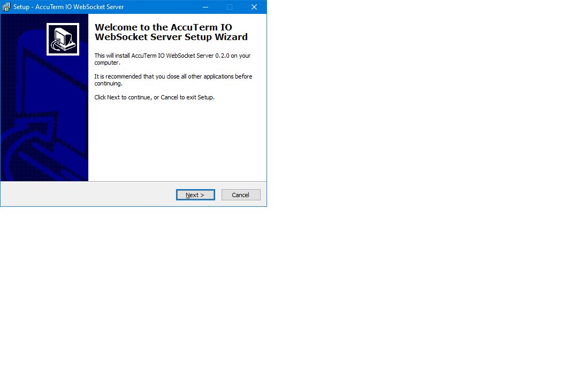
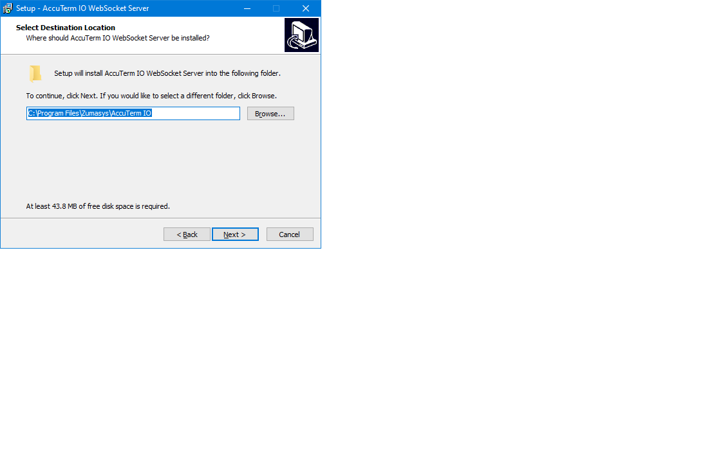
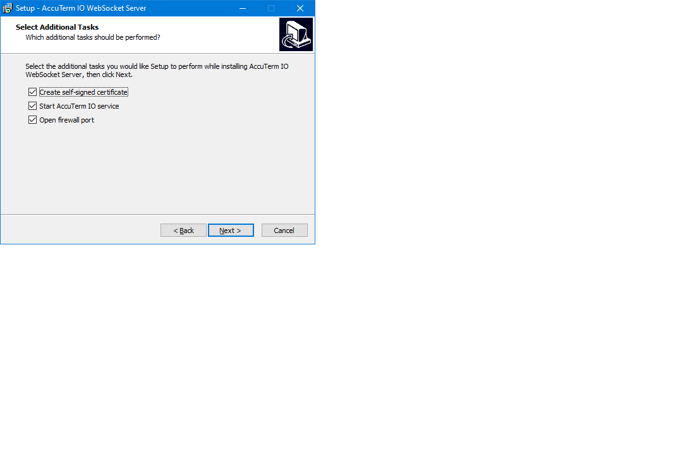
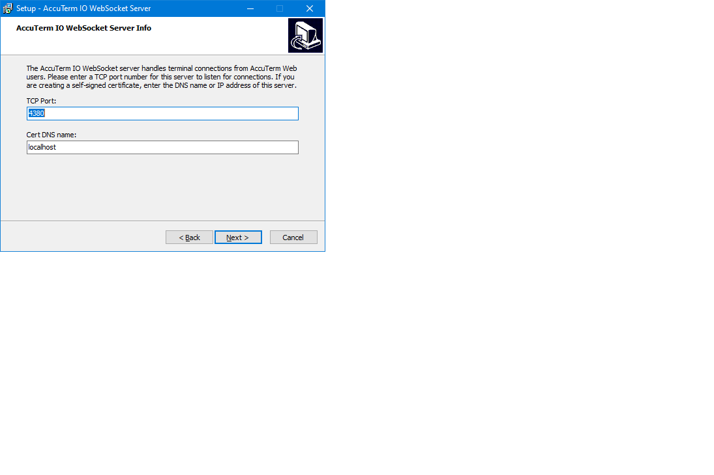
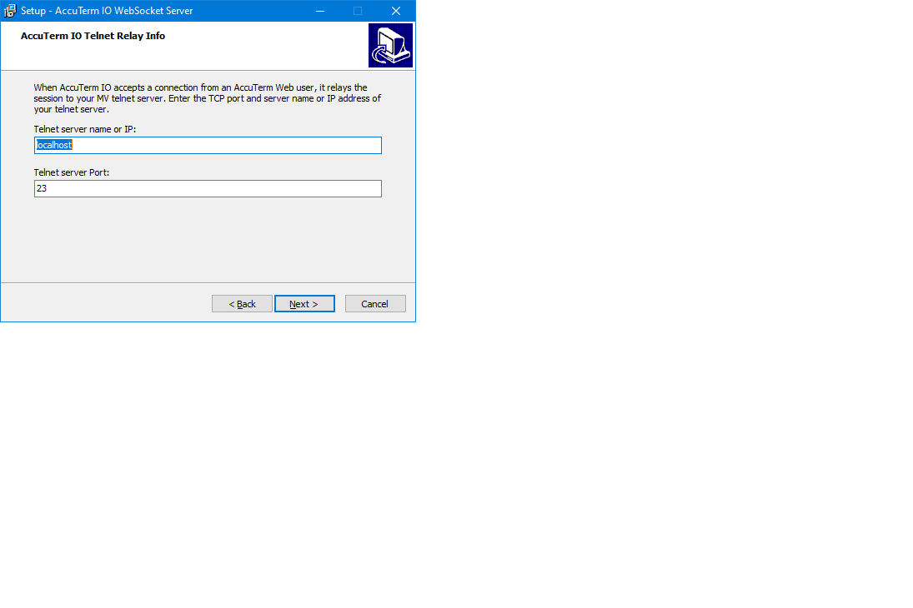
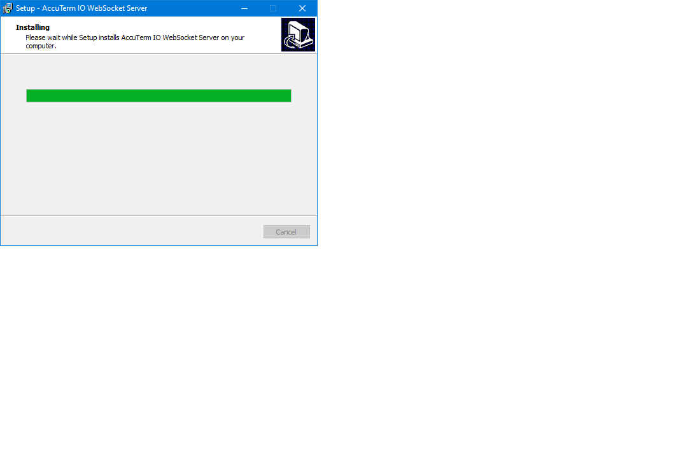
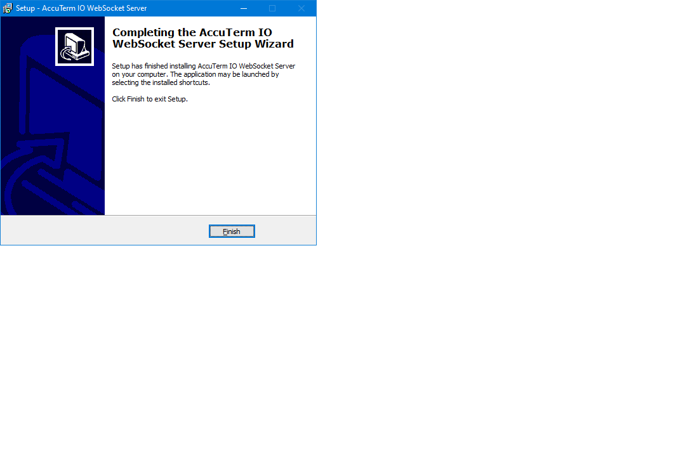
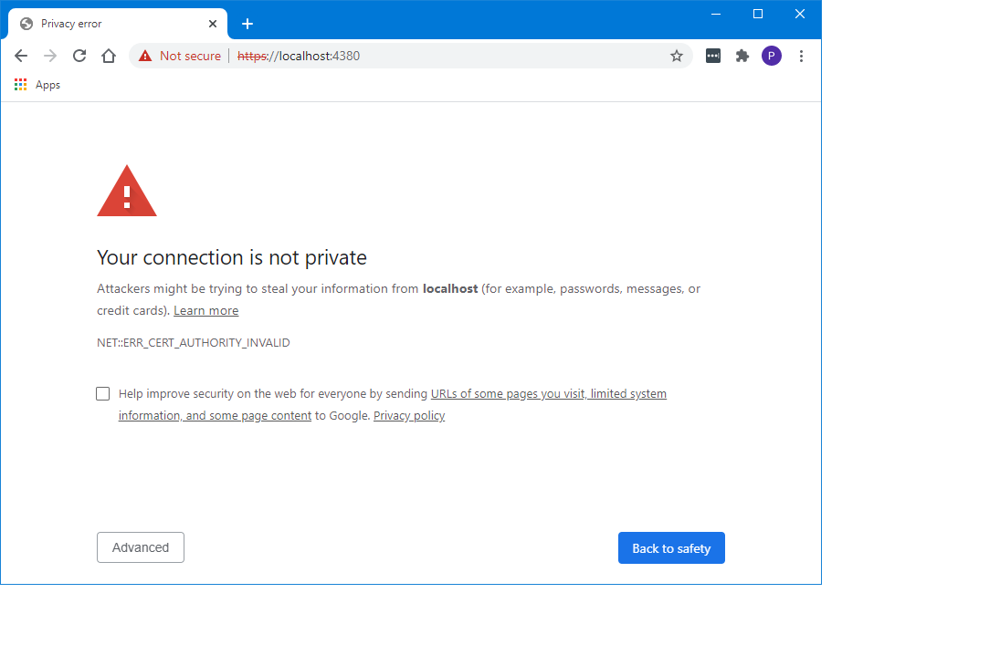

# Installing AccuTerm IO Server - Windows

<PageHeader />

<iframe width="640" height="360" src="https://www.youtube.com/embed/rAc3SBvenVw?&wmode=opaque" frameborder="0" allowfullscreen="" class="fr-draggable"></iframe>

## Info

You will need to make sure you have administrator privileges to install AccuTerm IO on Windows.

## Installation Steps

1. Download the [AccuTerm IO Server installation package](https://www.zumasys.com/downloads/) from the Zumasys Downloads page. You can download the installer directly from the following URL:

```
https://zdownload.blob.core.windows.net/accuterm/-AccuTerm-IO-Server/Windows/x64/0.2.0.0/install-accutermio-0.2.0.exe
```

3. Run the installer by double-clicking on the installer file from Windows Explorer:

```
install-accutermio-0.2.0.exe
```

4. Follow the installation wizard prompts to install AccuTerm IO Server.



5. Specify the installation directory. Default directory is "C:\Program Files\Zumasys\AccuTerm IO".



6. Select installation options. _Note: if you have a commercial certificate for your server, you can un-check the self-signed certificate option_.



7. Select the port where AccuTerm IO server will listen for connections. If you are creating a self-signed certificate, enter the name of your server. This name will be embedded in the certificate and must match the name used to connect to your server. An IP address may be used if your server will not be accessed using a DNS name.



8. AccuTerm IO relays connections to your database telnet server. Enter the name (or IP) and port used for telnet connections from this (AccuTerm IO) server to your database server.



9. Review the installation options and click *Install* to begin the installation.


10. The installer will display a progress bar while installing files and performing the optional tasks like creating the certificate.



11. After the installation is complete, click the *Finsh* button to exit the installer.



12.  AccuTerm IO Server is now installed.  Let's now test to make sure your workstation can talk to the server.  Open up Chrome or Firefox and open up the test status page. Enter your server DNS name or IP address and port number in the browser address bar to open the test page. If you are using a self-signed certificate, you will see a "privacy error" page in the browser:



This error is because we are using a self-signed certificate. To accept this certificate, click the Advanced button and choose the _Proceed to server (unsafe)_ link. The page should respond with a simple 1.  Please read below about Server Security to understand certificates and how to install a trusted certificate issued by a certificate authority and remove this error.  While using the self-signed certificate, each workstation that wishes to connect will need to go directly to the above test page and choose to proceed.

**Now the server is installed and running (and you have accepted the self-signed cert) you need to build your users and profiles.  AccuTerm is actually launched from accuterm.io and your profiles are built at portal.zumasys.com**

[Getting Started](./../../getting-started/README.md)

## Manage AccuTerm IO Server

AccuTerm IO is installed as a Windows service. You can start and stop the service using shortcuts in the Start menu (Zumasys folder), or from the Services Manager in control panel.

## Notes on AccuTerm IO Server and Security

AccuTerm IO is a true web application and as such it relies on normal [web certificates](https://www.websecurity.symantec.com/security-topics/what-is-ssl-tls-https) (https) for security.  Certs can be either purchased from sites such as [DigiCert](https://www.digicert.com/) or free ones can be obtained by [ACME](https://en.wikipedia.org/wiki/Automated_Certificate_Management_Environment)-based services such as [Let's Encrypt](https://letsencrypt.org/).

In order to install a real certificate you will need:

1. A true DNS entry for your server that can be resolved on the internet.
2. Access to that DNS to add a special TXT record for authentication.
3. Admin access to the server where AccuTerm IO is installed to run the certificate installation program.

If you do not have #1 or #2 you can use a free DNS service to give you a DNS name for your server.

Free DNS service:  [https://www.duckdns.org](https://www.duckdns.org)

ACME client to install CERT: [https://github.com/Neilpang/acme.sh](https://github.com/Neilpang/acme.sh)

ACME example with DuckDNS: [https://github.com/Neilpang/acme.sh/wiki/dnsapi#27-use-duckdnsorg-api](https://github.com/Neilpang/acme.sh/wiki/dnsapi#27-use-duckdnsorg-api)
  
<PageFooter />