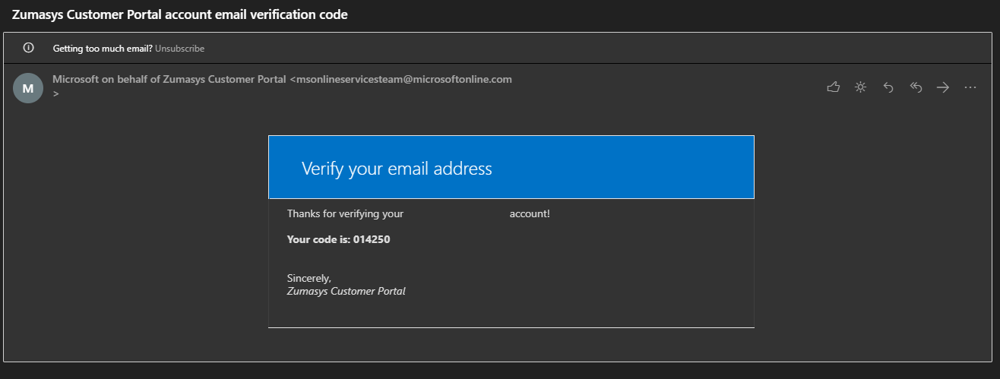
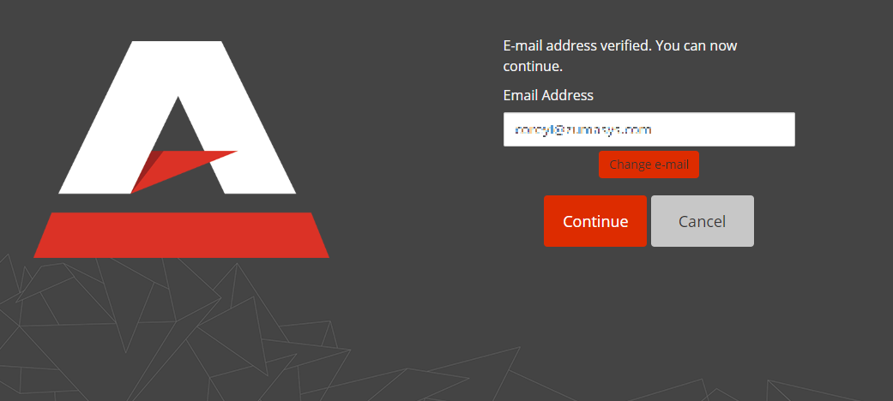

# Change Password

<PageHeader />

If you've forgotten or need to change your password and need to reset it, you can do so from the AccuTerm.IO login page. Choose the 'Forgot your password?' link and AccuTerm.IO will step you through the process to reset your password.

1. Go to the AccuTerm.IO login page at [www.accuterm.io](//www.accuterm.io) and click the "Forgot your password?" link.

2. Enter your email address to receive the verification email to change your password.

.png)

3. Take the verification code from the email and enter it into the verification code box and click verify. Once verified, then click Continue

4. Next, you will be prompted to change your password. Once you have completed that step, you will be redirected to the login page to authenticate with your new credentials.

.png)
