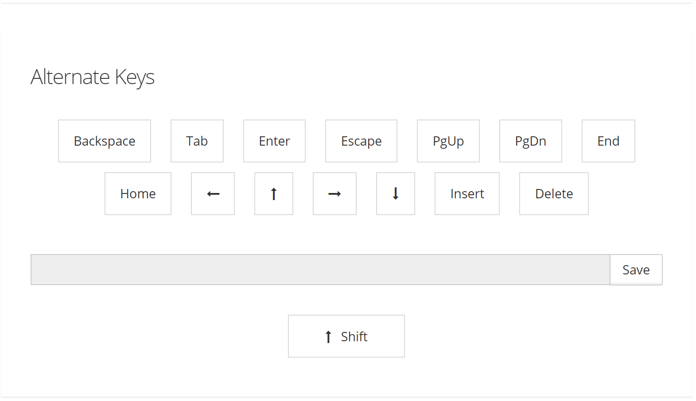

# Keyboard Options

<PageHeader />

The Keyboard Settings panel is to specify keyboard options and open the keyboard programming window.

Most terminals provide commands that allow the host to program the function keys. If you would like the host to be able to reset and reprogram the keys, select the Unlocked – host can reset or reprogram keys option. If you would like the host to be able to reprogram keys, but not reset them to their default values, select the Locked – host cannot reset keys to defaults option. If you would like to prevent the host from resetting or reprogramming keys, select the Locked – host cannot reset or reprogram keys option.

  
<PageFooter />