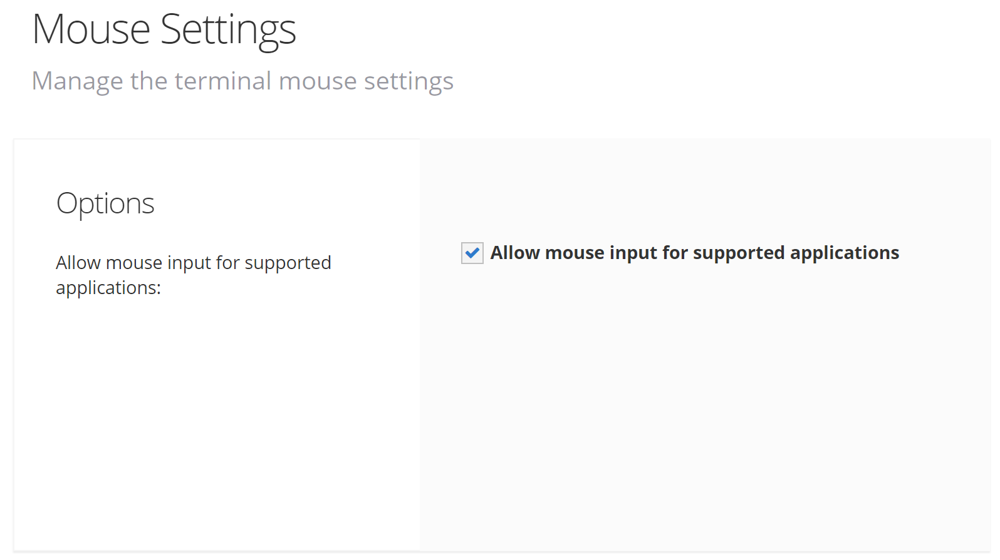

# Mouse Settings

<PageHeader />

AccuTerm supports extended mouse functions that can be used to add mouse functionality to your character-based applications.

Allow mouse input for supported applications This option determines whether host mouse reporting is enabled. When this option is enabled (the default), AccuTerm will enter mouse input mode when the host sends the enable mouse input command.

  
<PageFooter />