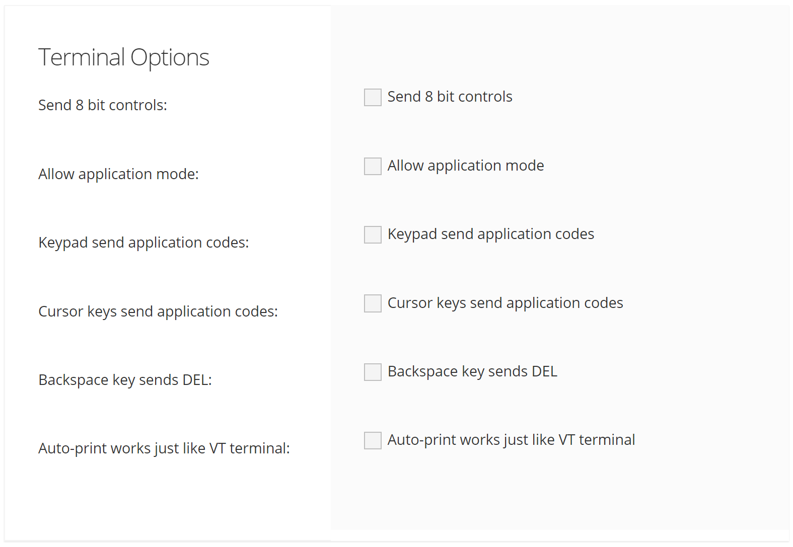

# Terminal Settings

<PageHeader />

## Terminal Type

| <!----> | <!----> |
| --- | --- |
| Terminal Emulation: | In order for AccuTerm to work properly with terminal-based applications, the terminal type that AccuTerm is emulating must match the terminal type the host application is configured or designed to use. Select the terminal type (emulation or personality) from the drop-down list. If you select the wrong type, your screen will probably be scrambled, and you should try a different type. The following supported terminal types for AccuTerm 8 Web are :<ul><li>TTY</li><li>Wyse 50</li><li>Wyse 60</li><li>ADDS Viewpoint</li><li>Viewpoint Enhanced</li><li>VT100</li><li>VT220</li><li>VT320</li><li>VT420</li><li>Linux Console</li><li>Xterm</li><li>Pick PC Monitor</li></ul> |
| Host Terminal Type: | In order for AccuTerm to work properly with terminal-based applications, the terminal type that AccuTerm is emulating must match the terminal type the host application is configured or designed to use. Select the terminal type (emulation or personality) from the drop-down list. If you select the wrong type, your screen will probably be scrambled, and you should try a different type. |
| Answerback: | The contents of this field are sent to the host when the application sends a "send answerback" command to AccuTerm. Wyse and VT emulations support the answerback command. When the answerback message is sent to the host under Wyse emulation, an ACK control character follows the message. Under VT emulation, no terminator is sent. Control characters may be entered into the Answerback field by prefixing the character with a caret (^). |

## Terminal Options

| <!----> | <!----> |
| --- | --- |
| Send 8 bit controls: | Send 8 bit controls If this option is selected, then 8-bit control codes will be transmitted to the host. If the option is not set (the default), equivalent 7-bit escape sequences will be transmitted to the host. This option applies to the VT220, VT320, VT420 and Linux Console emulations.  |
| Allow application mode: | When this option is selected (the default), commands that switch the numeric keypad keys and cursor keys into "application mode" are emulated. When the option is not selected, those commands are ignored, preventing the terminal from switching to "application mode". This option is useful when the host or application erroneously sends the command to enter application mode, and the application is expecting normal numeric or cursor keys. This option applies to the VT emulations (except VT52) and Linux Console emulation.  |
| Keypad sends application codes: | When this option is selected, the numeric keypad keys send special application codes. When the option is not set (the default), the numeric keypad keys send decimal numbers. This option applies to the VT emulations (except VT52) and Linux Console emulation.  |
| Cursor keys send application codes: | When this option is selected, the cursor keys send special application codes. When the option is not set (the default), the cursor keys send normal cursor codes. This option applies to the VT emulations (except VT52) and Linux Console emulation.  |
| Backspace key sends DEL: | When this option is selected, the BACKSPACE key sends the DEL (delete) control code. When the option is not set (the default), the BACKSPACE key sends the BS (backspace) control code. This option applies to the VT emulations (except VT52) and Linux Console emulation.  |
| Auto-print works just like VT terminal:   | When this option is selected, the "auto print" slave printer function works the same as a real VT terminal. That is, when AccuTerm is in "auto print" mode, the entire screen line that the cursor is on is printed when AccuTerm receives a CR, LF or FF control code. If this option is not set, then the text is printed as it is received from the host (similar to Wyse auto-print mode).   |

