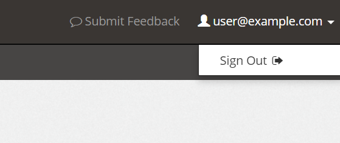

# Navigation

<PageHeader />

### Main Page

Once you are logged in, moving around is pretty simple. On the left side of the interface will be all the major areas you can work with. The options you have will depend on what services you are subscribed to with Zumasys, and may expand over time as we add more management to the Portal.

On the right side of the screen, you will see contact information for Zumasys Support, with a link to create a new service ticket.  In addition, below the contact information is the status of your support tickets.

On the upper-right side of the screen will show your account's email address and a "Submit Feedback" link.  Selecting "Submit Feedback" will allow you to send us a comment or question about the Portal. Clicking the drop-down for your account name will give you the option to sign out of the application.

### Info

If you simply close the window or tab your session credentials will still be active. You must select the Sign Out link to completely log out of the Portal!

  
<PageFooter />
