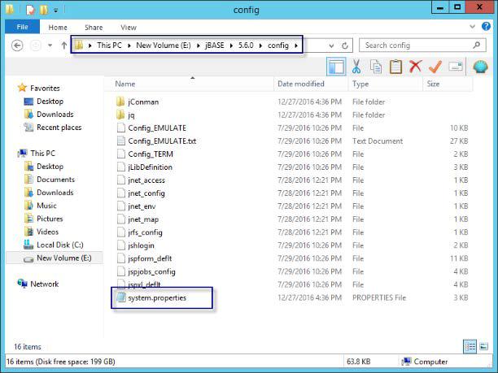

# MANUAL LICENSE KEY INSTALLATION

**Created At:** 7/6/2017 10:06:22 PM  
**Updated At:** 6/12/2018 7:17:57 AM  
**Original Doc:** [manual-license-key-installation](https://docs.jbase.com/36690-installation-guides/manual-license-key-installation)  
**Original ID:** 262611  
**Internal:** No  


The jBASE installer will automatically update the license keys during Express and Advanced mode install. If you need to change the keys, for example, to enter a permanent key instead of an evaluation key, or if you performed a Minimal install, you can use any text editor like **Notepad** or **vi**to enter the keys in the **system.properties**file. The **system.properties**file is located in the **config**directory under your jBASE installation directory. For example:

```
D:\jBASE\5.7.0\config
```




You should have either a **Permanent** system license key or an **evaluation**license key. You may also have a **Multisession** and/or **Websession**key. Each key must be added as a separate entry in the **system.properties**file. New keys should be added at the end of the file, after the **jruntime.license**line, which should be left in the file without modification. When the keys have been added, the last lines of the **system.properties** file will look something like this (comment lines starting with **#** can be added for clarity):

Permanent license example:

```
jruntime.license = qP2XhdjqbdbiqzvfDBgPisP3ITiDfhyT
jruntime.deepthought=5uGDQT5vh1DkpvMfqI+Srq5WWing6aYC
jruntime.multisession=5uGDQT5vh1DuSp2afBWAXO9RoGIr73gb
```

Evaluation license example:

```
jruntime.license = qP2XhdjqbdbiqzvfDBgPisP3ITiDfhyT
# Expires on 31 March 2018
jruntime.eval=L7G3Jq52/AVD9I9E6LNAvhp2l43xKnRU
```

Websession example:

```
jruntime.license = qP2XhdjqbdbiqzvfDBgPisP3ITiDfhyT
jruntime.deepthought=5uGDQT5vh1DkpvMfqI+Srq5WWing6aYC
jruntime.websession=99TvRhZrzwXahzjI9/NuqTNRlro/g1xpC/MJglgPQDE=
```

### RELATED TOPICS:

[UPGRADING FROM A PREVIOUS VERSION](./../upgrading-from-a-previous-version)

[INSTALLING THE COMPILER](installing-the-windows-compiler)

[MANUAL INSTALLATION OF JDLS SERVICE](./../../../jbase/manual-installation-of-jdls-service)

[CREATING ACCOUNTS AND USERS](./../create-accounts-and-users)
