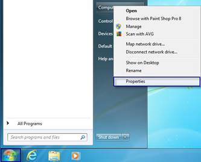
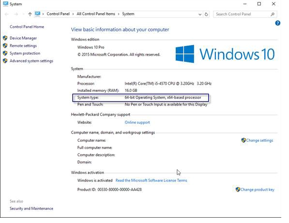

# VERIFY YOUR WINDOWS OPERATING SYSTEM

**Created At:** 7/6/2017 9:48:07 PM  
**Updated At:** 11/22/2017 10:49:52 AM  

### Windows 7

Click the start button, search for Computer, right-click Computer and choose Properties.

You should see the details highlighted as below;

### Windows 8/8.1

Click the Start button, search for Computer, right-click This PC and choose Properties. 

### Windows 10

Right-Click the start menu icon and choose System. 

### Windows Server 2008 R2

Click the start button, right-click Computer and choose Properties.

### Windows Server 2012 R2

Click the start menu, right-click this PC, choose Properties

