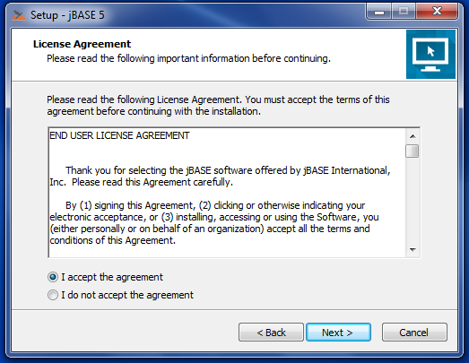
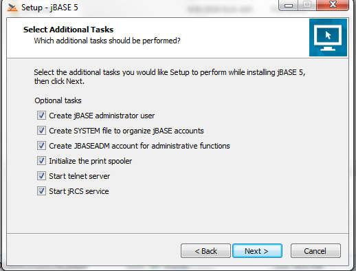
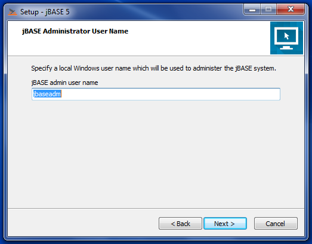
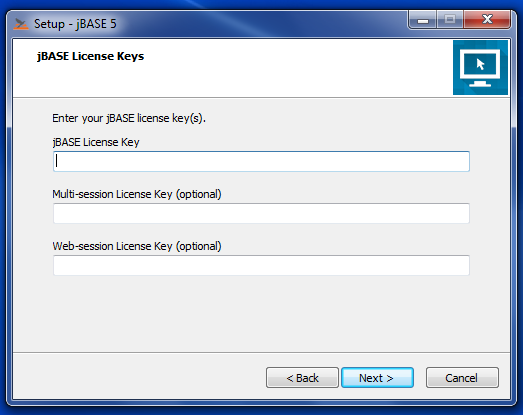
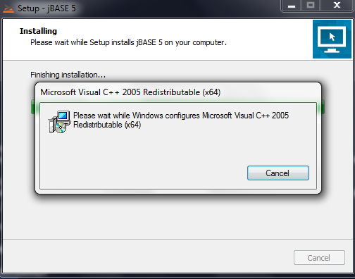
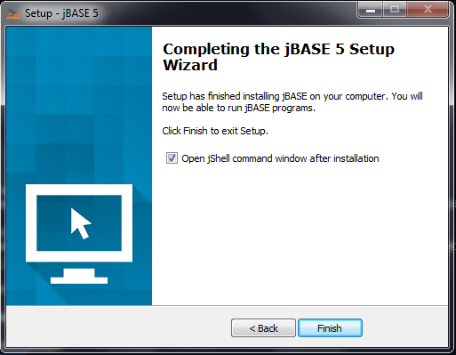

# WINDOWS INSTALLATION GUIDE

**Created At:** 6/21/2018 8:12:52 AM  
**Updated At:** 11/1/2019 4:42:59 PM  
**Original Doc:** [323805-windows-jbase-installation](https://docs.jbase.com/36690-installation-guides/323805-windows-jbase-installation)  

**Tags:**
<badge text='microsoft' vertical='middle' />
<badge text='windows 10' vertical='middle' />
<badge text='server 2008' vertical='middle' />
<badge text='server 2016' vertical='middle' />
<badge text='server 2012' vertical='middle' />
<badge text='installation' vertical='middle' />
<badge text='windows' vertical='middle' />

### SUPPORTED OPERATING SYSTEMS 

- Windows 10, Server 2008 and Server 2012

## Installation Types

The jBASE installer provides two installation modes: **Express**and**Advanced**

**Express:** install jBASE with typical options and services. Select this option if you are new to jBASE and wish to get started quickly. Express mode installs jBASE, creates a jBASE Administrator user and account, creates a SYSTEM file to organize jBASE accounts, initializes the spooler, installs and starts JBASE services.

**Advanced**: allows you to select which features and services to install. Select this option if you need to customize the location of the SYSTEM file, administrator account, or JBASE spooler, or if you do not want some of these features installed. Also select this option to select which optional services to install (telnet and jRCS).

### Info

- Please download jBASE and request evaluation from [https://www.zumasys.com/downloads/](https://www.zumasys.com/downloads/)
- The jRemote client will be located in C:\jBASE\CurrentVersion\clients\csjrcs
- jBASE requires a [C Compiler](323804-windows-compiler-installation)

Each step in this guide will highlight which mode this step pertains to. If you do not see the step during installation, skip to the next step as it may not apply to the mode chosen.

## Starting the Installation 

1. Launch the installer and choose Run if prompted.

Applies to:**Express** **Advanced**

2. jBase requires a c compiler to make it possible to compile programs. A guide to installing and configuring an appropriate c compiler can be found [here](323804-windows-compiler-installation).

3. Pick the appropriate location option,  and then click Next.

Applies to:**Express** **Advanced******

4. Review the End User License Agreement (EULA) and choose I Agree. Then click Next.

Applies to:**Express** **Advanced**

5. Select the desired installation type based on the earlier outlined details of available options, then click Next.

Applies to:**Express** **Advanced**

6. Choose the installation path for jBASE, default is C:\jBASE\5.x.x. Then click Next.

For Windows Server installations, it is recommended to install to an alternate partition than the C:\ System partition if available, however, JBASE will install properly on any local partition if there is sufficient free disk space.

Applies to:**Express** **Advanced**

7. Choose the path for the jBASE data directory, this will default to the same as the installation path. Then click Next.

Applies to: Express **Advanced**

8. Choose the Start Menu folder for the application shortcuts, default is “jBASE”, click Next.

Applies to: Express **Advanced**

9. Choose the desired installation options, then click Next.

Applies to: Express **Advanced**

The options are:

**Create jBASE administrator user**The installer can create a new Windows user to perform jBASE administrative functions such as creating new jBASE accounts. The jBASE administrator also owns the jBASE system files. If you select this option, you will be prompted for the user name and password. An existing user name is acceptable, for example, when performing an upgrade of jBASE.

**Create SYSTEM file to organize jBASE accounts**In jBASE, the SYSTEM file is optional. However, using a SYSTEM file provides a convenient way to organize your jBASE accounts, and is required for using Q-pointers and the LOGTO command in your JBASE applications.

**Create JBASEADM account for administrative functions**The JBASEADM account can be used to perform jBASE administrative tasks such as creating or deleting other jBASE accounts.

**Initialize the print spooler**Select this option to initialize the default print spooler configuration after a new installation. Please note this option is unavailable for upgrade installations.

**Start telnet server**The jBASE telnet server is required to support remote connections to jBASE over telnet. The telnet server runs as a Windows service. By default, the telnet server listens on TCP port 23.  More information on configuring the jBASE telnet server [here](www.jbase.com/r5/knowledgebase/manuals/3.0/30manpages/man/telnet1.htm).

**Start jRCS service**The jBASE Remote Connectivity Server (jRCS) provides remote access to your jBASE system. jBASE System Manager uses this service to perform management tasks on your jBASE system. By default, the jRCS server listens on TCP port 8236. See the jBASE knowledgebase article [JRCS](http://jbase.com/r5/knowledgebase/manuals/3.0/30manpages/man/JRCS_JRCS.htm) for more information regarding jRCS.

10. Type a username to be created for the jBASE Administrator. The installer will create a local Windows user account who will "own" the jBASE system files, and can be used to perform jBASE administrative tasks such as creating new jBASE accounts. If the user does not exist, the installer will create the user. Then click Next.

Applies to:**Express** **Advanced**

11. If the user name specified in the previous screen does not exist, a password needs to be specified for this user. If there are Windows Group Policy requirements that apply to this computer, the password **must**meet the requirements, then click Next.

The installer will not create a new user without a password. Because security policies vary widely, it is not possible for the jBASE installer to validate that the password created at this point conforms to the local security policy of the computer. Be sure to follow your local security policy regarding passwords. Otherwise, the installer will not be able to create the JBASE Administrator user, and this will have to be done manually after the installation.

Applies to:**Express** **Advanced**

12. Enter a jBASE license key, then click Next.

Applies to:**Express Advanced**

jBASE requires a valid license key in order to operate. Either a permanent or evaluation key may be used.

If a Multisession or Websession license key has been issued, enter these keys in the respective fields.

If upgrading from a previous version of jBASE, the installer will attempt to locate the existing license keys and use them to populate the license key fields on this page.

### Info

The installer will **not**continue unless at least one license key is entered.

For licensing assistance contact Zumasys jBASE support in the United States at 866 582 8447 and from the United Kingdom at 0808 189 3266 or [sales@jbase.com.](mailto:sales@jbase.com)

13. Review the summary information and then click Install.

Applies to: Express **Advanced**

14. The jBASE release files are copied to the destination folder, replacing any existing files if installing over an existing installation.

Applies to:**Express** **Advanced**

15. After copying the jBASE release files, the installer will install the Microsoft Visual C++ runtime. Finally, optional configuration tasks are performed, such as creating the jBASE Administrator user, creating the SYSTEM file, the JBASEADM account, initializing the spooler, and installing and starting the jBASE services.

Applies to:**Express** **Advanced**

16. If jBASE installation was successful, an option to open a jShell command prompt is available if it is desired to open the jShell after the Finish button is clicked. The shell will open after the finish button is clicked.

If the installation was not successful, for example, an invalid license key was entered, an error message will be displayed.

Applies to:**Express** **Advanced**

### See Next:

[INSTALLING WINDOWS COMPILER](323804-windows-compiler-installation)

[UPGRADING FROM A PREVIOUS VERSION](upgrading-from-a-previous-version)

[MANUAL INSTALLATION OF JDLS SERVICE](manual-installation-of-jdls-service)

[CREATING ACCOUNTS AND USERS](create-accounts-and-users)

[MANUAL LICENSE KEY INSTALLATION](manual-license-key-installation)

