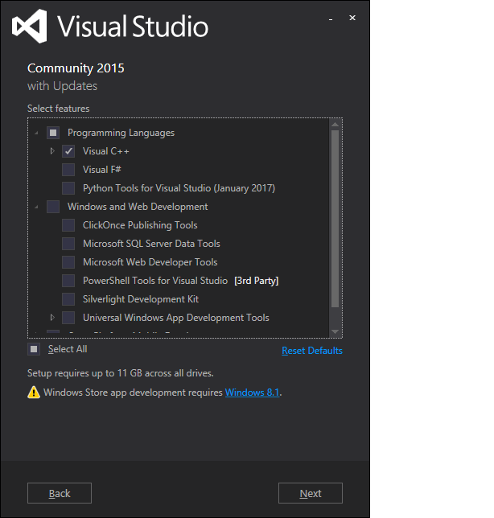

# WINDOWS SERVER 2012 & WINDOWS 8 COMPILER INSTALLATION

**Created At:** 8/31/2018 6:04:37 PM  
**Updated At:** 8/31/2018 8:47:26 PM  
**Original Doc:** [jbase-compiler-installation-for-windows-server-2012-not-r2-and-windows-8-not-81](https://docs.jbase.com/36690-installation-guides/jbase-compiler-installation-for-windows-server-2012-not-r2-and-windows-8-not-81)  

## Description 

The jBASE compiler installer checks for a working C compiler if a version of Visual Studio is already installed. If a working C compiler is not found, the jBASE compiler installer directs the user to the "Build Tools for Visual Studio 2017" web page to install Visual Studio. However Visual Studio 2017 is not supported on Windows Server 2012 or Windows 8, so an older version of Visual Studio is required.

We have tested various editions of Visual Studio 2015 with jBASE 5.6.x and 5.7.x and have determined that Visual Studio 2015 Community Edition provides a C compiler that is compatible with jBASE, and is also compatible with these versions of Windows. Visual Studio 2015 Express *may* work as well, however during our testing we found that at the end of the installation process, the Visual Studio installer reported an error downloading the Windows 10 SDK. The Community Edition was error-free in our testing.

1. Before installing jBASE, first install Visual Studio 2015 Community Edition.  At the time of this writing, this URL will directly download the web-based installer for Visual Studio 2015 Community Edition. There is no guarantee that this URL will remain valid. If it works, it is a shortcut to the official download process: [https://go.microsoft.com/fwlink/?LinkId=532606&clcid=0x409](https://go.microsoft.com/fwlink/?LinkId=532606&clcid=0x409) .

To download the web-based installer for Visual Studio 2015 Community Edition, you must first log in to Microsoft Dev Essentials. Open a browser and navigate to: [https://visualstudio.microsoft.com/dev-essentials/](https://visualstudio.microsoft.com/dev-essentials/) . Sign in with your MSDN or Dev Essentials credentials or create a new Dev Essentials account from this page. Once you are signed in, the Dev Essentials Welcome page will open. On this page, click the Downloads link, found in the menu at the top of the page. The Downloads page opens with links for Visual Studio 2017 and other current products. For older versions of Visual Studio, scroll to the bottom of the page and click the Older versions link. When the next page opens, find the table under "Still want an older version?" and click 2015. Then click the Download button in the Visual Studio 2015 and other Products box. This will open a download page for all 2015 versions of Visual Studio. Scroll through the table to find Visual Studio Community 2015 with Update 3 and click the Download button to download the web-based installer for this version of Visual Studio.

2. After the download completes, run the installer. Verify that the installer shows Visual Studio Community 2015 in the title at the top of the installer window:

3. Change the installation type from “Default” to “Custom”, then click Next.

4. In the features selection page, expand the "Programming Languages" branch and select Visual C++. Other options (Microsoft Web Development Tools, etc.) may be de-selected, only C++ is required for compiling jBASE programs. Click Next.

5. On the next page, click Install.

6. After installing Visual Studio, you will likely need to reboot Windows.

7. After restarting Windows (if needed), proceed with jBASE installation.  The installer for jBASE release 5.6.6 and 5.7.1 and above will locate Visual Studio 2015 and configure it properly for jBASE.

### See Next:

[INSTALLING jBASE ON WINDOWS](323805-windows-jbase-installation)

[UPGRADING FROM A PREVIOUS VERSION](upgrading-from-a-previous-version)

[MANUAL INSTALLATION OF JDLS SERVICE](manual-installation-of-jdls-service)

[CREATING ACCOUNTS AND USERS](create-accounts-and-users)

[MANUAL LICENSE KEY INSTALLATION](manual-license-key-installation)
