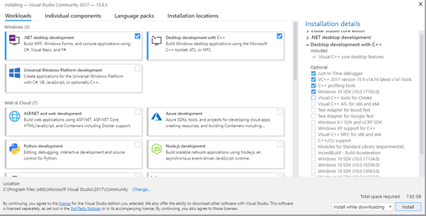

# jBASE for MultiValue Developers

**Created At:** 1/23/2019 11:31:06 PM  
**Updated At:** 1/30/2019 10:34:39 PM  
**Original Doc:** [359033-jbase-for-multivalue-developers](https://docs.jbase.com/coding-corner/359033-jbase-for-multivalue-developers)  
**Original ID:** 359033  
**Internal:** No  

**Tags:**
<badge text='education' vertical='middle' />
<badge text='excercise' vertical='middle' />
<badge text='tutorial' vertical='middle' />
<badge text='videos' vertical='middle' />
<badge text='class' vertical='middle' />
<badge text='excercises' vertical='middle' />
<badge text='training' vertical='middle' />

To follow along with the [jBASE Training Class videos](https://www.youtube.com/playlist?list=PLVXwKjeQzt19GqazZ0l3sAFpAAqz2STMw), you should follow these steps to set up the correct environment.  Assuming a clean Windows platform for all of this, run the jBASE 5.7 installer and follow along to install the prerequisites.

## Prerequisite Checklist

- [Download jBASE 5.7](https://www.jbase.com/products/demo/)
- [Install and configure jBASE 5.7 on Windows](./../../administration/installation-guides/windows-installation-guide)
- [Download, install and configure Visual Studio Community Edition](https://docs.microsoft.com/en-us/visualstudio/install/install-visual-studio?view=vs-2017)
- [Download evaluation of Accuterm Terminal Emulator](https://www.zumasys.com/atfiles/downloads/at7/atw73a.exe)
- [Install and configure Accuterm](https://www.zumasys.com/atfiles/manuals/at7/AccuTerm-7-User-Manual.pdf)
- Download training files
    - [wychbooks.zip](https://s3.amazonaws.com/helpjuice-static/helpjuice_production%2Fuploads%2Fupload%2Fimage%2F3397%2Fdirect%2F1548303493356-wychbooks.zip)

Be sure to select the “Desktop development with C++” option along with the “.NET desktop development”.  The options shown should be sufficient for the purposes of these videos.  If the Visual Studio 2017 Build Tools have already been installed, then the “Desktop development with C++” option is not required.

