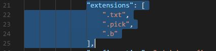
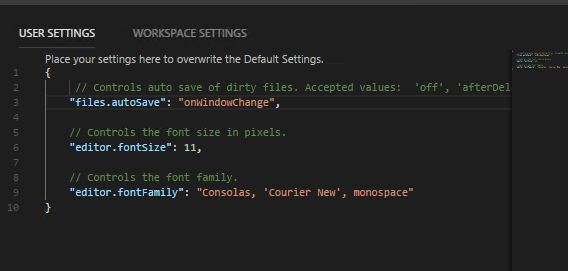

# VISUAL STUDIO CODE PICK BASIC EXTENSION

**Created At:** 5/15/2018 6:06:44 PM  
**Updated At:** 12/22/2018 12:32:02 AM  
**Original Doc:** [316972-visual-studio-pick-basic-extension](https://docs.jbase.com/coding-corner/316972-visual-studio-pick-basic-extension)  


## Description

Would you like to update your coding environment and inject some color into your work?

Visual Studio Code is a free download which has an extension entitled “PickBasic” (A Pick Basic Syntax Highlighter for VS Code).

In jBASE Development and Support, we commonly use folders for our BASIC source code and add a “.b” suffix to enable it to be identified.  Use of “jcompile” also mandates the use of the “.b” suffix.  The standard syntax definition for the PickBasic extension has no suffix by default, and also uses “.pick” and .”txt”, but it is easy to add the .b”.

For Windows, Visual Studio Code can be downloaded from this location:

[https://code.visualstudio.com/download](https://code.visualstudio.com/download)

Visual Studio Code also works on Linux, unfortunately it will only install and work on Red Hat Linux 7 (or CentOS 7) - see below for installation details.


## Instructions:

1. To find the PickBasic extension, click on the square extensions button and enter “PickBasic” as the search term:


2. Once Visual Studio Code is installed:

a) on Windows, navigate to the “C:\Users\&lt;yourname&gt;\.vscode\extensions\TravisHaley.pick-1.1.0”

b) on Linux, navigate to "/home/&lt;yourname&gt;/.vscode/extensions/TravisHaley.pick-1.1.0"

and open the “package.json” file in Visual Studio Code.

Under the “extensions” tag, set your preferred suffixes:



3. Save the changes. When the changes are saved, Visual Studio Code should invite you to reload, otherwise, exit and restart. You can then edit individual items or open a complete folder.  It is also possible to change other settings such as font size, font family, tab size and whether “autosave” is enabled or not:



4. End result – syntax highlighting:


> ### Note: 
> 
> To install Visual Studio Code on Linux, proceed as follows:
> 
> ```
> [mikestre@Bordeaux ~]$ sudo su -
> [sudo] password for mikestre:
> Last login: Tue May 15 17:29:41 BST 2018 on :1
> [root@Bordeaux ~]# rpm --import https://packages.microsoft.com/keys/microsoft.asc
> [root@Bordeaux ~]# sh -c 'echo -e "[code]\nname=Visual Studio Code\nbaseurl=https://packages.microsoft.com/yumrepos/vscode\nenabled=1\ngpgcheck=1\ngpgkey=https://packages.microsoft.com/keys/microsoft.asc" > /etc/yum.repos.d/vscode.repo'
> [root@Bordeaux ~]# yum check-update
> [root@Bordeaux ~]# yum install code
> ```
> 
> 
> 
> When updates for Visual Studio Code are available, they can be installed via “yum update”.


**Syntax**

The BASIC syntax definition can be found in the "syntaxes" sub-folder of the extension definition in a "pick.tmLanguage" item.

From a jBASE point-of-view, the syntax is currently incomplete, but can be modified to suit.

We plan to develop a standard jBASE version of the syntax which will be made available via the web site.
