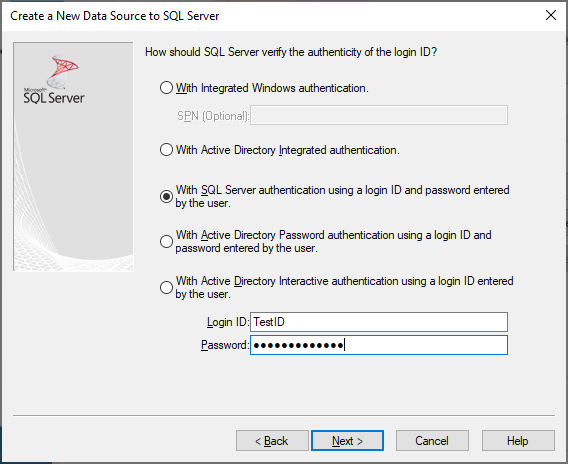
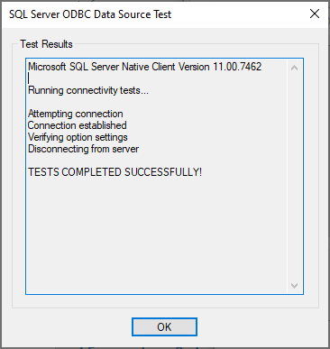
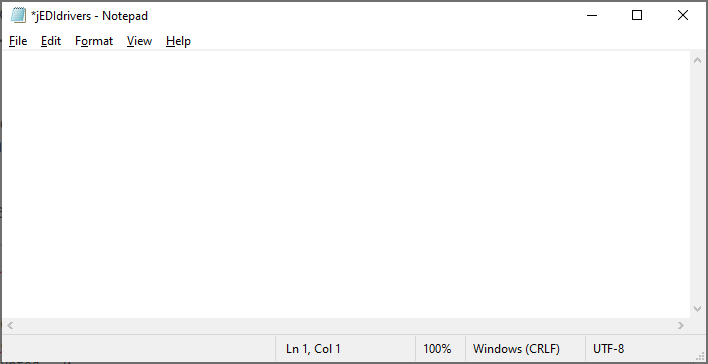

# Configuring the ODBC jEDI on Windows

**Created At:** 11/22/2019 7:51:18 PM  
**Updated At:** 11/26/2019 6:37:55 PM  
**Original Doc:** [configuring-the-odbc-jedi-on-windows](https://docs.jbase.com//configuring-the-odbc-jedi-on-windows)  


For windows operating systems, only the **jEDIdrivers.ini** file needs to be properly configured for correct function of the utility (as the ODBC definitions are defined in the native Windows 32/64 bit manager). It can exist in the **%SYSTEMROOT%, %JBCDATADIR%/config,**or **%HOME%**environment variables. Moreover, since the *ODBC* *jEDI* is comprised of a set of bin (executable) and lib (driver libraries and subroutines) binary-object files, you must ensure the lib directory path is added to your **PATH**environment variable (before beginning the steps listed below). The full path of the bin directory is located within your **PATH**environment variable, and the full path of the lib directory is located within your **JBCOBJECTLIST**environment variable.

For the configuration example below, we will be configuring an MSSQL *ODBC*driver by doing the following:

1. Navigate to the **Control Panel**


2. Click on **System and Security**


3. Click on **System**


4. Confirm whether you have a 32 or 64 bit operating system


5. Navigate back to the **System and Security** page


6. Click on **Administrative Tools**


7. Open the **ODBC Data Sources** app for the operating system we found in step 4 (64-bit in this example)


8.  Click on **Add**


9. Select **SQL Server Native Client [*version*]** and click on **Finish**


### Note

For SQL Server, the **SQL Server Native Client [*version*]**must be the selected driver due to its ability to support Multiple Active Statements (MAS).

10. Fill out the fields to define the Microsoft SQL Server Native Client driver


11. Click on **Next**


12. Click on **With SQL Server authentication using a login ID and password** **entered by the user**, and enter the user id and password used to enter your *RDBMS*server



13. Click on **Next**


14. Update the fields listed as desired

15. Click on **Next**


16. Update the fields listed as desired

17. Click on **Finish**


18. Click on **Test Data Source** to test the*ODBC* driver configuration, this will let you know if the *ODBC* driver correctly connected to your MSSQL database server



### Troubleshooting

If you did not receive the "TESTS COMPLETED SUCCESSFULLY!" message, make sure you selected the correct server in step 10, and entered the correct username and password information to connect to the server in step 12.

19. Navigate to the **%SYSROOT%** or **%HOME%** directory (where the **jEDIdrivers.ini** file lives) using the File Explorer

20. Open **jEDIdrivers.ini** up for editing using your favorite text editor



21. Update the file parameters in the file to reflect the correct *ODBC* driver parameter values (these will depend on which driver you're setting up). Use the parameter descriptions in the **jEDIdrivers.ini** file definition section of the [Structure of ODBC jEDI Initialization Files](./../structure-of-odbc-jedi-initialization-files) document to identify what needs to be changed.

### Note

The *DSN* parameter value corresponds to the name of the *ODBC* data source you created in the steps above.

```
jEDIdrivers.ini

[General]
JRLAlock = 0
FullyExpanded = 0
PasswdsEncrypted = 0
TblSep = __
VMCSep = __
CSVdir = /dbms/JEDICSV

[ODBC]
default = DSN=MSSQL;UID=sa_new;DATABASE=ds_Portal_prod
msmatrix = DSN=MSSQL;UID=sa_new;DATABASE=hs_label_matrix

[ODBC_default]
passwd = expswrd

[ODBC_matrix]
passwd = expswrd
```

----------------------------------------------------------------------------------------------------------------------------

[Introduction to the ODBC jEDI](./../introduction-to-the-odbc-jedi)

Installing the ODBC jEDI on Linux/Unix

Installing the ODBC jEDI on Windows

[Structure of ODBC jEDI Initialization Files](./../structure-of-odbc-jedi-initialization-files)

[Structure of ODBC JEDI Mapping Files](./../structure-of-odbc-jedi-mapping-files)

[Configuring the ODBC jEDI on Linux/Unix](./../configuring-the-odbc-jedi-on-linux&unix)

[Using the ODBC jEDI](./../using-the-odbc-jedi)


