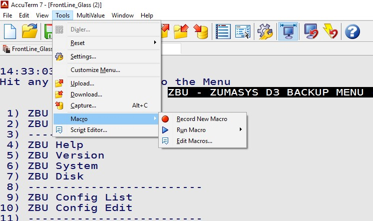
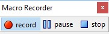
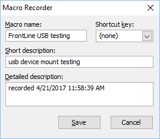
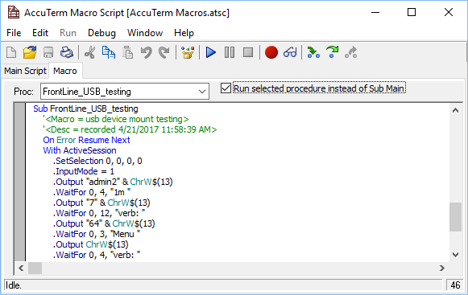
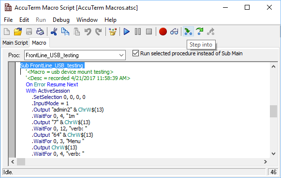
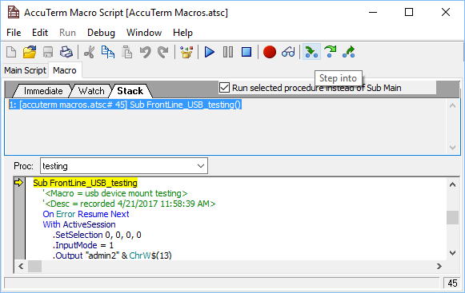
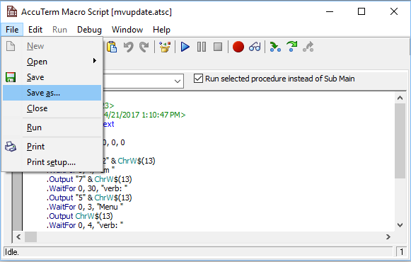
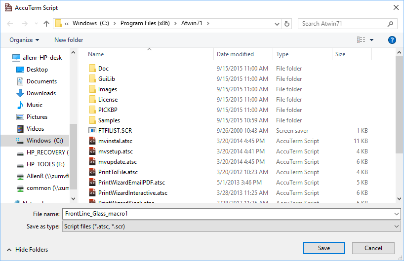

# Accuterm Macro Recording

**Created At:** 6/26/2017 9:25:53 PM  
**Updated At:** 8/11/2017 12:03:37 AM  
**Original Doc:** [261242-accuterm-macro-recording](https://docs.jbase.com/36040-migration-knowledge-base/261242-accuterm-macro-recording)  
**Original ID:** 261242  
**Internal:** Yes  

# Accuterm Macro Recording

**RECORDING A SESSION**

## The Macro Record mini control appears at the foot of the screen.

Record your keystrokes and screen sequences.

## Stop the recording and save the recording session as a Macro.

## Provide a name and description for the recording.

## 

**PLAYBACK A SESSION**

## Select the session to playback.

Edit or play back a session in debug (to single step through a recorded sequence)

## Select the session from the drop down Macro list.

## Check the “Run selected procedure instead of Sub Main” checkbox.

## Run or “Step into” the Macro to run through the session.

## Save the Macro

