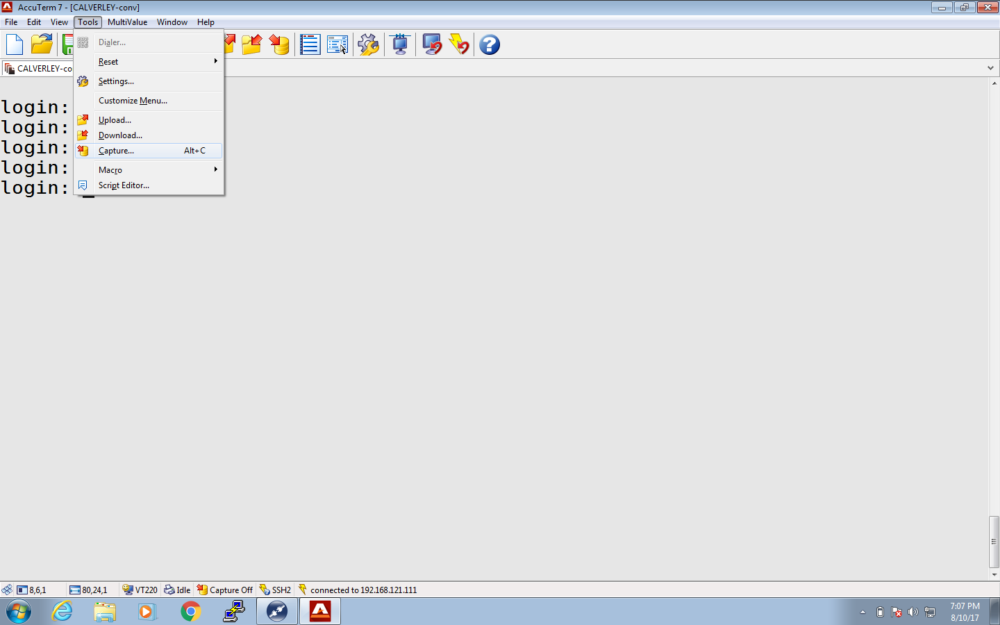
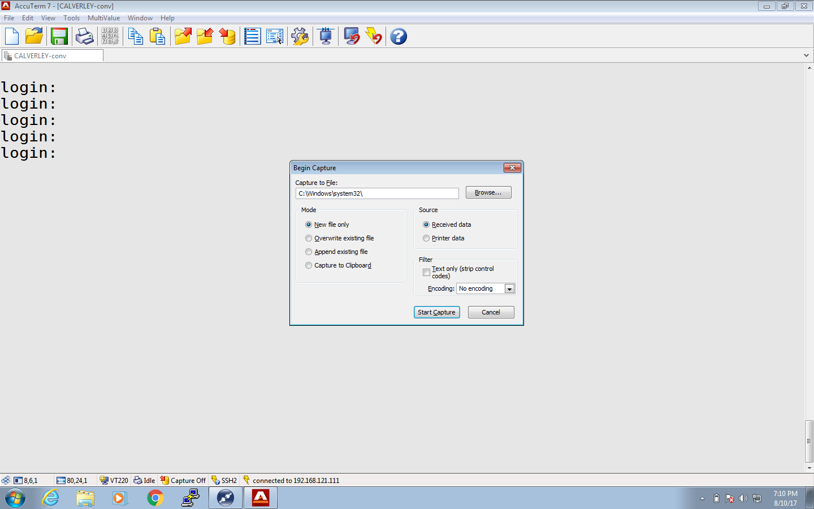
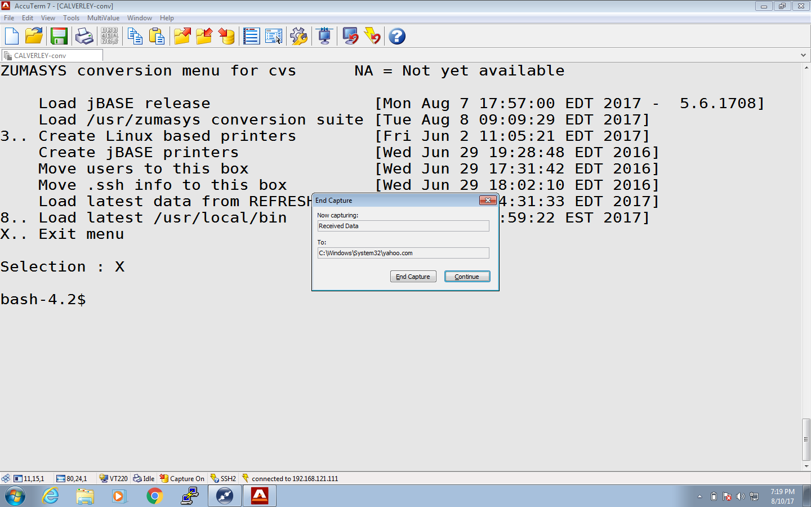

# AccuTerm Screen Capture

**Created At:** 8/11/2017 12:08:30 AM  
**Updated At:** 8/11/2017 3:31:48 PM  
**Original Doc:** [266644-accuterm-screen-capture](https://docs.jbase.com/36040-migration-knowledge-base/266644-accuterm-screen-capture)  

**RECORDING A SESSION**

1.) Click on Tools -&gt; Capture

2.) That will bring up the following modal:

Select the appropriate options:

- Capture to File - &lt;file save location&gt;
- Mode - "New file only"
- Source - "Received data"
- Filter - leave unchecked

Click on "Start Capture".

3.) Do your stuff

4.) To end the capture, Tools -&gt; Capture again, which will bring up the "Screen Capture" widget:

Click on "End Capture" to stop.  It will now write out the results of the screen capture to the "Capture to File" specified in step 2.  This is just a text file with everything that was typed in and what the screen displayed.

Clicking on "Continue" will minimize the widget and return focus back to the main window so you can continue working.

