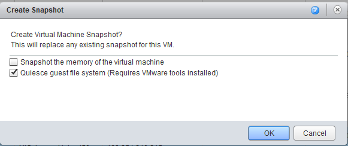
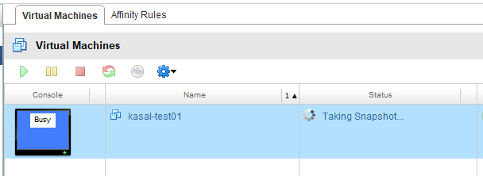

# VM Snapshot

**Created At:** 8/24/2017 5:42:25 PM  
**Updated At:** 8/24/2017 5:46:24 PM  
**Original Doc:** [vm-snapshot](https://docs.jbase.com/36040-migration-knowledge-base/vm-snapshot)  

Log into the customer’s vCloud environments (URL and Credentials are in ConnectWise) and create a VM level snapshot just prior to performing any work. Should something go south, reverting to the snapshot will take the VM back to the state when the snapshot was created.

Once the work is complete, remove the snapshot. Keeping snapshots longer than a day on a VM can cause performance issues. I have documented this simple process below. On premise virtualized VMs have the same functionality with a similar process.

Another option which I do in addition to a VM snapshot when performing work on a database is to create a backup of the database as well. I then have two options for restore.

1. Right click the VM and select “Create Snapshot”.

1. Select the desired options. (In most cases you probably don’t need to snapshot memory)

1. Wait for the process to Complete.
2. If you need to revert or are done with maintenance and ready to remove the snapshot, right click the VM again and select the option you need.

