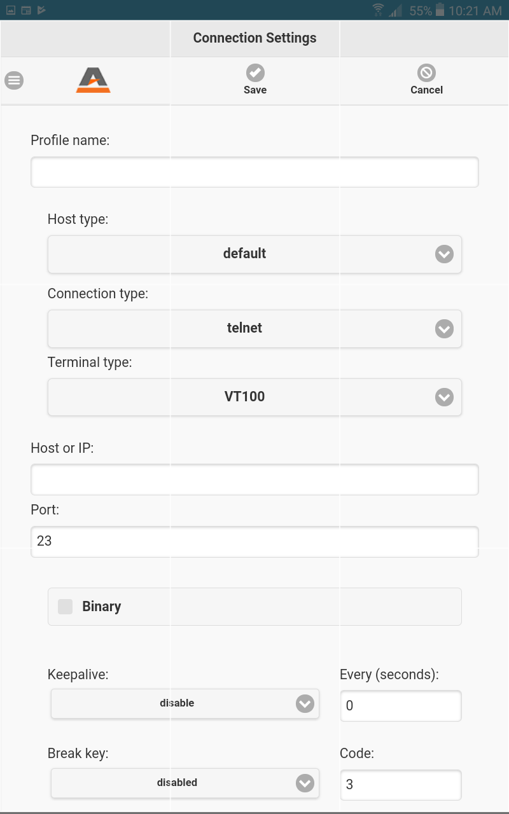

# AccuTerm Mobile: Connection Settings

**Created At:** 11/15/2019 6:10:29 PM  
**Updated At:** 11/15/2019 7:32:18 PM  
**Original Doc:** [connection-settings](https://docs.zumasys.com/accutermmobile/connection-settings)  
**Original ID:** 494595  
**Internal:** No  

AccuTerm supports Telnet connections to host machines over a TCP/IP network. Any Telnet server (host) on the network, including hosts on the Internet, can be accessed.

### Host Details

| <!----> | <!----> |
| --- | --- |
| Host Type | If your host is listed in the Host Type list, select it, otherwise, just use the default host type. By selecting a host type from this list, certain advanced options are configured to be compatible with the specified host type. For some host types, the port number and host terminal type are also adjusted. |
| Connection Type | The Connection type drop-down list is used to select a connection type. Based on the connection type selected, other configuration options may be available. For example, if the connection type is a network protocol, the device licensing options are available. The specific settings for each connection type will be described later in related topics. |
| Terminal Type | In order for AccuTerm to work properly with terminal-based applications, the terminal type that AccuTerm is emulating must match the terminal type the host application is configured or designed to use. Select the terminal type (emulation or personality) from the drop-down list. If you select the wrong type, your screen will probably be scrambled, and you should try a different type. |
| Hostname/IP Address | Enter the hostname or IP address in this field. If the desired hostname has been used previously when configuring a Telnet session, you may select it from the drop-down list by clicking the drop-down arrow in this field. |
| Port | If the Port field is left blank, or set to "Default" AccuTerm will use TCP port 23 (the default port for Telnet). If a different port is used for Telnet connections to your host, enter that port number in this field. Certain host systems, such as Raining Data D3, allow a host process number (PIB) to be mapped to a specific TCP port number. You can use the Port setting to specify the port number mapped to your process number. Consult with your system administrator for this setting.  |

### Host Settings

| <!----> | <!----> |
| --- | --- |
| Keepalive | Although the Telnet protocol specification does not provide for "keepalives", AccuTerm can send periodic commands that should be ignored by most Telnet servers. Using keepalives may prevent the host (or router) from detecting that the connection is idle and forcing a disconnect. To use keepalives, select either DMARK or NOP as the command to send as a keepalive. Enter the desired interval in the every... sec field. |
| Break key | Normally, AccuTerm sends the Telnet "interrupt process" command when you press the CTRL+BREAK key. If your host requires a different BREAK command, or to use a control character instead of a command, select the desired option from this drop-down list. If you select "control character", enter the decimal value of the control character to send in the code field (for CTRL+C, the decimal value is 3). |

