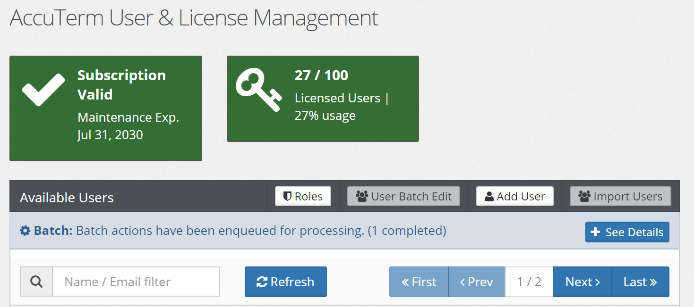

# AccuTerm 8: Batch User Actions

**Created At:** 10/11/2019 12:21:56 AM  
**Updated At:** 10/11/2019 12:52:27 AM  

There are multiple options an AccuTerm user has access to when it is being created; whether it is licensed and if the user will have access to AccuTerm Web. With the introduction of Batch User Actions, you can now enable or disable those features in one mass action.

1. Select User Batch Edit button

2. Select the users you wish to update options and select the Next button.

### Info

ctrl + a will select all users

ctrl + mouse click will allow you to select multiple users per mouse click

3. Select the Batch Action you would like to enable or disable for the user group by clicking the checkbox on the left and click Next button to continue.

### Info

Currently, you can enable or disable the following features:

- Provision AccuTerm Desktop license
- Grant access to AccuTerm.IO

4. The last step is to confirm the Batch Action Process, review the action and users selected and click the Complete button to initiate the batch action. Upon completion, you will receive a success message and be directed back to the main Users & Licenses screen.

### Info

By selecting the See Details button, you can view the progress of the batch action and the success or failure of each action.

