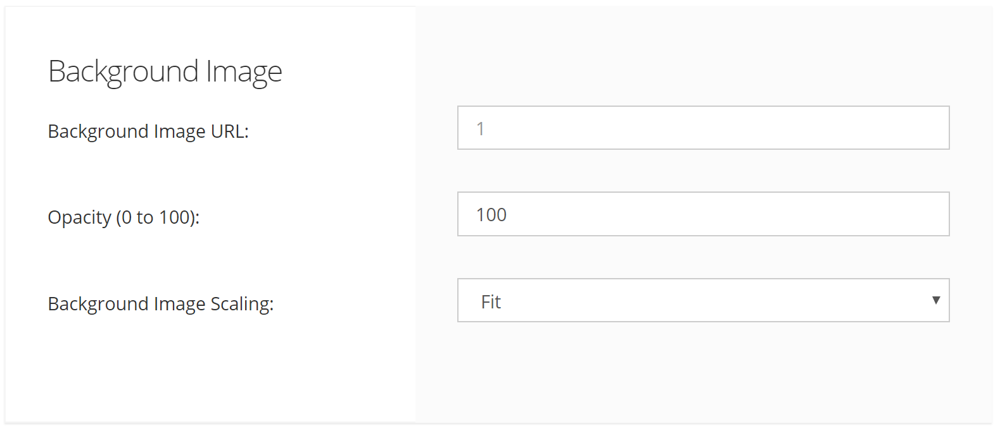

# AccuTerm 8: Terminal Screen Options

**Created At:** 8/15/2019 10:31:23 PM  
**Updated At:** 8/15/2019 10:46:31 PM  
**Original Doc:** [accuterm-8-terminal-screen-options](https://docs.zumasys.com/accuterm/accuterm-8-terminal-screen-options)  
**Original ID:** 443898  
**Internal:** No  

Use the Screen Settings panel to specify the size of the terminal screen, the number of screen pages, the number of history rows, the status line, and other options.

## Screen Size

There are two separate screen sizes that AccuTerm supports: normal and extended. These sizes are used to emulate the 80 and 132 column modes of the Wyse and VT terminals. AccuTerm has taken the extended and normal modes one step further: with AccuTerm you can define both the normal and extended modes to be any number of columns or rows (up to a maximum of 240). You can select which screen size is active when the session is first opened by checking the Active box for the desired size. You will probably leave these settings at their default settings of 80 columns by 24 rows for normal mode and 132 columns by 24 rows in extended mode. If you have software that supports other screen sizes, you can experiment with these settings until you find a size that you like. The number of rows may change if you change terminal emulations. The console terminal emulations use 25 rows with no status line; others use 24 rows with one or more status lines. When AccuTerm switches between the normal and extended modes, one of two things will happen: either the font will change the size to fit the visible screen, or scroll bars will be displayed if the full screen will not fit within the session window at the selected font size (see Fonts).

## Screen Size Settings

| <!----> | <!----> |
| --- | --- |
| Screen Pages: | Some of the terminals which AccuTerm emulates support multiple addressable pages. With AccuTerm, you can have up to 25 pages. |
| History Rows: | AccuTerm supports a "history" or "scrollback" buffer, which saves lines which have scrolled off of the terminal screen. To use this feature, specify how many rows (up to 10,000) are to be saved. When the history buffer has been enabled (by setting the number of rows), use the vertical scroll bar, mouse wheel, or keyboard commands to scan history. You can use CTRL+SHIFT+PGUP, CTRL+SHIFT+PGDN, CTRL+SHIFT+UP, CTRL+SHIFT+DOWN, CTRL+SHIFT+HOME, and CTRL+SHIFT+END to scan the history. |
| Status & Message Lines: | Some of the terminals that AccuTerm can emulate display status, function key labels or host messages on the top or bottom lines of the screen. Depending on the terminal emulation selected, you may be able to adjust the number of status lines to use. |

## Screen Options

| <!----> | <!----> |
| --- | --- |
| Automatic Line Wrap: | When this option is checked, automatic line-wrap is enabled. When the cursor reaches the end of a line, typing another character normally causes the cursor to move to the beginning of the next line. When this option is not set, the cursor does not move. |
| Cursor Style: | AccuTerm supports either a blinking block or blinking underscore for the terminal screen cursor. |

## Color & Themes

The Theme buttons provide an easy way to select one of the built-in color themes. Themes consist of the palette colors, attribute colors and Visual Styles. To preview any of the built-in themes, hover the mouse over one of the theme buttons. The Preview panel temporarily changes to the theme under the mouse so you can see the effect without actually changing the current settings. To select one of the built-in themes, click the theme's button. Some of the built-in themes utilize AccuTerm's "Visual Styles" feature which can make character-based screens look like Windows. This effect requires careful use of the visual attributes by the application. Each rectangular block of characters on the screen with a common visual attribute will be enclosed in a thin border if one is defined for that attribute. Visual Styles supports 3 border styles: inset, raised and flat.

The built-in themes are:

- Modern Code
- Default Colors
- Legacy Colors
- White on Black
- System Colors
- Black on White
- Classic Windows
- Green Screen
- Modern Windows
- Reverse Green Screen

## Background Image

## Attribute Effects

Since AccuTerm assigns colors to the visual attributes, some of the visual effects are not as important as they were on a real terminal. You can disable the underline effect or the blinking effect is you like. The assigned colors will still be used for those attributes, but the actual underline or blink will be disabled.

