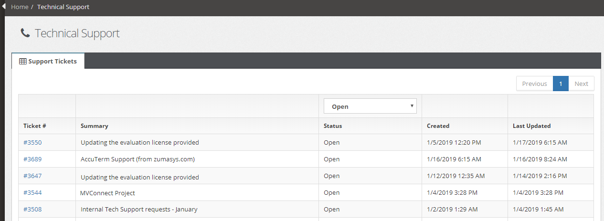

# Customer Portal: Support Tickets

**Created At:** 8/16/2019 11:57:57 PM  
**Updated At:** 8/17/2019 12:04:48 AM  
**Original Doc:** [customer-portal](https://docs.zumasys.com/customerportal/customer-portal)  
**Original ID:** 444379  
**Internal:** No  

### Support Ticket Page

Select a Support Ticket you wish to review or update by selecting the Ticket # link.

Once the ticket is opened, you can review the notes.  Click Add Comment button at  the bottom of the support ticket to add a comment or close the ticket.

Add your comment and select Submit or Submit & Close.

## 

