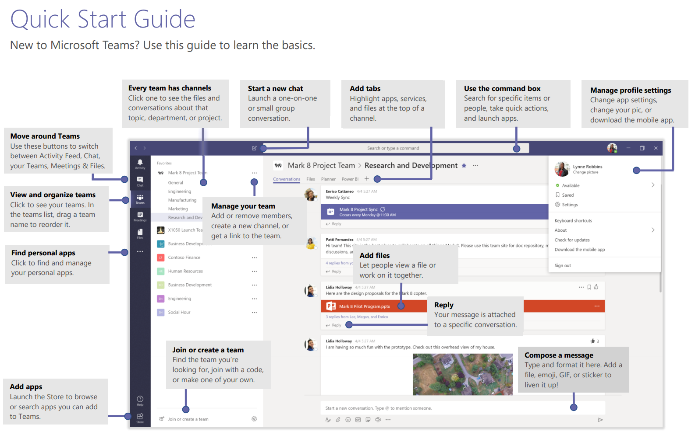
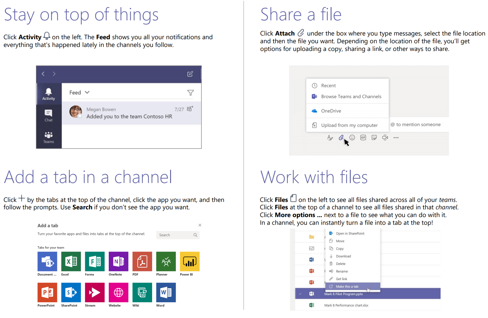

# Microsoft Teams

**Created At:** 1/3/2019 2:31:28 PM  
**Updated At:** 1/3/2019 2:37:00 PM  
**Original Doc:** [355158-microsoft-teams](https://docs.zumasys.com/47150-internal-applications/355158-microsoft-teams)  

This upcoming Wednesday, we will be having our first company meeting as Zumasys 2.0. Previously, we utilized Slack for internal communication; chat, email and company announcements. Moving forward we will be utilizing Microsoft Teams as a replacement for Slack. Microsoft Teams will eventually replace Microsoft Skype for Business, with all of Skype’s functionality being incorporated into Teams. Before Wednesday’s meeting, can you please install the Desktop and Mobile client on your devices as we will be utilizing it to communicate during our company meeting. I have included instructions below, please reach out if you need assistance.

Thanks,
Corey

# Get clients for Microsoft Teams

Microsoft Teams has clients available for desktop (Windows and Mac), web, and mobile (Android, iOS, and Windows Phone). These clients all require an active internet connection and do not support an offline mode.

## Desktop client

The Microsoft Teams desktop client is a standalone application and currently not part of Office 365 ProPlus. Teams is available for both Windows (7+), both 32-bit and 64-bit versions, and macOS (10.10+). On Windows, Teams requires .NET framework 4.5 or later; the Teams installer will offer to install it for you if you don't have it.

The desktop clients provide real-time communications support (audio, video, and content sharing) for team meetings, group calling, and private one-on-one calls.

Desktop clients can be downloaded and installed by end users directly from [https://teams.microsoft.com/downloads](https://go.microsoft.com/fwlink/?linkid=855754) if they have the appropriate local permissions (admin rights are not required to install the Teams client on a PC but are required on a Mac).

IT admins can choose their preferred method to distribute the installation files to computers in their organization, such as System Center Configuration Manager (Windows) or Jamf Pro (macOS). To get the MSI package for Windows distribution, see [Install Microsoft Teams using MSI](https://docs.microsoft.com/en-us/microsoftteams/msi-deployment).

**Note**

Distribution of the client via these mechanisms is only for the initial installation of Microsoft Team clients and not for future updates.

### Windows

The Microsoft Teams installation for Windows provides downloadable installers in 32-bit and 64-bit architecture.

**Note**

The architecture (32-bit vs. 64-bit) of Microsoft Teams is agnostic to the architecture of Windows and Office that is installed.

The Windows client is deployed to the AppData folder located in the user’s profile. Deploying to the user’s local profile allows the client to be installed without requiring elevated rights. The Windows client is installed in the following locations:

%appdata%\local\Microsoft\Teams

%appdata%\roaming\Microsoft\Teams

When users initiate a call using the Microsoft Teams client for the first time, they might notice a warning with the Windows firewall settings that asks for users to allow communication. Users might be instructed to ignore this message because the call will work, even when the warning is dismissed.

**Note**

Windows Firewall configuration will be altered even when the prompt is dismissed by selecting “Cancel”. Two inbound rules for teams.exe will be created with Block action for both TCP and UDP protocols.

**Mobile clients**

The Microsoft Teams mobile apps are available for Android, iOS, and Windows Phones, and are geared for on-the-go users participating in chat-based conversations and allow peer-to-peer audio calls. For mobile apps, go to the relevant mobile store for Google Play, Apple App Store, and Microsoft Store.

Supported mobile platforms for Microsoft Teams mobile apps are the following:

**Android**: 4.4 or later

What is Teams: [https://support.office.com/en-us/article/video-what-is-microsoft-teams-422bf3aa-9ae8-46f1-83a2-e65720e1a34d?wt.mc\_id=otc\_microsoft\_teams&ui=en-US&rs=en-US&ad=US](https://support.office.com/en-us/article/video-what-is-microsoft-teams-422bf3aa-9ae8-46f1-83a2-e65720e1a34d?wt.mc_id=otc_microsoft_teams&ui=en-US&rs=en-US&ad=US)

Interactive Demo: [https://teamsdemo.office.com/](https://teamsdemo.office.com/)

Quick Start

