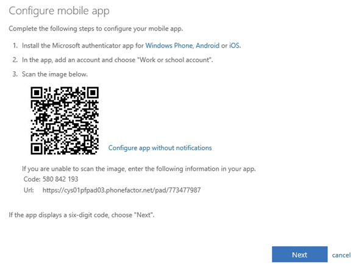
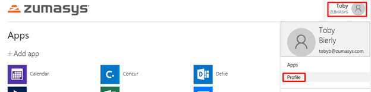
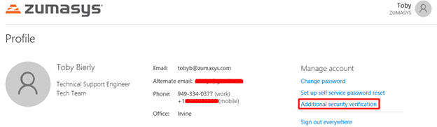
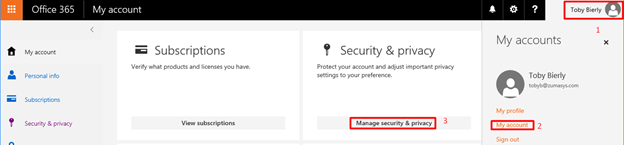
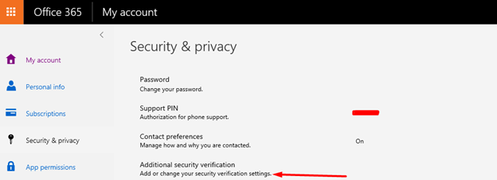
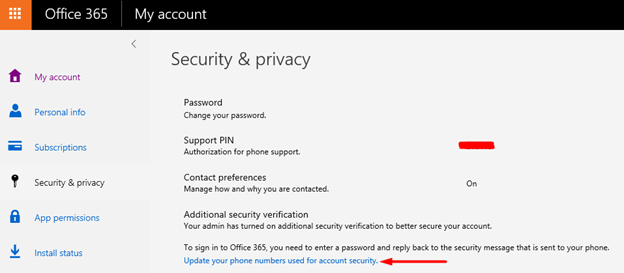

# O365 MFA Account Setup

**Created At:** 1/3/2019 2:15:44 PM  
**Updated At:** 1/3/2019 2:21:41 PM  
**Original Doc:** [355157-o365-account-setup](https://docs.zumasys.com/47150-internal-applications/355157-o365-account-setup)  
**Original ID:** 355157  
**Internal:** Yes  

Prepare a bit by downloading the Authenticator application to your mobile phones which will be required to complete the setup to your account.

Android: [https://play.google.com/store/apps/details?id=com.azure.authenticator&hl=en\_US](https://play.google.com/store/apps/details?id=com.azure.authenticator&hl=en_US)

Apple: [https://itunes.apple.com/us/app/microsoft-authenticator/id983156458?mt=8](https://itunes.apple.com/us/app/microsoft-authenticator/id983156458?mt=8)

**Enroll Account for MFA**

The user is required to enroll for MFA once the feature has been enabled for their account by an administrator. The user should sign in to Office 365 as usual with their username and password, and then click **Set it up now** on the sign in screen.

On the *Additional security verification* screen, select **Mobile app** from the menu below *Step 1: How should we contact you?*

Select **Receive notifications for verification**

Click **Set up** to setup the Mobile Authenticator app

### Info

Change this to **Notify me through app**or **Receive notifications for verification**(not sure which terminology is used)

Download and install the Microsoft Authenticator app on your iPhone or Android.

Open the Microsoft Authenticator app on your phone and click **Scan Barcode**.

Use the camera on your phone to scan the barcode in the *Configure mobile app* dialog. You’ll then need to wait a couple of seconds while the app activates the new account.

Click **Finished** in the browser window.

Back on the *Additional security verification* screen, click **Contact me**.

You’ll receive a notification on your phone. Open it and you’ll be taken to the Microsoft Authenticator app. Click **Approve** to complete the sign-in process.

Click **Close** in the Microsoft Authentication app.

Web-based, mobile apps, and properly configured recent versions of Outlook can use Microsoft Authenticator app verifications for MFA logins, but applications such as the native mail apps for iPhone or Android require an app password. The final step provides you with an app password for these apps.

Finally, copy the app password by clicking the **copy** icon to the right of the password, and paste it somewhere safe. Click **Finished**.

You’ll be prompted to sign in again, this time by verifying the login using the Microsoft Authenticator app.

**Adjusting settings after initial MFA configuration**

There are at least 2 ways for a user to access their already-configured MFA settings:

Method 1

- Browse to [https://myapps.microsoft.com](https://myapps.microsoft.com) and sign in with your O365 credentials.
- Click on your name in the top right corner, and click **Profile**

****

- Click on **Additional security verification**

Method 2

- While signed in to the Office 365 portal, click on your user name in the top right corner, then click **My account**, and then click on **Manage security & privacy**

- Click on **Add or change your security verification settings**

****

- Click on **Update your phone numbers used for account security**

Regardless of which method you used, you should now be at the settings page.

- On this page, you can choose again whether to “Notify me through app” (the most convenient, as you cell phone prompts and you just tap Approve) or “Use verification code from app” (less convenient, because you have to open the Microsoft Authenticator app on your phone to find the  6-digit code you have to type into the login screen).
- All other authentication methods are disabled for Zumasys other than the **Authenticator app**.  You can click Configure on this screen if you need to reconfigure the Mobile Authenticator app.

