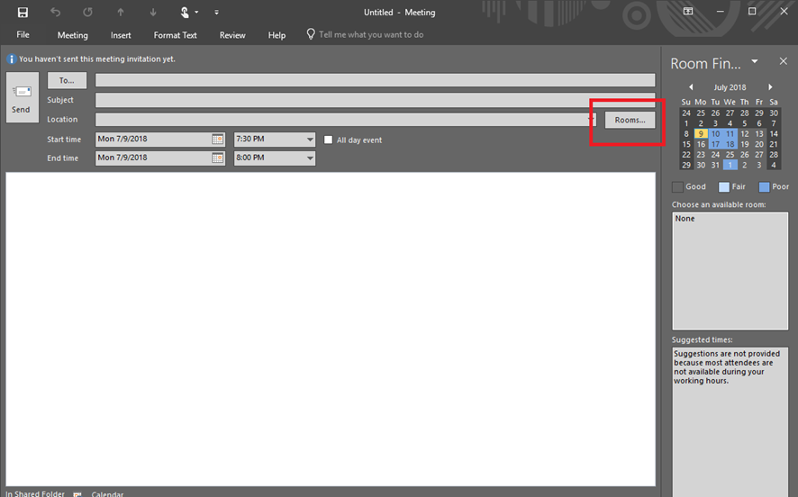
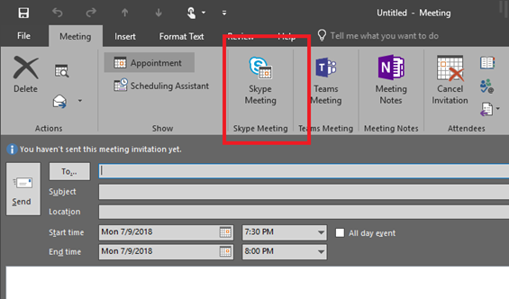

# Skype Conference Phone

**Created At:** 7/10/2018 4:58:52 PM  
**Updated At:** 7/10/2018 5:04:02 PM  
**Original Doc:** [skype-conference-phone](https://docs.zumasys.com/47150-internal-applications/skype-conference-phone)  

## Document Scope

How to utilize the Skype for Business conference phone.

You can book meetings on it like a regular resource room and it should auto-accept your invite (same way the upstairsconf or downstairsconf worked for Irvine). Here are the easy steps.

When setting up a new meeting click on the "Rooms..." button in Outlook meeting invite

You should get a list of rooms available - one of which will be "San Clemente Conference Room" - double-click on that and hit OK

Enable the meeting as a Skype meeting and you should be good to go.

You'll receive a response from the "room" noting the status of your meeting acceptance. Please note that it will auto-decline if there is any conflict and the phone will not be able to join a meeting if this happens.

The phone will look something like this on the screen (if the panel is dark just touch it to wake up the phone)

Tap the meetings to get a list of all meetings – (it will jump past this screen if there is only 1 upcoming meeting)

Tap your meeting to see the details and tap Join to join the call.

