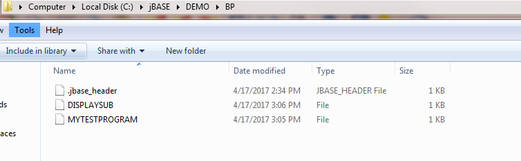

# Create a jBASE Program

<PageHeader />

## Document Scope

The following guide is an instructional walkthrough on creating a standard hash file as well as a directory file which will be used to create a simple program and subroutine.

## Create a standard hash file using CREATE-FILE command

```
CREATE-FILE MYDATA 1 13

[ 417 ] File MYDATA]D created , type = J4
[ 417 ] File MYDATA created , type = J4
```

Display the newly created file using LISTFILES command

```
LISTFILES

PATH :C:\jBASE\DEMO                       14:30:18  17 APR 2017
FILENAME....... TYPE   MODULO  SEP  BCKUP   CASING

MD]D            J4       17    1    yes      no
MYDATA]D        J4        1    1    yes      no
 MYDATA         J4       13    1    yes      no
```

The new file can also be seen in windows explorer


### Create a jBC type file using CREATE-FILE command

```
CREATE-FILE BP TYPE=JBC

[ 417 ] File BP]D created , type = JD
[ 417 ] File BP created , type = UD
[ 417 ] File BP]MOBJECT created , type = UD
```

Display the newly created file using LISTFILES command

```
LISTFILES

PATH :C:\jBASE\DEMO                              14:34:09  17 APR 2017
FILENAME........ TYPE   MODULO  SEP  BCKUP   CASING


BP]D              JD        1    1    yes      no
 BP              DIR                  yes      no
BP]MOBJECT       DIR                  yes      no
MD]D              J4       17    1    yes      no
MYDATA]D          J4        1    1    yes      no
 MYDATA           J4       13    1    yes      no
```

The new file can also be seen in windows explorer as a directory


### Create a new program using jED editor

```
jed BP MYTESTPROGRAM

NEW *File BP , Record 'MYTESTPROGRAM'          Insert      15:05:26
Command-> FI
0001 MSG = "This is my test program. Please hit enter to exit:"
0002 CALL DISPLAYSUB(MSG)
0003 INPUT ANS
-------------------------------- End Of Record --------------------


Record 'MYTESTPROGRAM' written to file 'BP'
```

### Create a new subroutine using jED editor

```
jed BP DISPLAYSUB

NEW *File BP , Record 'DISPLAYSUB'                Insert      15:06:12
Command-> FI
0001 SUBROUTINE DISPLAYSUB(MSG)
0002 CRT MSG:
0003 RETURN
-------------------------------- End Of Record -----------------------


Record 'DISPLAYSUB' written to file 'BP'
```

The contents of BP can be displayed using LIST command

```
LIST BP

BP............

DISPLAYSUB
MYTESTPROGRAM


 2 Records Listed
```

The contents can also be seen in windows explorer as a directory



These program can also be edited using any text editor including notepad


### Compile the program using BASIC command

```
BASIC BP MYTESTPROGRAM DISPLAYSUB

MYTESTPROGRAM
BASIC_18.c
Source file MYTESTPROGRAM compiled successfully
DISPLAYSUB
BASIC_18.c
Source file DISPLAYSUB compiled successfully
```

The compiled code can be displayed using LIST command

```
LIST BP
```

```
BP............

DISPLAYSUB
MYTESTPROGRAM


 2 Records Listed
```

Note that the compiled code for each program is stored in the OBJECT directory (i.e. BP,OBJECT or BP]MOBJECT).

### Catalog the basic program using CATALOG command

```
CATALOG BP MYTESTPROGRAM DISPLAYSUB

MYTESTPROGRAM
Object MYTESTPROGRAM cataloged successfully
DISPLAYSUB
Object DISPLAYSUB cataloged successfully
Library C:\jBASE\DEMO\lib\lib0.dll rebuild okay
```

The program can run from TCL prompt

```
MYTESTPROGRAM

This is my test program. Please hit enter to exit:?
```

The catalog process also created an executable that can be run from command prompt from the  C:\jBASE\DEMO\bin directory


The subroutine is not located in the bin directory. It can be found as an object in the C:\jBASE\DEMO\lib\objdir directory.


Run the executable by double clicking  MYTESTPROGRAM.exe. Notice the error as subroutine cannot be found. This is due to an environment variable not set to allow for subroutine to be found.


This can be resolved by adding the adding PUTENV("JBCOBJECTLIST=C:\jBASE\DEMO\lib") into MYTESTPROGRAM.

```
jed BP MYTESTPROGRAM
File BP , Record 'MYTESTPROGRAM'                           Insert      13:25:14
Command-> EX
0001 ERR = 0
0002 ERR = PUTENV("JBCOBJECTLIST=C:\jBASE\DEMO\lib")
0003 IF ERR = 1 THEN
0004   CRT 'JBCOBJECTLIST=C:\jBASE\DEMO\lib was set'
0005 END ELSE
0006   CRT 'JBCOBJECTLIST=C:\jBASE\DEMO\lib was not set'
0007 END
0008 MSG = "This is my test program. Please hit enter to exit:"
0009 CALL DISPLAYSUB(MSG)
0010 INPUT ANS
-------------------------------- End Of Record --------------------------------


Record 'MYTESTPROGRAM' exited from file 'BP'
```

Compile and re-catalog programs (see above steps)

Run the executable by double clicking MYTESTPROGRAM.exe.


Additional information:

> When you start up a jBASE process it preloads all shared objects from JBCOBJECTLIST into memory for that session. The 'ctest' subroutine does not yet exist so, after it is compiled and cataloged, the program that calls it must be run in a new session, as you've discovered. The way that is done is with EXECUTE @IM:"k" ( @IM is the same as CHAR(255), just as @AM is the same as CHAR(254) ).
>
> In fact, this is the way you would force any process to run within a new environment. For example, if you wanted a process to run in a different emulation and on a specific port number:
>
> ```
> shellout = @IM : "k"
> ok = PUTENV("JBCEMULATE=D3")
> ok = PUTENV("JBCPORTNO=42")
> EXECUTE shellout : "myprogram"
> ```
>
> When the EXECUTE finishes, it is back to its original environment. The new environment is only active during the EXECUTE process.

Back to [Installation Guides](./../README.md).

<PageFooter />
