# Linux Installation Guide

<PageHeader />

**Tags:**
<badge text='ubuntu' vertical='middle' />
<badge text='debian' vertical='middle' />
<badge text='centos' vertical='middle' />
<badge text='redhat' vertical='middle' />
<badge text='installing jbase on linux' vertical='middle' />
<badge text='linux' vertical='middle' />
<badge text='install ' vertical='middle' />
<badge text='jbase on linux' vertical='middle' />

## System Requirements

jBASE 5.8.x for Linux is officially supported on 64-bit versions of CentOS 7, Red Hat Enterprise Linux 7 or above, Ubuntu 18.04 and 20.04.  

If installed on other distributions you may receive a warning but allowed to continue, however prerequisites will not be installed on un-supported operating systems.

### Supported Operating Systems

- CentOS 7
- Red Hat Enterprise 7 and 8
- Ubuntu 18.04/20.04
  
See also our [Platform Availability Matrix](./../../platform-availability/README.md)  

### Info

- Please download jBASE and request an evaluation license from [https://www.zumasys.com/downloads/](https://www.zumasys.com/downloads/)
- Each step in this guide will highlight to which mode this step pertains. If you do not see the step during installation, skip to the next step as it may not apply to the mode chosen.

### Root Access

1. This document assumes you have superuser (su) or root access to the computer. Root or superuser commands will be represented with the pound sign or hash (#) character.
2. To gain root or superuser access, login to your system as root, or from a terminal prompt, type the (su) command.  
   1. Alternatively, as a sudoer, use "sudo" to change file properties and run the jBASE installer.

3. Enter the root password when prompted, and you will notice the command prompt changes to a pound or hash (#) sign.

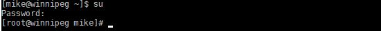

### Determining Operating System Version

1. To determine the operating system version, run the (uname -a) command from the terminal as root.

2. You should see this information displayed, x86\_64 indicates this is a 64-bit version of Linux.

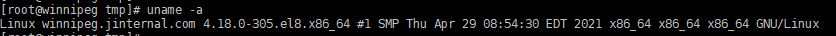

### Disk Space Requirements

1. jBASE for Linux requires the same minimum hardware specifications as the host operating system plus a minimum of 500MB of additional hard disk space, plus space for temporary files.

2. To determine disk space available, run the df -h command.

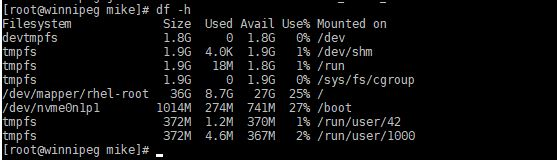

3. In this example this volume has 27 GB free.

### License Information

To install and use jBASE for Linux, you will need the **Linux_jBASE_5.8.x_xxxxxxxx_64bit.bin** file, a license key and root or su permissions, as discussed in the previous section. You should receive an email with an html attachment containing license key information.

After installation, a default two user license will initially be available. Use the jBASE license key provided to access additional functionality. Licenses can be installed using the [jlicenseupdate](./../../licensing/jlicenseupdate/README.md) utility.

For licensing assistance contact jBASE support in the United States at 866 582 8447 and in the United Kingdom at 0808 189 3266 or sales@jbase.com.

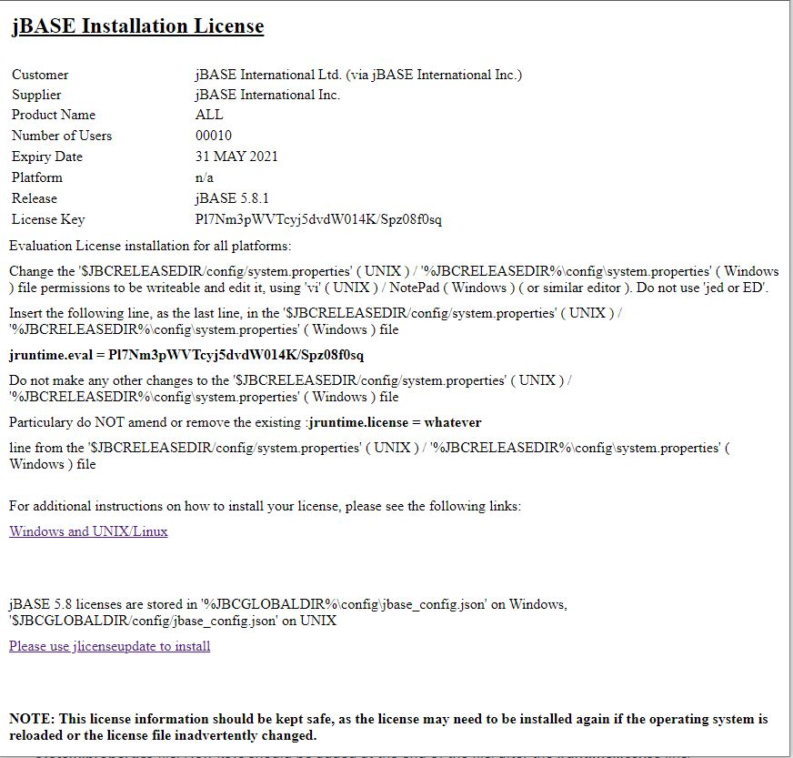

## Prerequisites

### Required Components

The jBASE installer will check for the following required packages and install them automatically:

- openssl
- gcc
- ksh
- ncurses-devel

### Installer Binary

1. Download the jBASE installer and place the installer in a convenient directory, for example, /tmp.  

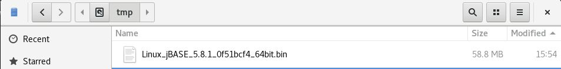

### Installer file permissions

1. Ensure that the installer is executable. Depending on the source of the installer file, most likely the execute mode of the installer file may have been lost. Use the chmod to change permissions.

2. First cd to the directory where the installer is located:

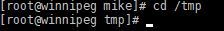

3. Run chmod u+x command to enable the file to be executed, note your filename and build number may vary. 

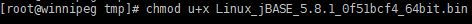

4. Then run ls -l command to verify the permissions.

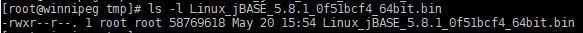

## Installation

### Starting the Installation

The jBASE installer is an interactive script-based installer. The installer will prompt you with various questions about the installation and after all of the information has been gathered, it will perform the installation automatically.

1. Launch the installer by typing ./ and then the install file name. Then press Enter.

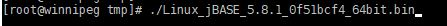

2. The installer checks operating system compatibility, then verifies that all of the required Linux commands used during installation are available. 

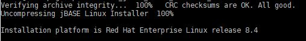

3.  Once the pre-installation tests are complete, a welcome message is displayed. Press enter to start the installation.  

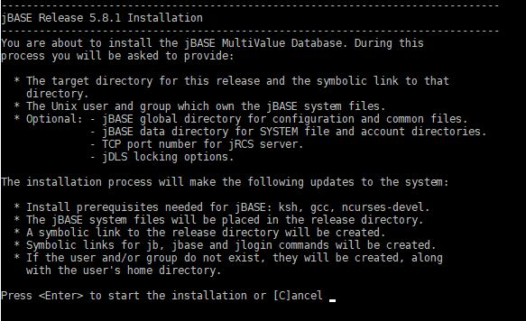

4. Type W if your company is within the EU, otherwise type O if outside the EU. Then press Enter.

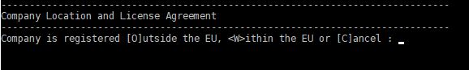

5. Press spacebar to page down through the license agreement, then type YES to accept and continue.

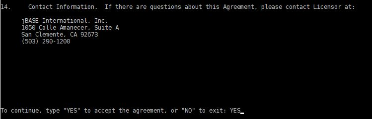

6. Choose an installation type.

jBASE provides two installation modes, **Express** and **Advanced**.

**Express**: installs jBASE with typical options and services. Select this option if you are new to jBASE and wish to get started quickly. Express mode installs jBASE, creates a jBASE Administrator user and account, creates a SYSTEM file to organize jBASE accounts, initializes the spooler, installs and starts jBASE services.

**Advanced**: allows you to select which features and services to install. Select this option if you wish to customize the location of the SYSTEM file, administrator account, or jBASE spooler, or if you do not require some of these features to be installed.  Also select this option to indicate which optional services to install (jDLS and jRCS).  

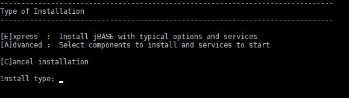  

Any required dependencies will now be installed. Your experience may vary:

```bash
Checking for required dependencies...

Installing dependency "ksh"...
Updating Subscription Management repositories.
Last metadata expiration check: 1:26:17 ago on Fri 21 May 2021 15:46:04 BST.
Dependencies resolved.
====================================================================================================================================================================================
 Package                         Architecture                       Version                                      Repository                                                    Size
====================================================================================================================================================================================
Installing:
 ksh                             x86_64                             20120801-254.el8                             rhel-8-for-x86_64-appstream-rpms                             926 k

Transaction Summary
====================================================================================================================================================================================
Install  1 Package

Total download size: 926 k
Installed size: 3.2 M
Downloading Packages:
ksh-20120801-254.el8.x86_64.rpm                                                                                                                     2.2 MB/s | 926 kB     00:00
------------------------------------------------------------------------------------------------------------------------------------------------------------------------------------
Total                                                                                                                                               2.2 MB/s | 926 kB     00:00
Running transaction check
Transaction check succeeded.
Running transaction test
Transaction test succeeded.
Running transaction
  Preparing        :                                                                                                                                                            1/1
  Installing       : ksh-20120801-254.el8.x86_64                                                                                                                                1/1
  Running scriptlet: ksh-20120801-254.el8.x86_64                                                                                                                                1/1
  Verifying        : ksh-20120801-254.el8.x86_64                                                                                                                                1/1
Installed products updated.

Installed:
  ksh-20120801-254.el8.x86_64

Complete!
  ksh installed.

Installing dependency "ncurses-devel"...
Updating Subscription Management repositories.
Last metadata expiration check: 1:26:31 ago on Fri 21 May 2021 15:46:04 BST.
Dependencies resolved.
====================================================================================================================================================================================
 Package                                   Architecture                    Version                                     Repository                                              Size
====================================================================================================================================================================================
Installing:
 ncurses-devel                             x86_64                          6.1-7.20180224.el8                          rhel-8-for-x86_64-baseos-rpms                          528 k
Installing dependencies:
 ncurses-c++-libs                          x86_64                          6.1-7.20180224.el8                          rhel-8-for-x86_64-baseos-rpms                           58 k

Transaction Summary
====================================================================================================================================================================================
Install  2 Packages

Total download size: 586 k
Installed size: 989 k
Downloading Packages:
(1/2): ncurses-devel-6.1-7.20180224.el8.x86_64.rpm                                                                                                  608 kB/s | 528 kB     00:00
(2/2): ncurses-c++-libs-6.1-7.20180224.el8.x86_64.rpm                                                                                                67 kB/s |  58 kB     00:00
------------------------------------------------------------------------------------------------------------------------------------------------------------------------------------
Total                                                                                                                                               671 kB/s | 586 kB     00:00
Running transaction check
Transaction check succeeded.
Running transaction test
Transaction test succeeded.
Running transaction
  Preparing        :                                                                                                                                                            1/1
  Installing       : ncurses-c++-libs-6.1-7.20180224.el8.x86_64                                                                                                                 1/2
  Installing       : ncurses-devel-6.1-7.20180224.el8.x86_64                                                                                                                    2/2
  Running scriptlet: ncurses-devel-6.1-7.20180224.el8.x86_64                                                                                                                    2/2
  Verifying        : ncurses-devel-6.1-7.20180224.el8.x86_64                                                                                                                    1/2
  Verifying        : ncurses-c++-libs-6.1-7.20180224.el8.x86_64                                                                                                                 2/2
Installed products updated.

Installed:
  ncurses-c++-libs-6.1-7.20180224.el8.x86_64                                                 ncurses-devel-6.1-7.20180224.el8.x86_64

Complete!
  ncurses-devel installed.

Installing dependency "ncurses-compat-libs"...
Updating Subscription Management repositories.
Last metadata expiration check: 1:26:44 ago on Fri 21 May 2021 15:46:04 BST.
Dependencies resolved.
====================================================================================================================================================================================
 Package                                     Architecture                   Version                                     Repository                                             Size
====================================================================================================================================================================================
Installing:
 ncurses-compat-libs                         x86_64                         6.1-7.20180224.el8                          rhel-8-for-x86_64-baseos-rpms                         331 k

Transaction Summary
====================================================================================================================================================================================
Install  1 Package

Total download size: 331 k
Installed size: 1.2 M
Downloading Packages:
ncurses-compat-libs-6.1-7.20180224.el8.x86_64.rpm                                                                                                   990 kB/s | 331 kB     00:00
------------------------------------------------------------------------------------------------------------------------------------------------------------------------------------
Total                                                                                                                                               979 kB/s | 331 kB     00:00
Running transaction check
Transaction check succeeded.
Running transaction test
Transaction test succeeded.
Running transaction
  Preparing        :                                                                                                                                                            1/1
  Installing       : ncurses-compat-libs-6.1-7.20180224.el8.x86_64                                                                                                              1/1
  Running scriptlet: ncurses-compat-libs-6.1-7.20180224.el8.x86_64                                                                                                              1/1
  Verifying        : ncurses-compat-libs-6.1-7.20180224.el8.x86_64                                                                                                              1/1
Installed products updated.

Installed:
  ncurses-compat-libs-6.1-7.20180224.el8.x86_64

Complete!
  ncurses-compat-libs installed.

openssl11-libs package already installed.

openssl11-libs package already installed.

gcc package already installed.

Initializing the installation environment and checking
for previous jBASE installations...
```

6. Type an installation path or press Enter to choose the default /opt/jbase/5.8.1 directory.

Applies to: **Express,** **Advanced**  

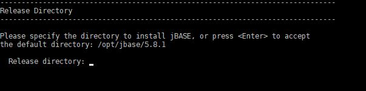

7. If the installer is able to locate an existing jBASE installation, the previous release directory will also be shown on this page. The installer will look for existing installations at the location pointed to by the JBCRELEASEDIR environment variable, as well as commonly used directories for past jBASE releases.

The default installation directory should be /opt/jbase/&lt;release number&gt;.

The installer will validate the specified installation directory. If it is a new directory, or an empty directory, installation may proceed. If the directory exists and contains a jBASE installation of the same release as the one being installed, the installation may proceed. Otherwise a different directory must be selected.

8. Then press Y and then Enter to confirm  

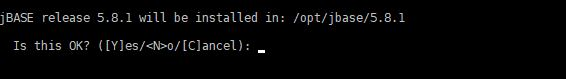

9. Specify a name for a symbolic link for the new release or press Enter to accept the default. The symbolic link name is typically used for the JBCRELEASEDIR environment variable. For jBASE, the default symbolic link name is 'CurrentVersion'.

If the installer identified a previous jBASE release, the symbolic link name for the previous release will also be displayed. If you have existing scripts that rely on the previous symlink name, you may want to use the same name here to avoid having to update any existing scripts.

Express install will use the default symbolic link name 'CurrentVersion':

Applies to: **Advanced**  

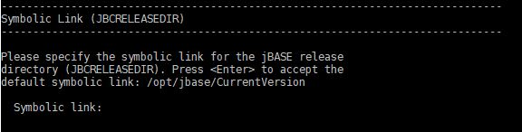

10.  Then press Y to confirm.  

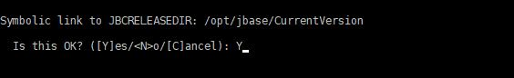

11. In a change from previous jBASE releases, the installer now asks for a location to store the jBASE Global files, i.e. files that are not specific to a jBASE release:

Express install will use the default /opt/jbase/global:

Applies to: **Advanced**  

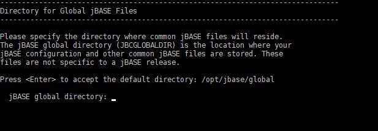

12. Then press Y to confirm.  


13. Specify a location where jBASE will store the SYSTEM file, the JBASEADM account and jBASE spooler, along with any new accounts that may be created.

Express install will use the default /jbasedata:

Applies to: **Advanced**  

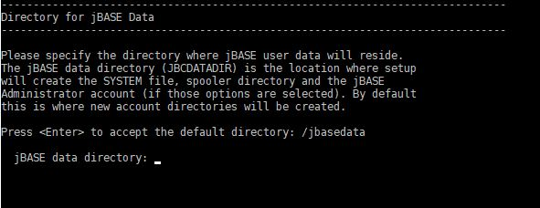

14. Then press Y to confirm.  

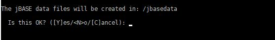

15. Specify a Linux user ID to own the jBASE system files, or press Enter to accept the default jbaseadm user account. If the user does not exist, the installer will create the user for you. Press Y to confirm.

Applies to: **Express,** **Advanced**  

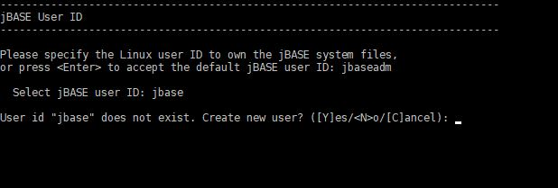

12. Enter a password for the Linux user, and again for verification.

Applies to: **Express,** **Advanced**  


13. Specify a group ID for the jBASE system files, or press Enter to accept the default jBASE group ID. Then press Y to confirm.

Applies to: **Express,** **Advanced**  

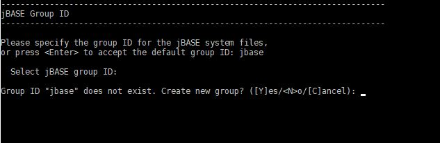

14. Here you can choose optional tasks to complete during installation, or choose the default to complete all tasks. Options include:

#### Create JBASEADM account for administrative functions  

The JBASEADM account can be used to perform jBASE administrative tasks such as creating or deleting other jBASE accounts.

#### Create SYSTEM file to organize jBASE accounts  

In jBASE, the SYSTEM file is optional. However, using a SYSTEM file provides a convenient way to organize your jBASE accounts, and is required when using Q-pointers and the LOGTO command in your jBASE applications.

#### Start jDLS distributed locking service

jDLS is responsible for resolving all record locking conflicts for jBASE processes. If jDLS is not running, jBASE will use the normal operating system locks. This is acceptable for small user populations, but the operating system locking mechanism has limits on the number of locks available, and on performance. See the [Introduction to jBASE Distributed Locking](./../../../../faq/introduction-to-distributed-locking/README.md) for more information regarding jDLS.

#### Start jRCS remote connectivity service  

The jBASE Remote Connectivity Server (jRCS) provides remote access to your jBASE system. jBASE System Manager uses this service to perform management tasks on your jBASE system. By default, the jRCS server listens on TCP port 8236. See the [jBASE Remote Connectivity Service knowledgebase article](./../../../../connectivity/jrcs/README.md) for more information regarding jRCS.

#### Note

> The jRCS client binary is located in /opt/jbase/CurrentVersion/clients/csjrcs

#### Initialize the print spooler  

Select this option to initialize the default print spooler configuration after a new installation. For upgrade installations, this option will restart the print spooler instead.

Applies to: **Advanced**  


15.  Specify the TCP port to use for the jBASE Remote Connectivity Server (jRCS), or press Enter to use the default port 8236. Then press Y to accept.

Applies to: **Advanced**  

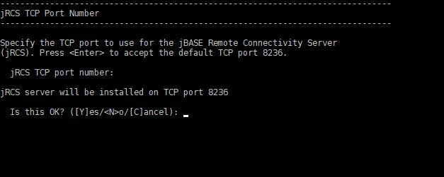

16. If you opt to start the jDLS service, you can select port-based or process-based locks or press Y to choose the default process-based locks. See the [Introduction to jBASE Distributed Locking](./../../../../faq/introduction-to-distributed-locking/README.md) for more information regarding jDLS.

Applies to: **Advanced**  

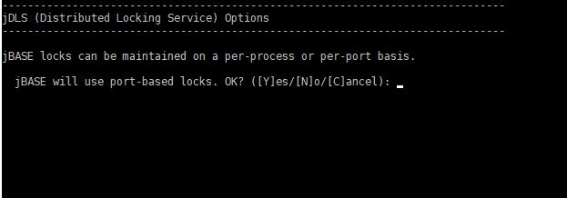

19. After verifying the information displayed on the summary page, type Y to begin the installation process. The following tasks will be completed.

Applies to: **Express,** **Advanced**

- Shut down jBASE daemons and ensure that no processes are using jBASE files
- Check for required packages and install any that are missing
- Backup the config directory from a previous installation
- Copy the jBASE release files to the destination directory
- Install the license keys in the 'system.properties' file
- Validate that jBASE is functional by executing a simple command (TERM)
- Create the jbaseadm user and jbase group, if needed
- Create a jbase\_env.sh script in the release directory to help with jBASE configuration
- Create the SYSTEM file (if option is selected)
- Initialize the spooler (if option is selected and performing a new install)
- Create the JBASEADM account (if option is selected)
- Update /etc/init.d with scripts to start jDLS, jRCS, jSPOOL daemons (if option is selected)  

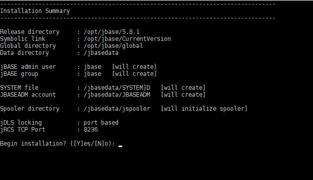

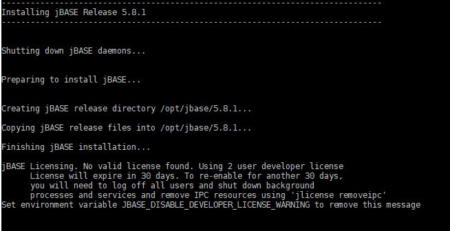

20. Congratulations, jBASE is now successfully installed. Press Y to login as JBASEADM.

If you have a local firewall installed on this server, it may prevent network users from connecting to the application. Your system administrator may need to allow access to TCP port 8236.

Applies to: **Express,** **Advanced**  

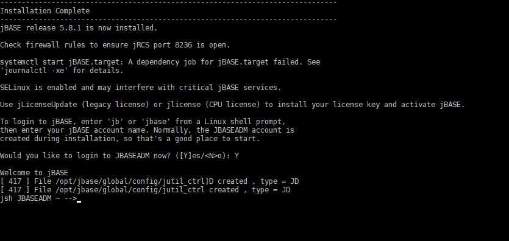

### Upgrading from a Previous Version

See [Upgrading to jBASE 5.8.x from a previous version](./../upgrading-to-5.8-linux/README.md)  

The jBASE installer will examine the directory pointed to by the JBCRELEASEDIR environment variable for a previous jBASE installation. If JBCRELEASEDIR does not point to a valid jBASE installation, the installer will test common installation locations for previous jBASE versions. The 'jdiag' command is used to that the directory contains a jBASE installation, as well as the previous jBASE release number.

If a previous jBASE release is found, the contents of the previous release 'config' directory will be backed up to 'config\_pre\_&lt;new version&gt; in the destination directory. For example, if, prior to installing this release of jBASE, JBCRELEAESEDIR points to '/opt/jbase5/5.2' and the new installation destination directory is '/opt/jbase/5.5.1', then the contents of '/opt/jbase5/5.2/config' will be backed up as '/opt/jbase/5.5.1/config\_pre\_5.5.1'.

If you have modified any of the configuration files in the previous release 'config' directory, you will need to apply your modifications to the corresponding files in the new installation 'config' directory. Such files may include:

**Config\_EMULATE** - Contains the JBCEMULATE settings

**Config\_TERM** - Contains translations from PICK TERM to linux TERM items

**jediLoggerAdminLog**, **jediLoggerConfig**, **jediLoggerTransLock** - Contains TJ log parameters

**jnet\_access**, **jnet\_config**, **jnet\_env**, **jnet\_map**, **jrfs\_config** - jRFS configuration files

**jspjobs\_config**, **jspform\_deflt**, **jspxl\_deflt** - jBASE spooler config files

**jLibDefinition** - Define shared object items

When upgrading a previous release of jBASE, the installer will not overwrite any existing JBASEADM account, SYSTEM file or jBASE Spooler configuration.

## Administration

### jBASE Users

jBASE users are normal Linux users. The installer automatically creates a Linux user group called jBASE. To create new Linux users joined to this group, follow the instructions below.

It is recommended that all jBASE users belong to the 'jbase' group, as their primary group. That way, they not only have access to other files belonging to the 'jbase' group, but any files they create will also belong to the 'jbase' group, and be accessible by other members of this group.

1. If you just completed the jBASE install above, exit out of the jSHELL prompt, by typing exit then Enter.

2. Run the useradd command to add a new Linux user called for example, jbaseuser. This can be any username you wish.

``` bash
useradd -m -k /opt/jbase/CurrentVersion/src/skel -g jbase jbaseuser
```


3. Set the Linux password for the new user:

``` bash
# passwd jbaseuser
```


### jBASE Accounts

Now that we have created a Linux user, in order to login to jBASE, we must create a corresponding jBASE Account.

1. From the root command prompt, launch the jSHELL prompt by typing jbase.

``` bash
# jbase
```

2. If prompted, type JBASEADM for the username.

3. You should now be back at the jSHELL prompt, type CREATE-ACCOUNT jbaseuser, or any account name to match the Linux user account you created in the previous section.

```
CREATE-ACCOUNT jbaseuser
```


4. Congratulations, now you have created the corresponding jBASE Account.

5. You may now login to the jSHELL prompt as the user:


6. You may also connect remotely from another Linux OS or Windows, typically with SSH protocol and a terminal emulator such as AccuTerm or Putty. First you are logging in with the Linux User username and password. Then, the jBASE environment variables automatically launch the jSHELL prompt. If prompted, enter the jBASE account username to continue. You should now be at the jSHELL prompt.

## Support

Contact jBASE support in the United States at 866 582 8447 and from the United Kingdom at 0808 189 3266.  

You may also email devsup@jbase.com and visit [http://www.jbase.com/support/](http://www.jbase.com/support/) for more support options.

Back to [Linux Installation Guides](./../README.md).

<PageFooter />
