# Upgrading to jBASE 5.8 on Linux from an earlier release

<PageHeader />

Documenting an upgrade to jBASE 5.8 from a previous jBASE 5 version could cover many possibilities.

Our initial document will cover a scenario where a recent version of jBASE 5 (i.e. 5.7.0 or later) is installed, and we are installing jBASE as a Linux user with sudo privileges:

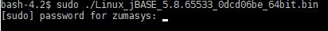  

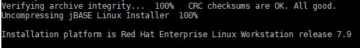  

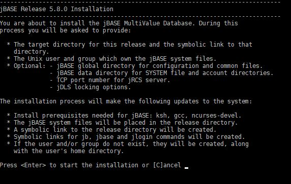  

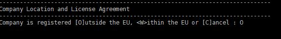  

Use the space bar to page through the License Agreement and then accept:

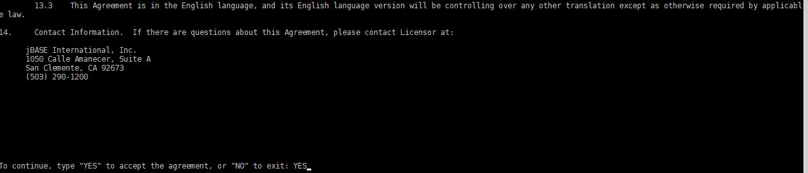  

We will opt for the Advanced install so that we have control over how jBASE 5.8 is installed:

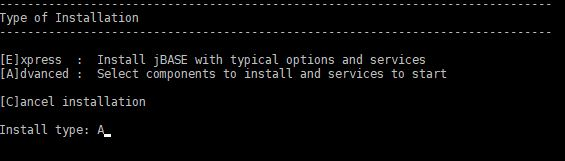  

The epel package is installed, if not present, so that the openssl11-libs can be added.

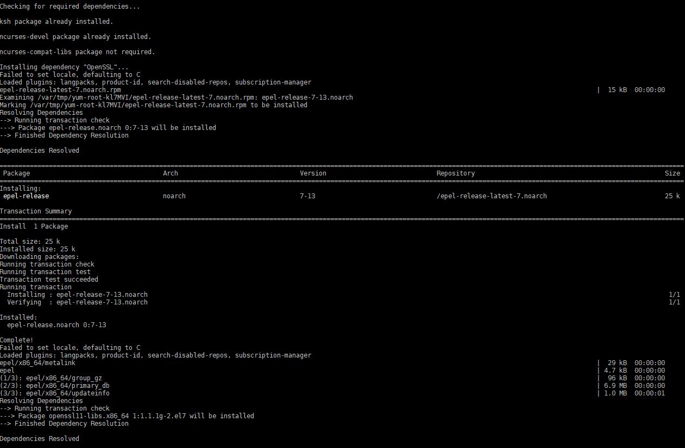

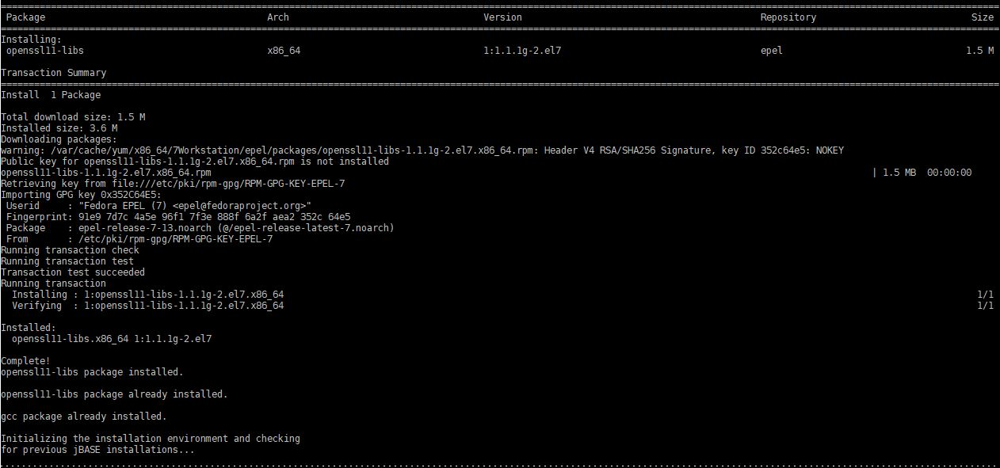

Release directory can be set or accepted:

  

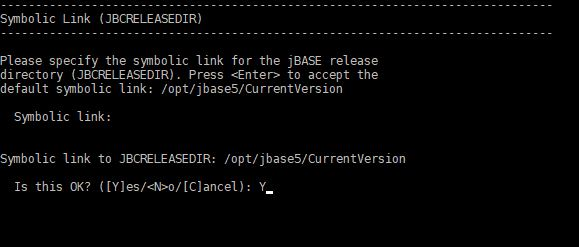

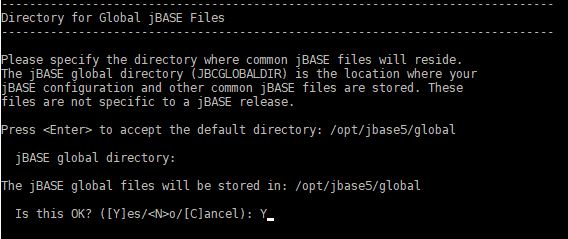

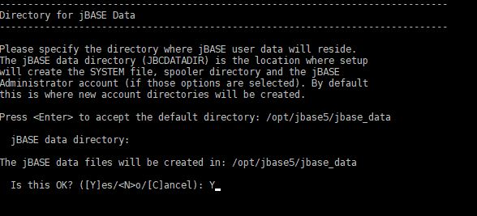

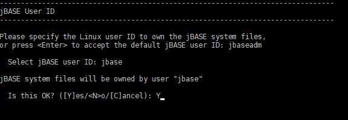  

Use the option number to remove what is not required:

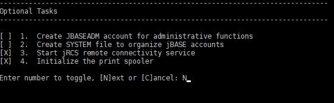

Set the port number to be used by jRCS, if opted for:

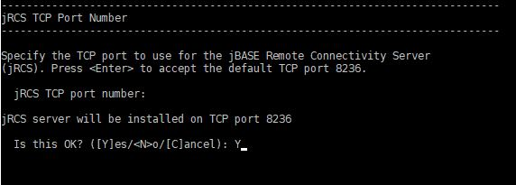

Set/Accept the jDLS options:

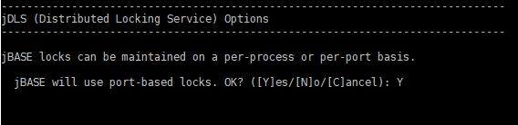  

  

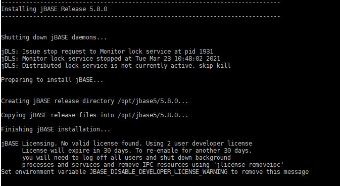  

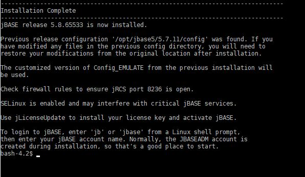  

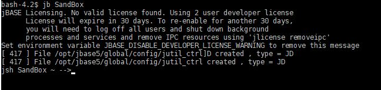  

Back to [Linux](./../README.md)  

<PageFooter />
