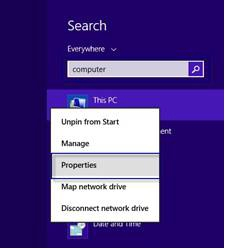
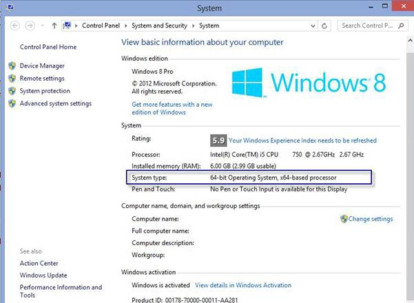
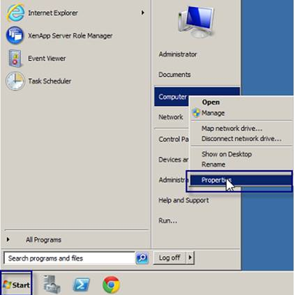

# Verify your Windows Operating System

<PageHeader />

## Windows 7

Click the start button, search for Computer, right-click Computer and choose Properties.

You should see the details highlighted as below;

## Windows 8/8.1

Click the Start button, search for Computer, right-click This PC and choose Properties.  

)

## Windows 10

Right-Click the start menu icon and choose System. 

### Windows Server 2008 R2

Click the start button, right-click Computer and choose Properties.

### Windows Server 2012 R2

Click the start menu, right-click this PC, choose Properties

Back to [Installation Guides](./../README.md).

<PageFooter />
