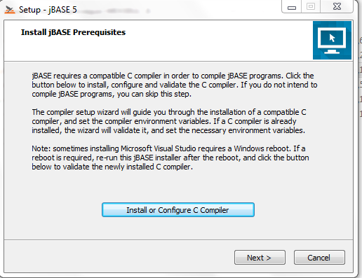
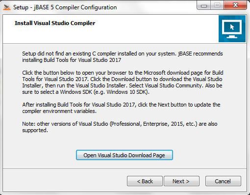

# Windows Compiler Installation

**Created At:** 6/21/2018 7:32:49 AM  
**Updated At:** 4/4/2019 5:00:16 PM  
**Original Doc:** [323804-windows-compiler-installation](https://docs.jbase.com/36690-installation-guides/323804-windows-compiler-installation)  
**Original ID:** 323804  
**Internal:** No  

**Tags:**
<badge text='windows' vertical='middle' />
<badge text='installation' vertical='middle' />
<badge text='compiler' vertical='middle' />

**For jBASE Releases 5.5.x, 5.6.x (except 5.6.6) and 5.7.0**

Follow this [link](./../jbase-release-5.5,-5.6,-5.7.0-%28except-5.6.6%29) to install a compiler.

Note: If you are installing jBASE on Windows 8 (not 8.1) or Windows Server 2012 (not R2), please follow this [link](./../windows-server-2012-&-windows-8-compiler-installation) to install a compatible version of Visual Studio BEFORE installing jBASE.

**For jBASE Releases 5.6.6, 5.7.1 and later**

The jBASE installer will install and configure a suitable C compiler for compiling JBC programs as a prerequisite to installing jBASE. The compiler installation is initiated by clicking the "Install or Configure C Compiler" button on the Prerequisites page of the jBASE installation.

The steps are:

1. Run the jBASE installer to start the prerequisite installer as below:

2. If no suitable compiler is found on the local machine, the following dialog will be shown:

3. Clicking on the **Open Visual Studio Download Page** button will open the Visual Studio download page.  An internet connection is required for the steps that come after this.

When the Visual Studio site opens, locate **Build Tools for Visual Studio 2017** and click the download link.

From jBASE 5.7.2.1 onward, a link to the **Build Tools for Visual Studio 2019** will be shown:

4. Make selections as in the screenshot below, and click install:

The selections available in Build Tools 2019 are much the same:

5. Depending on the installed components of the target machine and connection speeds, the compiler download and installation may take a while to complete. A reboot may also be required.

6. After the compiler install completes you will need to rerun the jBASE installer.

7. If the compiler installation succeeded, the jBASE installer will detect it and ask to configure the compiler. When the **Next** button is clicked, configuration will begin.

8. The user will be prompted to update environment variables:

7. Click the **Update Environment Variables** button and click **Next** after the confirmation prompt:

At this point, the compiler is installed, environment variables appropriately configured and [installation of jBASE](./../windows-installation-guide) can proceed.

## Note

Due to the recent deprecation of Windows SDK for Windows 7 compiler, jBASE has begun utilizing the C compiler for Visual Studio 2017.  One of the issues that users have encountered is "Warning, PATH environment variable too long, truncated".

End Users are experiencing this due to additional "redundant" entries being added to the PATH, INCLUDE and LIB Environment Variables.

[Here](./../../../environment-variables/notes-on-environment-variables-for-the-jbase-compiler) is an approach to resolving this warning, removing the "redundant" entries from your PATH, together with the INCLUDE entries, that will help cut down on the size.

### See Next

[Installing jBASE on Windows](./../windows-installation-guide)

[Upgrading from a Previous Version](./../upgrading-from-a-previous-version)

[Manual Installation of jDLS Service](./../../../jbase/manual-installation-of-jdls-service)

[Creating Accounts and Users](./../create-accounts-and-users)

[Manual License Key Installation](./../manual-license-key-installation)
