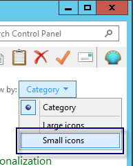
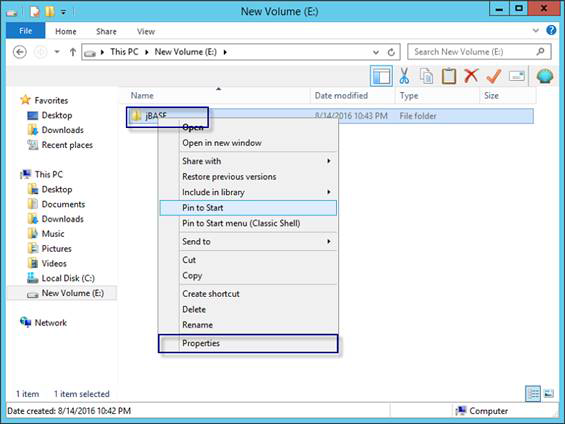
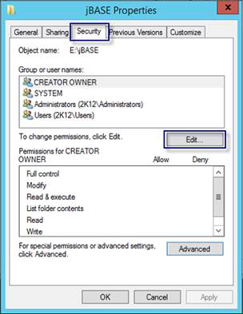
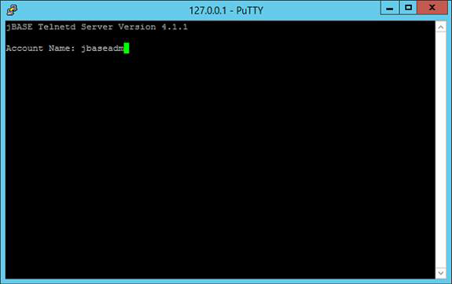
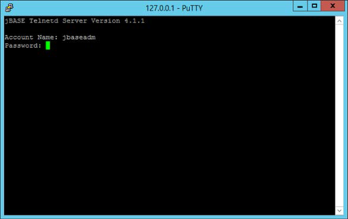
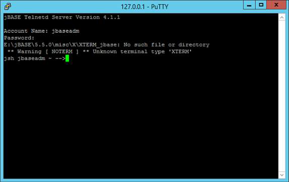
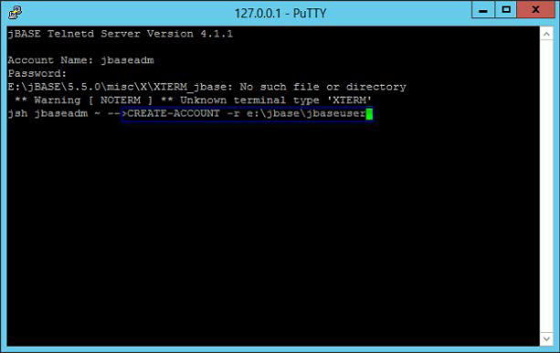
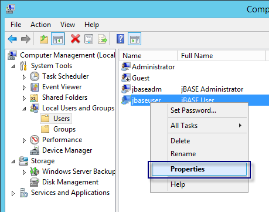
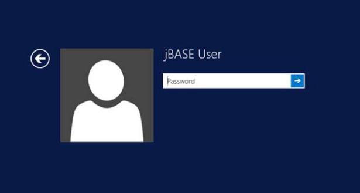
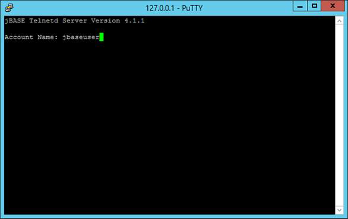

# Create Accounts and Users

<PageHeader />

**Tags:**
<badge text='how to set up users' vertical='middle' />
<badge text='how to set up windows users' vertical='middle' />

## Accounts and Users

jBASE accounts are user accounts inside jBASE, represented as a folder that contains jBASE data and executable files. jBASE Users are normal Windows account users and both local and domain users are supported. The jBASE Account depends on the Windows user account for remote access, for example via Telnet.

### Configuration of JBASEADM user

If you installed jBASE with the Express or Advanced option above, the installer may have automatically created a jBASE Account and folder under the jBASE install folder, for example ‘E:\jBASE\jBASEADM’. In such cases, the installer also created a local Windows user account, or a domain user account, called ‘jbaseadm’ and pointed the user home folder to the Account folder.

The Windows user account is important as it allows access to the built-in jBASE telnet server. As part of the "jbaseadm" user set-up, a skeleton remote.cmd will have been created in the user account that is used by Telnet to define the jBASE environment for the "jbaseadm" user.

jBASE users must be created on the local Windows computer or Active Directory domain of which the computer is a member.

jBASE users must have their home folder pointed to ‘jBASE Install folder\Username’, for example ‘E:\jBASE\jBASEADM’.

jBASE users must have permission to read and write into the jBASE application folder and subfolders, for example ‘E:\jBASE’ and subfolders.

Its recommended to create a User Group to apply permissions to the jBASE application folder.

1. Create a Group and add JBASEADM as a member.

2. Access Computer Management. This can be found by navigating through Control Panel or the Start Menu. Depending on your version of Windows this may vary and some steps may not apply.

  
3. From the Control Panel, choose category, then choose either Large Icons or Small Icons.

  
4. Choose Administrative Tools.

  
5. Choose Computer Management.

  
6. Navigate into Local Users and Groups, and into Groups folder.  
7. Right-Click Groups and choose New Group.

  
8.  Type a name for the group, for example, jBASE Users.

  
9. Click the Add button, and add the JBASEADM user.

  
10. Click Ok, and then Close button.  
11. Browse to the jBASE install folder, right-click the folder and choose properties.

  
12. Choose the Security tab and click Edit.

  
13. Click Add.

  
14. Type in the group name you created earlier, click OK.

  
15. Choose the Modify permission and the Allow checkbox, then click OK.


If your environment requires additional security, it is recommended to only allow the jBASE Users group permission to the following subfolders under the jBASE\5.5.0 folder; dev, jbase, data, misc, proc, src, and tmp.  
16. Click OK again, then log off Windows.  
17. Login as the localmachinename\jbaseadm.

  
18. Once logged in to Windows as jbaseadm you can test connecting into jBASE with telnet using AccuTerm or any telnet client.  
19. In this example, we will use the free telnet client called PuTTY.  
20. You may telnet to jBASE from the local computer or from any other computer over a network. From the local computer, open Putty and point it to 127.0.0.1 and choose Telnet, then click Open.

  
21. You should see this screen, enter jbaseadm as the username and press Enter.  

  
22. Type the same password you used to login to Windows and press Enter.

  
23. Congratulations, you have successfully connected into jBASE as jBASEADM using telnet, and are at the JSHELL prompt.



### Creating jBASE Accounts

To create additional accounts, make sure you have completed the steps above to create a jBASE Users group and applied the appropriate permissions to the E:\jbase folder. This will allow the JBASEADM account and associated Windows user to create the Account folder. We need to first create a jBASE Account, then a corresponding Windows user, just like the JBASEADM user account

1. From the telnet session opened in the previous section as jBASEADM, run the following command to create a jBASE Account for the user ‘jbaseuser’.

```
CREATE-ACCOUNT -r e:\jbase\jbaseuser
```

  
2. Press Enter, then you should see the message, Account ‘jbaseuser’ created.


### Creating corresponding Windows Users for jBASE Accounts

1. Open Control Panel.

  
2. From the Control Panel, choose category, then choose either Large Icons or Small Icons.

  
3. Choose Administrative Tools.

  
4. Choose Computer Management.  
5. Navigate into Local Users and Groups, and into the Users folder.

  
6. To create a new user, right-click on the Users folder, and choose New User.

  
7. Fill in the user information and click Create, then click Close.

  
8. Right-click on the user you created and choose Properties.

  
9. Click Member Of, then click Add.

  
10. We will add the new user to the jBASE Users Group we created in the previous section. Click OK.

  
11. Click the Profile tab.

  
12. Set the local path for the home folder to the jBASE install folder\username, for example ‘E:\jBASE\jbaseuser’.  
      
13. Click OK.

Remember, now that you have created the jBASE Account and the corresponding Windows User account, you must login to Windows as the user to build the local profile before you can telnet into jBASE as the user.  
14. Close the telnet session, then log off Windows.  
15. Login as the localmachinename\jbaseuser.

  
16. Once logged in to Windows, the user profile is built for the jbaseuser account. You may telnet to jBASE from the local computer or from any other computer over a network.  
17. From the local computer, open Putty and point it to 127.0.0.1 and choose Telnet, then click Open.

  
18. Type the account name jbaseuser and press Enter.

  
19. Type the same password you configured for jbaseuser, and press Enter.  
20. Congratulations, you are now logged in to jBASE as the new user account called jbaseuser and at the JSHELL prompt.

### Related Topics

[Upgrading from a previous jBASE version](./../../upgrading-from-a-previous-version/README.md)

[Installing the Compiler](./../windows-compiler-installation/README.md)

[Manual installation of jDLS service](./../../../../daemons/manual-installation-of-jdls-service/README.md)

[Creating Accounts and Users](./.)

[Manual License Key installation](./../../licensing/manual-license-key-installation/README.md)

Back to [Installation Guides](./../README.md).

<PageFooter />
