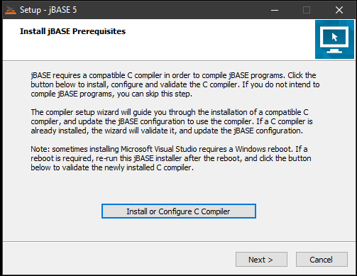
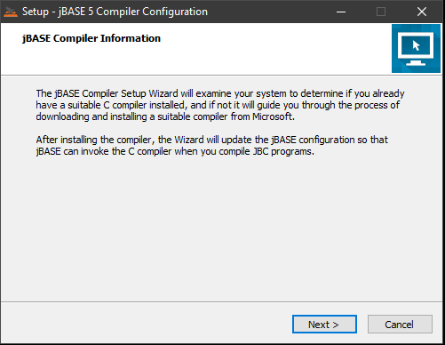
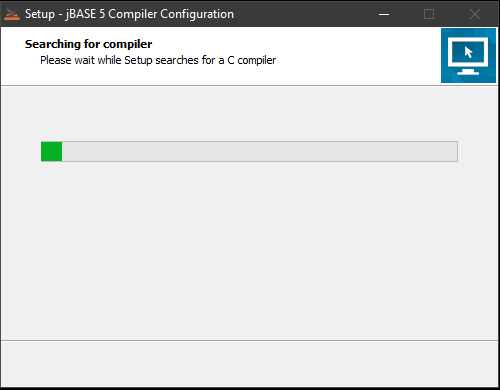
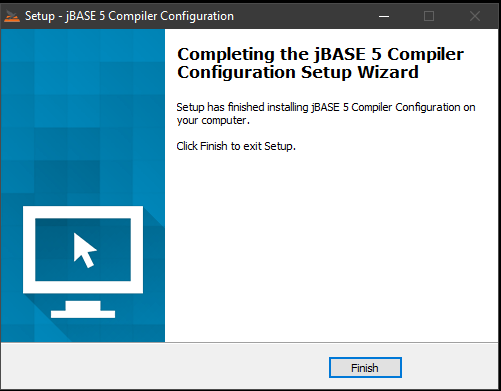
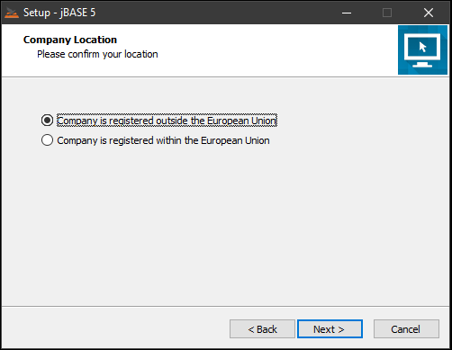
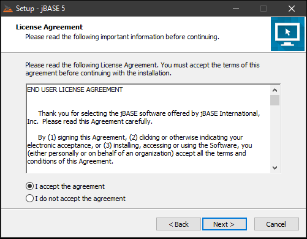
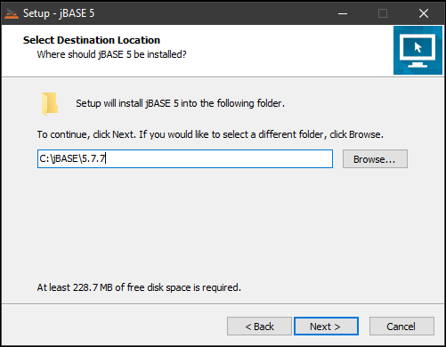
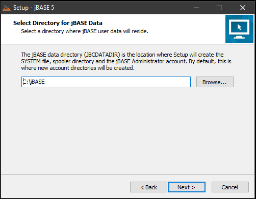
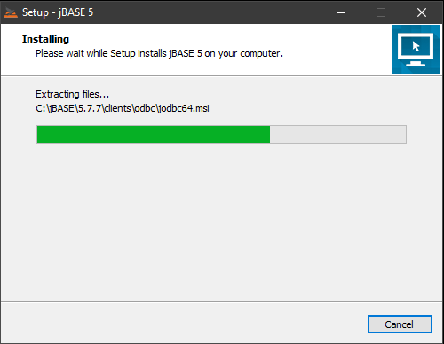

# Windows Installation Guide for jBASE 5.7.7 through 5.7.11

<PageHeader />

**Tags:**
<badge text='installing jbase on windows' vertical='middle' />
<badge text='windows' vertical='middle' />
<badge text='install ' vertical='middle' />
<badge text='jbase on windows' vertical='middle' />
<badge text='5.7.7' vertical='middle' />

## Document Scope

These instructions describe the system requirements and process for installing and initial configuration of jBASE 5.7.7 and later on a Microsoft Windows operating systems.

There are separate instructions for [jBASE 5.8](./../jbase-5-8-windows-installation-guide/README.md)

## System Requirements

jBASE 5.7 is a 64-bit application and must be installed on Microsoft Windows 64-bit operating systems.

jBASE 5.7 for Windows requires the same minimum hardware specifications as the host operating system plus a minimum of 500MB of additional hard disk space.

### Supported Operating Systems

- Windows 8/8.1 64-bit
- Windows 10 64-bit
- Windows Server 2012 R2  
- Windows Server 2016  

> [How to verify your Windows Operating System](./../verify-your-windows-operating-system/README.md)

## Prerequisites

To install jBASE 5.7 for Windows, you will need the jbase\_5.7.x.xxx\_64bit.exe installer, license key and a user account with administrator privileges.  

For licensing assistance contact Zumasys jBASE support in the United States at 866 582 8447 and from the United Kingdom at 0808 189 3266 or sales@jbase.com.

### Installer File

### License Information

## Installation

jBASE is now utilizing the C compiler from Visual Studio 2019 by installing the Visual Studio 2019 Build Tools. This process takes place before the jBASE installation proper.

  

  

  

  

  

  

  

  

  

  

## Note on the C Compiler  

>Whereas in previous jBASE 5.7.x installs, the Compiler Installer would add System Environment variables for LIB, INCLUDE and PATH, those settings are now stored in the system.properties file, located in the "config" folder of the jBASE install.  

### jBASE Installation Types

The jBASE installer provides two installation modes: **Express** and **Advanced**.  

Continue to [Upgrading from a Previous Version](./../../upgrading/README.md), if you already have jBASE installed.

**Express:** install jBASE with typical options and services. Select this option if you are new to jBASE and wish to get started quickly. Express mode installs jBASE, creates a jBASE Administrator user and account, creates a SYSTEM file to organize jBASE accounts, initializes the spooler, installs and starts jBASE services.

**Advanced**: allows you to select which features and services to install. Select this option if you need to customize the location of the SYSTEM file, administrator account, or jBASE spooler, or if you do not want some of these features installed. Also select this option to select which optional services to install (telnet and jRCS).

### Note on the jRemote Client
>
> The jRemote client can be found in  C:\jBASE\CurrentVersion\clients\jremotecs after installation.  

Each step below will highlight which mode this step pertains. If you do not see the step during installation, skip to the next step as it may not apply to the mode chosen.

### Starting the Installation Proper

1. Click the "Finish" button to start the jBASE install.

Applies to: **Express** **Advanced**

2. Choose your company location and then click Next.

Applies to: **Express** **Advanced**

  

3. Review the End User License Agreement (EULA) and choose to accept the agreement. Then click Next.

Applies to: **Express** **Advanced**

4. Choose the installation type, then click Next. See the beginning of this section for more detail about each mode.

Applies to: **Express** **Advanced**

5. Choose the installation path for jBASE, default in this case is C:\jBASE\5.7.7 Then click Next.

For Windows Server installations, it is recommended to install to an alternate partition than the C:\ System partition if available, however jBASE will install properly on any local partition if there is sufficient free disk space.

Applies to: **Express** **Advanced**

6. Choose the path for the jBASE data directory, this will default to the same as the installation path, then click Next.

Applies to: Express **Advanced**

7. Choose the Start Menu folder for the application shortcuts, default is “jBASE”, click Next.

Applies to: Express **Advanced**

8. Choose the installation Options/Additional Tasks, then click Next.

Applies to: Express **Advanced**

**Create jBASE administrator user** The installer can create a new Windows user to perform jBASE administrative functions such as creating new jBASE accounts. The jBASE administrator also owns the jBASE system files. If you select this option, you will be prompted for the user name and password. An existing user name is acceptable, for example, when performing an upgrade of jBASE.

**Create SYSTEM file to organize jBASE accounts** In jBASE, the SYSTEM file is optional. However, using a SYSTEM file provides a convenient way to organize your jBASE accounts, and is required for using Q-pointers and the LOGTO command in your jBASE applications.

**Create JBASEADM account for administrative functions** The JBASEADM account can be used to perform jBASE administrative tasks such as creating or deleting other jBASE accounts.

**Initialize the print spooler** Select this option to initialize the default print spooler configuration after a new installation. *Note: this option is not available for upgrade installations.*

**Start telnet server** The jBASE telnet server is required to support remote connections to jBASE over telnet. The telnet server runs as a Windows service. By default, the telnet server listens on TCP port 23. See [Windows Telnet](./../../../telnet/windows-telnet/README.md) article for information on configuring the jBASE telnet server.

**Start jRCS service** The jBASE Remote Connectivity Server (jRCS) provides remote access to your jBASE system. By default, the jRCS server listens on TCP port 8236. See the jBASE knowledgebase article [jRCS](./../../../connectivity/jbase-remote-connectivity-server-(jrcs)/README.md) for more information regarding jRCS.

9. Type a username to be created for the jBASE Administrator. The installer will create a local Windows user account who will "own" the jBASE system files, and can be used to perform jBASE administrative tasks such as creating new jBASE accounts. If the user does not exist, the installer will create the user for you. Then click Next.

Applies to: **Express** **Advanced**

10. If the user name specified in the previous screen does not exist, you need to specify a password for this user. If there are Windows Group Policy requirements that apply to this computer, you must type a password that meets the requirements, then click Next. The installer will not create a new user without a password. Because security policies vary widely, it is not possible for the jBASE installer to validate that the password you enter conforms to the local security policy of the computer. Be sure to follow your local security policy regarding passwords. Otherwise the installer will not be able to create the JBASE Administrator user, and you will need to do this manually after the installation.

Applies to: **Express** **Advanced**

11. Enter your jBASE license key(s), then click Next.

Applies to: **Express** **Advanced**

jBASE requires a valid license key in order to operate. Either a permanent or evaluation key may be used. If you have been issued a Multisession or Websession license key, enter these keys in the respective fields. If you are upgrading from a previous version of jBASE, the installer will attempt to locate your existing license keys and use them to populate the license key fields on this page. *Note: the installer will not continue unless you enter a license key.*

For licensing assistance contact Zumasys jBASE support in the United States at 866 582 8447 and from the United Kingdom at 0808 189 3266 or sales@jbase.com.

12. Review the summary information and then click Install.

Applies to: **Express** **Advanced**

13. The jBASE release files are copied to the destination folder, replacing any existing files if installing over an existing installation.

Applies to: **Express** **Advanced**

14. After copying the jBASE release files, the installer provides information on anything during the install process which may have occurred and any steps that need to be taken after the installtion to ensure that jBASE operates correctly.

Applies to: **Express** **Advanced**

15. If the jBASE installation was successful, you can now choose to open a jShell command prompt. If the installation was not successful, for example, an invalid license key was entered, an error message will be displayed.

Applies to: **Express** **Advanced**

The installation of jBASE is complete.  

### Related Topics

[Upgrading from a Previous Version](./../../upgrading/README.md)

[Installing the Compiler](./../windows-compiler-installation/README.md)

[Manual Installation of jDLS Service](./../../../../daemons/manual-installation-of-jdls-service/README.md)

[Creating Accounts and Users](./../create-accounts-and-users/README.md)

[Manual License Key Installation](./../../licensing/manual-license-key-installation/README.md)

Back to [Windows](./../README.md).

<PageFooter />
