# jBASE 5.8 Windows Installation Guide

<PageHeader />

**Tags:**
<badge text='installing jbase on windows' vertical='middle' />
<badge text='windows' vertical='middle' />
<badge text='install ' vertical='middle' />
<badge text='jbase on windows' vertical='middle' />
<badge text='5.8' vertical='middle' />

## Document Scope

These instructions describe the system requirements and process for installing and initial configuration of jBASE 5.8.0 and later on a Microsoft Windows operating systems.

## System Requirements

jBASE 5.8 is a 64-bit application and must be installed on Microsoft Windows 64-bit operating systems.

jBASE 5.8 for Windows requires the same minimum hardware specifications as the host operating system plus a minimum of 500MB of additional hard disk space.

### Supported Operating Systems

- Windows 10 64-bit
- Windows Server 2016  
- Windows Server 2019  

> [How to verify your Windows Operating System](./../verify-your-windows-operating-system/README.md)

## Prerequisites

To install jBASE 5.8 for Windows, you will need the jbase\_5.8.x.xxx\_64bit.exe installer, license key and a user account with administrator privileges.  

For licensing assistance contact Zumasys jBASE support in the United States at 866 582 8447 and from the United Kingdom at 0808 189 3266 or sales@jbase.com.

### Installer File

### License Information

As of the 5.8 version, jBASE can be licensed using either a conventional license key:

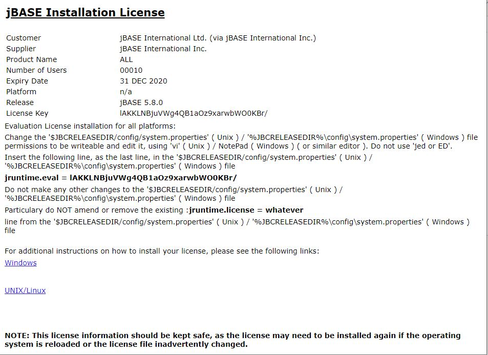

or using CPU Licensing:

[jBASE CPU Licensing Overview](./../../../../licensing/cpu/README.md)  

jBASE 5.8 can either be installed on a clean system or used to upgrade from a previous jBASE 5.x version. We will cover both scenarios here.

### Installing on a clean system

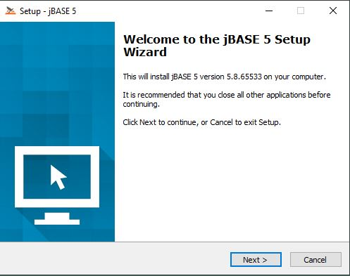

jBASE now utilizes the command-line C compiler from Visual Studio 2019 by installing the Visual Studio Build Tools 2019. This process takes place before the jBASE installation proper.

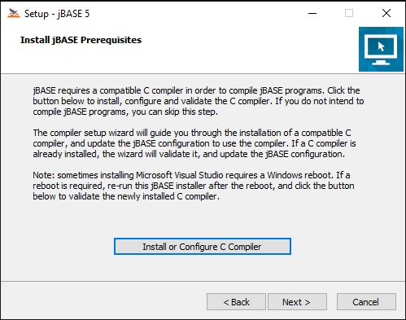

Click to install the Visual Studio Build Tools.

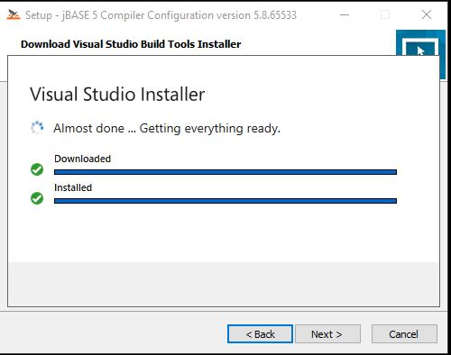

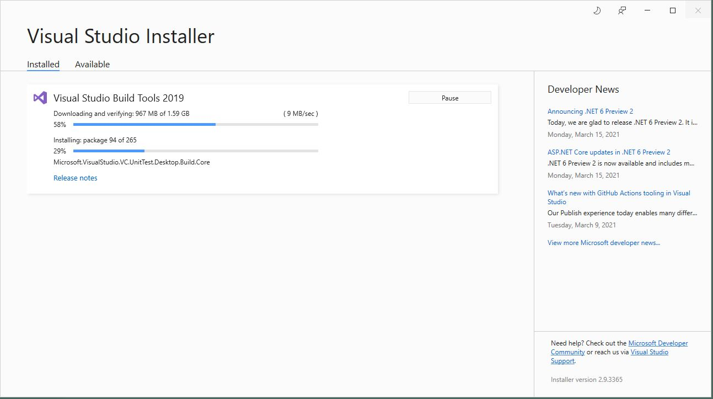

After the Build Installation completes, click the "Next" button to continue.

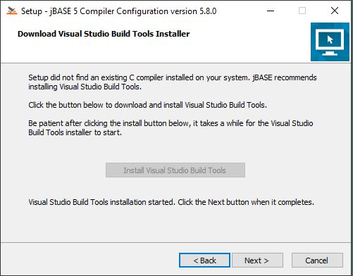

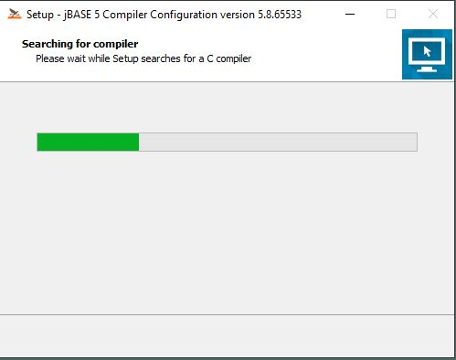

The installer will then save compiler configuration information for later use.

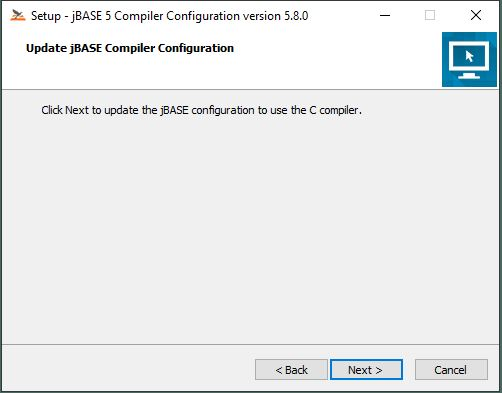

Compiler Setup is complete and we can now install jBASE.

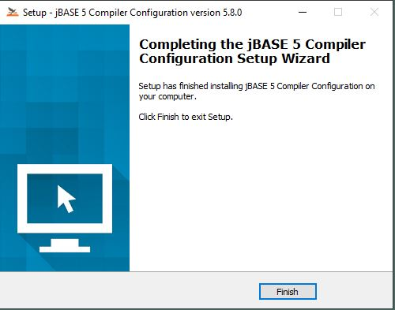

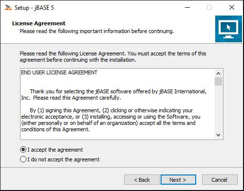

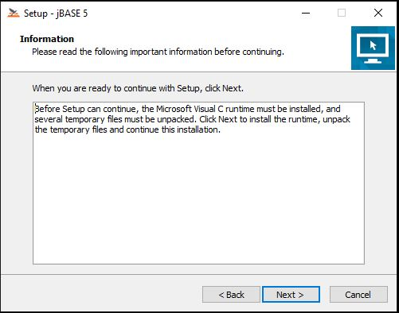

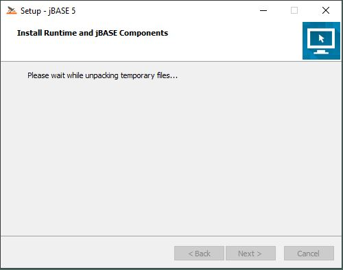

We will cover the Advanced Installation Options, which provide control over what is installed and where.

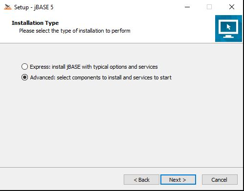

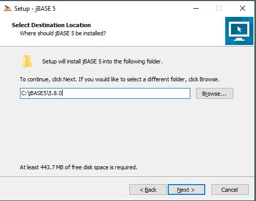

With jBASE 5.8, user profiles are introduced and the default version is stored in JBCGLOBALDIR, which may now be a different location than JBCRELEASEDIR.

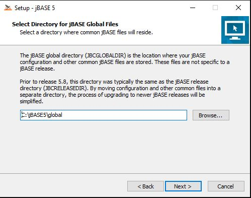

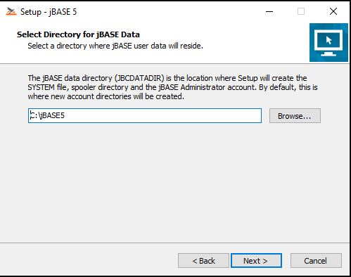
exit
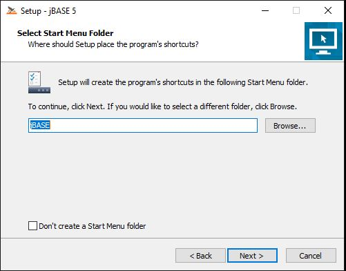

Decide which additional options you wish to install:

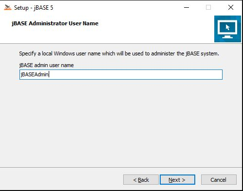

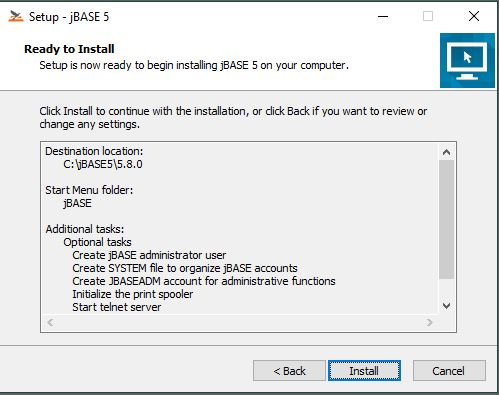

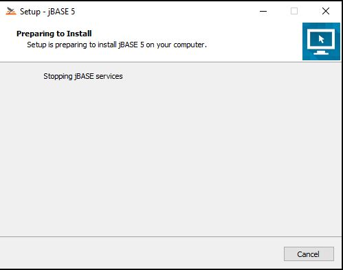

The jBASE installation process will be performed here, before displaying the following:

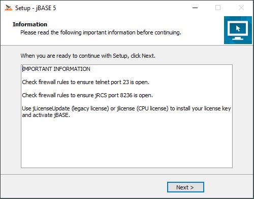

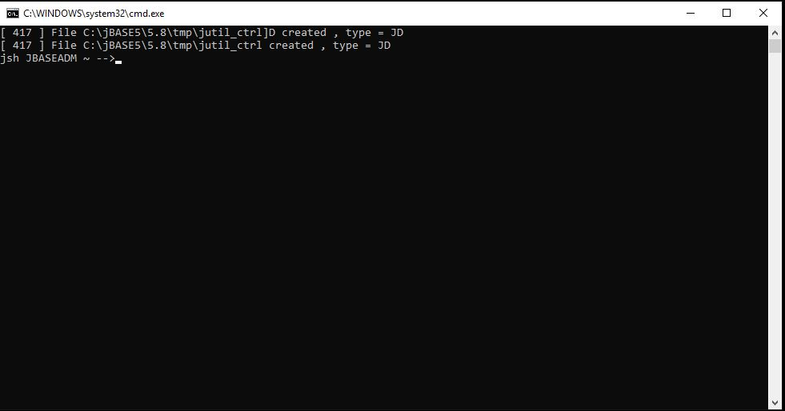

### Upgrading from a previous jBASE version

[Upgrading to jBASE 5.8 from a previous release](./../upgrading-to-5.8-windows/README.md)

Back to [Windows](./../README.md)

<PageFooter />
