# Upgrading to jBASE 5.8 on Windows from an earlier release

<PageHeader />

Documenting an upgrade to jBASE 5.8 from a previous jBASE 5 version could cover many possibilities.

Our initial document will cover a scenario where a recent version of jBASE 5 (i.e. 5.5.x or later) is installed, which employs Visual Studio 2017 or 2019 Build Tools as the compiler.

Upgrading to jBASE 5.8 for Windows requires that you have a jbase_5.8.x.xxx_64bit.exe installer and a user account with administrator privileges.

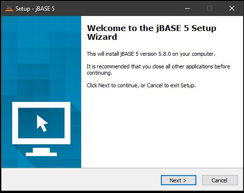

Two possibilities here:

## Scenario 1  

There is a working compiler installed, we will skip installing a compiler and retain all of our current setup, including PATH, INCUDE and LIB settings:

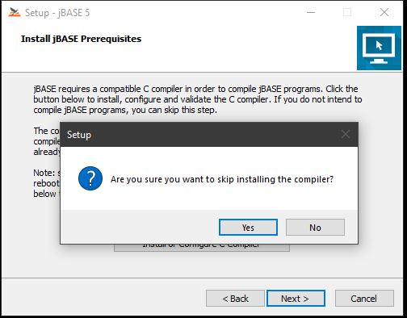

Note that this same option can be taken when upgrading from jBASE 5.7.7 onwards, where the environment variables necessary for the jBASE compiler are already stored in your system.properties file.

## Scenario 2

We wish to take advantage of the automatic compiler settings which will be stored in the system.properties file and do not require the use of PATH, INCUDE and LIB to use the compiler.

We let the jBASE installer check the compiler information:

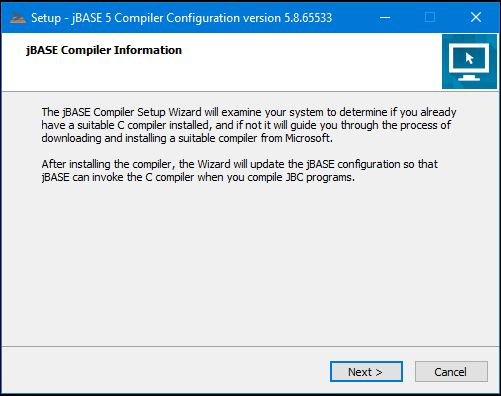

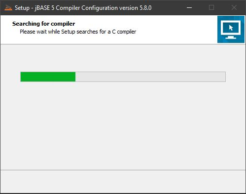

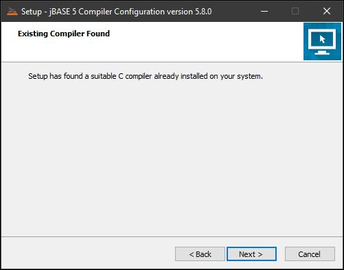

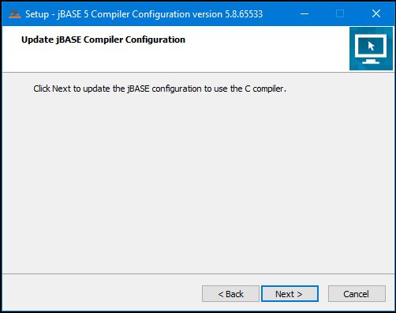  

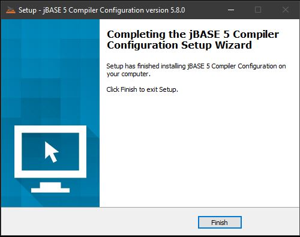

## Continue with the Install

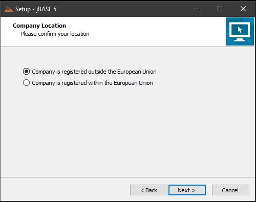

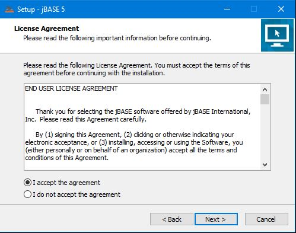

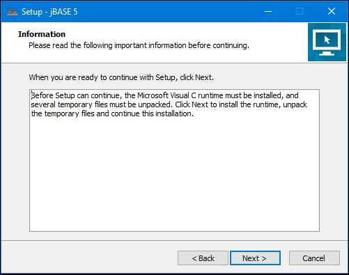

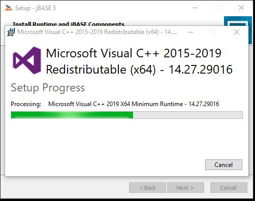

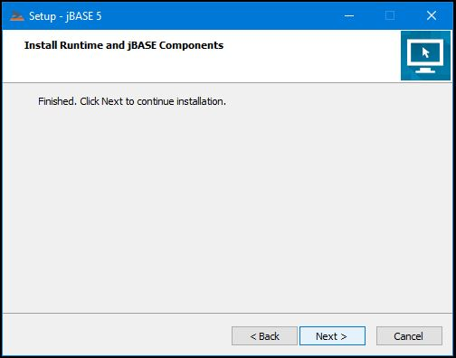

We will opt for the Advanced install so that we have control over how jBASE 5.8 is installed:

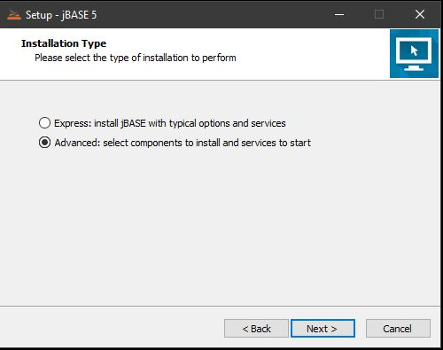

Opt to install jBASE 5.8 in a new folder:

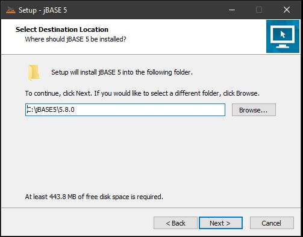

Select the location for JBCGLOBALDIR, which can be different from JBCRELEASEDIR:

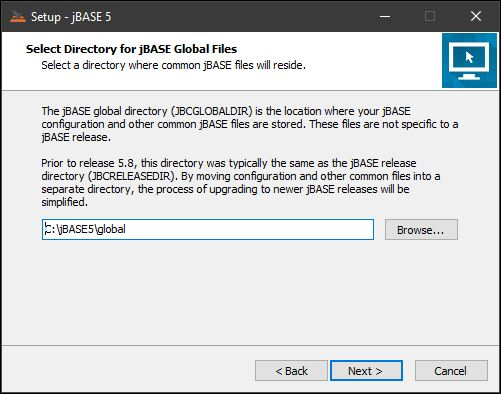

Select the location where the jBASE spooler may reside, unless you wish to specify a location where all jBASE accounts will reside:

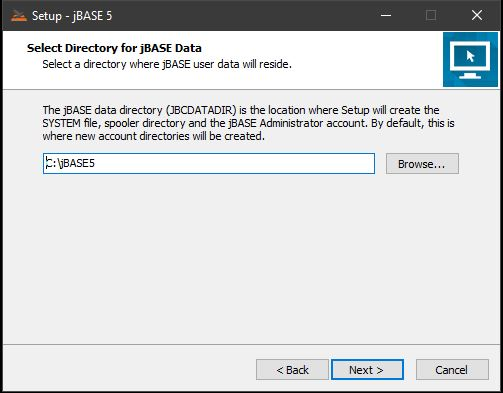

Select additional options for the install:

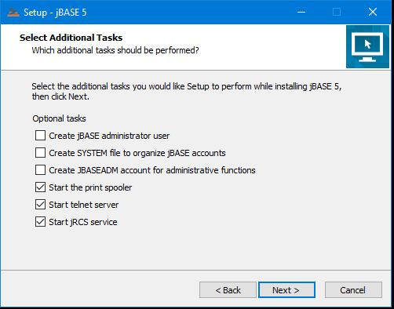

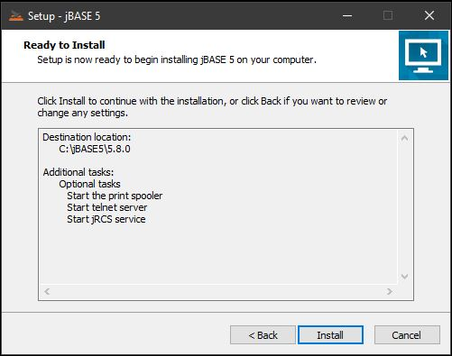

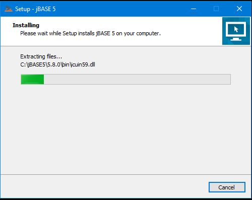

Your results may be different, but these  are things to be aware of post-installation:

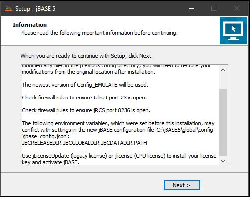

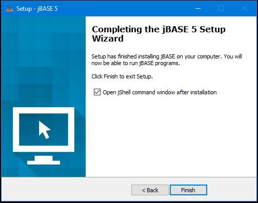

It should now be possible to log into a jBASE account using an absolute path, but JEDIFILENAME_SYSTEM may need to be defined in the %JBCGLOBALDIR%\\jbase_config.json to enable LOGTO or the use of an account name to function correctly.

If option #2 was selected, all of the environment variables necessary for the jBASE compiler are stored in the %JBCRELEASEDIR%\\system.properties file:

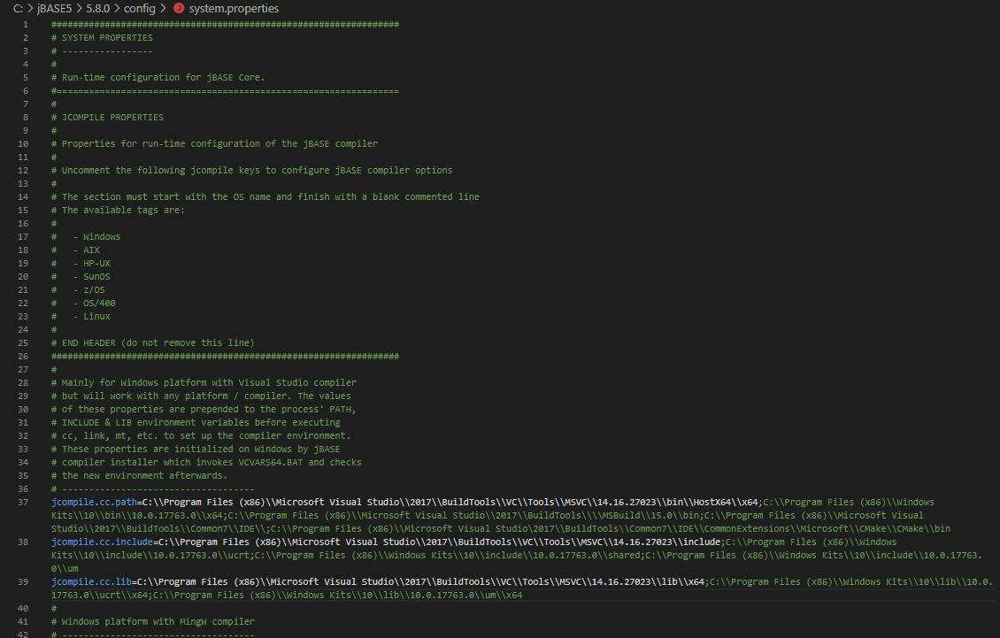

Back to [Windows](./../README.md)

<PageFooter />
