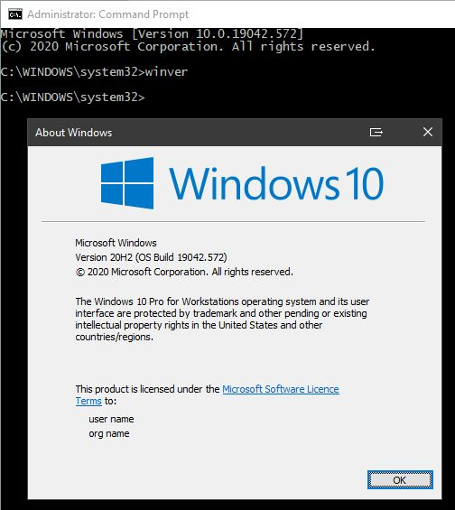
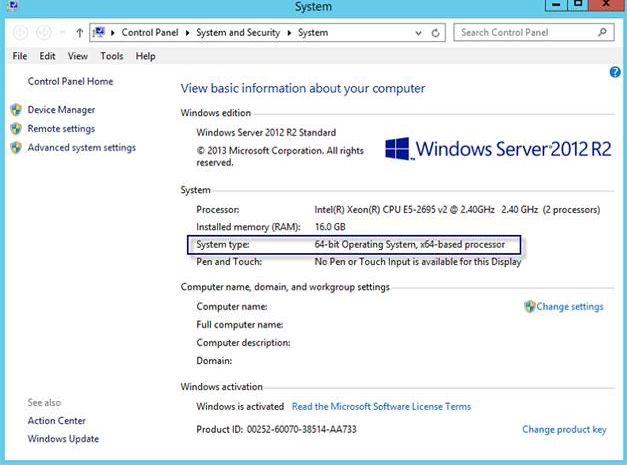

# Verify your Windows Operating System

<PageHeader />

## Note

>Only actively supported versions of the Windows Operating system are listed here.
>
>An alternative option with all these platforms is to run "winver" from a Command Prompt.  
>

## Windows 10

Right-Click the start menu icon and choose System.  

* * *  

### Windows Server 2012 R2

Click the start menu, right-click this PC, choose Properties

  

* * *  

### Windows Server 2016  

Right-Click the start menu icon and choose System.  

  

* * *  

### Windows Server 2019  

  

  

Back to [Installation Guides](./../README.md).

<PageFooter />
