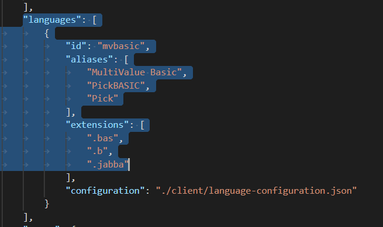
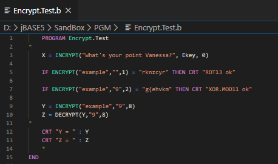

# Visual Studio Code Pick BASIC Extension

<PageHeader />

## Description

Would you like to update your coding environment and inject some color into your work?

Visual Studio Code is a free download which has an extension entitled “MV Basic”.

In jBASE Development and Support, we commonly use folders for our BASIC source code and add a “.b” suffix to enable it to be identified.  Use of the [jcompile](./../../compilation/jcompile/README.md) utility also mandates the use of the “.b” suffix.  

The standard syntax definition for the PickBasic extension has no suffix by default, and also uses “.pick” and .”txt”, but it is easy to add the .b”.

For Windows, Visual Studio Code can be downloaded from this location:

[https://code.visualstudio.com/download](https://code.visualstudio.com/download)

Visual Studio Code also works on Linux, unfortunately it will only install and work on Red Hat Linux 7/8 (or CentOS 7/8) - see below for installation details.

## Instructions

- Details of the MV Basic extension can be found [here](https://github.com/mvextensions/mvbasic/blob/master/doc/Extension%20Guide.md)
- Once Visual Studio Code and the MV Basic extension are installed:
  - On Windows, navigate to the `C:\Users\<yourname>\.vscode\extensions\mvextensions.mvbasic-2.x.x`
  - On Linux, navigate to `/home/<yourname>/.vscode/extensions/mvextensions.mvbasic-2.x.x`
    > Note #1: If you graduate to using the Insiders version of Visual Studio Code the ".vscode" folder becomes ".vscode-insiders"
- Open the `package.json` file in Visual Studio Code
- Under the “languages, extensions” tag, set your preferred suffixes:

  

- Under the "MVBasic.languageType" tag, set "jBASE" as your preferred language:  

  

- Save the changes. When the changes are saved, Visual Studio Code should invite you to reload, otherwise, exit and restart. You can then edit individual items or open a complete folder.  It is also possible to change other settings such as font size, font family, tab size and whether “autosave” is enabled or not:


- End result – syntax highlighting:



> Note #2:
>
> To install Visual Studio Code on Linux, proceed as follows:
>
> ``` bash
> [mikestre@Bordeaux ~]$ sudo su -
> [sudo] password for mikestre:
> Last login: Tue May 15 17:29:41 BST 2018 on :1
> [root@Bordeaux ~]# rpm --import https://packages.microsoft.com/keys/microsoft.asc
> [root@Bordeaux ~]# sh -c 'echo -e "[code]\nname=Visual Studio Code\nbaseurl=https://packages.microsoft.com/yumrepos/vscode\nenabled=1\ngpgcheck=1\ngpgkey=https://packages.microsoft.com/keys/microsoft.asc" > /etc/yum.repos.d/vscode.repo'
> [root@Bordeaux ~]# yum check-update
> [root@Bordeaux ~]# yum install code
> ```
>
> When updates for Visual Studio Code are available, they can be installed via “yum update”.

## Syntax

The BASIC syntax definition can be found in the "syntaxes" sub-folder of the extension definition in a "jBASE.tmLanguage.json" and "jBASELanguage.json" items.

From a jBASE point-of-view, as of "mvbasic-2.0.2" the syntax and "Intellisense" is complete, but can be modified to suit.

## Notes

>AccuTerm 8 now has a VSCODE option in addition to WED.  
>If you prefer a browser interface, there is now also a [VSCode server which offers a browser interface to your code](https://github.com/gitpod-io/openvscode-server/) 

Back to [Coding Corner](./../coding-corner)

<PageFooter />
