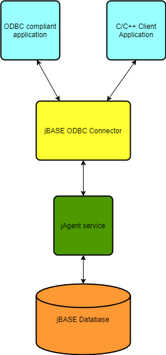

# Introduction to ODBC

<PageHeader />

**Tags:**
<badge text='odbc' vertical='middle' />
<badge text='sql' vertical='middle' />
<badge text='jagent' vertical='middle' />

[ODBC Installation/Configuration](./odbc-installation-configuration/README.md)

## Introduction

The **jBASE ODBC Connector** is an ODBC driver implementing the Open Database Connectivity (ODBC) 3.0 API. This driver release supports a driver-manager based and Unicode compliant interface, featuring support for transactions and calling stored procedures. The ODBC Connector is only available to Windows platforms but SQL requests may be issued against a remote jBASE instance running on other platforms.

In the diagram some examples of a **ODBC compliant application** are ***Excel*** and ***Access***. A **C/C++ Client Application** is discussed [here](./developing-with-the-odbc-driver)

**jAgent service** is the jBASE component responsible for accepting and processing incoming client requests and returning results back to the client.

As shown in this diagram, jAgent must be running to accept and dispatch SQL requests to the jBASE Server. jAgent, as well as ODBC, use TCP socket connections to communicate with each other and therefore need to be configured to use the same TCP port. More details about jAgent may be found in the jAgent user guide [here](../../jagent/introduction-to-jagent/README.md).

The **ODBC Driver Manager** is a system component which on Windows is part of the MDAC (Microsoft Data Access Components) package and automatically included with the latest Windows operating systems. Odbcad32.exe is the 32bit/64bit ODBC Data Source Administrator and odbc32.lib/ odbccp32.lib are import libraries to be used by client applications.

[ODBC Quick Start](./odbc-quick-start/README.md)

<PageFooter />
