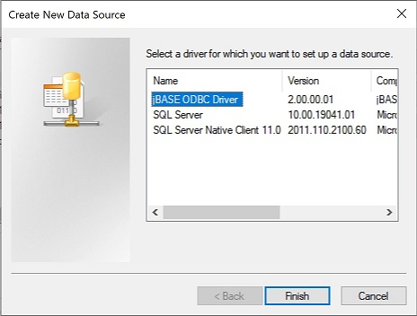
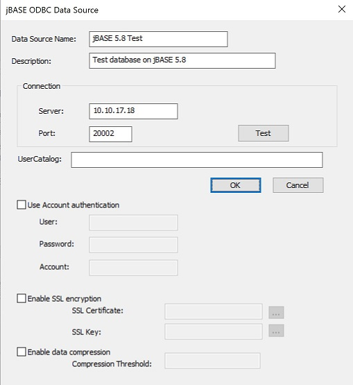
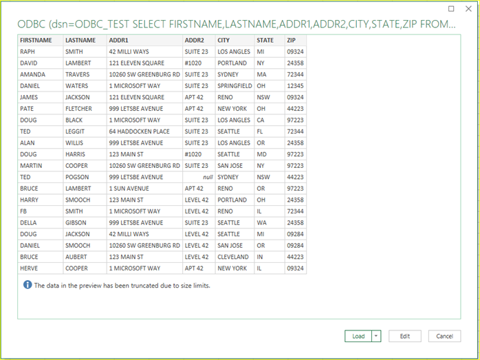

# ODBC Quick Start

<PageHeader />

**Tags:**
<badge text='sql' vertical='middle' />
<badge text='odbc' vertical='middle' />

## Introduction

The ODBC Connector is included with jBASE 5.x but may also be deployed on any Windows operating systems which do not have jBASE 5.x installed.  A self-contained installer (from now on referred to as jODBC installer) is available which installs and registers the ODBC driver.   ([Client Software Download](https://zumasys.us8.list-manage.com/track/click?u=ed1011024b445ab7d2f0c1e6e&id=7aaa8beaa2&e=57befd976d))

On Linux, to set up an ODBC Data Source definition, a jbase\_agent listener must already be running on the jBASE Linux server.  There is an example script to start/stop jbase\_agent on Linux at the end of this document.

Via “Control Panel -&gt; Administrative Tools -&gt; ODBC Data Sources (64-bit)”, define a new Data Source:





To be able to run the Data Source “jBASE 5.8 Test”, the jbase\_agent listener must already be running.

You can specify which files are visible to jODBC by means of an SQL Catalog file. This file will contain an entry for each file that needs to be accessible to jODBC.

The location of the SQL Catalog file is set via the JSQLFILENAME\_CATALOG environment variable, and may be set on a per DSN basis using the UserCatalog option in the jBASE ODBC Data Source, as above.

The Catalog file can be any valid file or directory that jBASE can open. Below is an example entry::

```
ODBCDEMO
001 /home/jbtest/ODBCDEMO
002 /home/jbtest/ODBCDEMO]D
```
A [utility](../../../utilities/sqlcatman/README.md) is provided to create/maintain catalog entries although you can also use a jBASE compliant editor (e.g. ED, JED) or write your own program.

For the purposes of this document, we have used the “make-demo-file” utility to create a new test file for querying:

```
DICT PATH : DICT ODBCDEMO                                                                          Page   1 13:08:11  15 DEC 2017
*A0...........    D/CODE...    A/AMC....    S/NAME....    V/CONV...    V/CORR...    V/TYPE...    V/MAX
FIRSTNAME         A            1            First Name                              L               24
EMAIL             A            10           Email                                   L               22
HARDWARE          A            11           Hardware                                L               15
OS                A            12           OS                                      L               15
SYSTEMTYPE        A            13           MVDBASE                                 L               24
NUMUSERS          A            14           Num Users                               L                6
BIRTHDATE         A            15           Birth Date    D                         R               11
BIRTHTIME         A            16           Birth Time    MTS                       R                8
LASTNAME          A            2            Last Name                               L               20
ADDR1             A            3            Address                                 L                6
                                            Line 1
ADDR2             A            4            Address                                 L               20
                                            Line 2
CITY              A            5            City                                    L               10
STATE             A            6            State                                   L                3
ZIP               A            7            Zip                                     L               12
HOMETEL           A            8            Home Tel                                L               16
WORKTEL           A            9            Work Tel                                L               16
 16 Records Listed
```

It is possible to use Account authentication for these ODBC connections, but, to keep things simple we will start off by not using any authentication.

This means that the jbase\_agent listener should be started in the account folder where the files to be queried reside.


The Data Source can now be referenced by an ODBC aware Windows application, i.e. Excel.

Open a new Excel spreadsheet and navigate to the Data tab, then:

Data -&gt; Get Data -&gt; From Other Sources -&gt; From ODBC




Press the “Load” button and the spreadsheet will be populated:


> Note: On initial “Load”, even without authentication in place, Excel may request a User ID and Password, which would be the user credentials of the account where the jbase\_agent listener is running.

Multi-valued data is returned in first-normal form, which means that any “singular” fields will be repeated for each multi-valued occurrence.

Having added an “ID” dictionary definition to the ODBCDEMO file, the following is an example of a multi-value query:


See also [Using SQL against a jBASE Database](../../../jsql/README.md)
<PageFooter />
