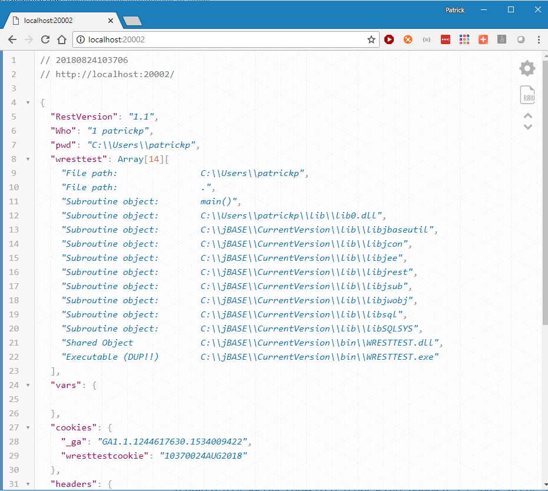

# Introduction TO jAGENT

<PageHeader />

**Tags:**
<badge text='jbase_agent' vertical='middle' />

## Document Scope

This document describes many concepts and methodologies that are highly technical in nature, and as such prerequisite knowledge of the following is considered essential:

- jBASE and concepts of Multivalue databases
- Secure Sockets Layer (SSL) protocol
- HTTP concepts including headers, cookies and CGI for REST services

## jAGENT Introduction

jAgent is a **server-side** jBASE component responsible for accepting and processing incoming client requests. Communication is established via TCP socket connections and by means of a well defined protocol. jAgent is a socket server listening on a user-defined TCP port and has the capability to serve a wide range of client applications as long as they speak the same protocol.


This protocol is currently implemented by the following jBASE components:

- jBASE jRemote C# Client API (Requires Client)
- jBASE jRemote Java Client API (Requires Client)
- jBASE JDBC Driver 2.0+ (Requires Client)
- jBASE ODBC Driver (Requires Client)
- jBASE RESTful services (No client required, runs as web service on jBase box)

## jAGENT Administration

jAgent is a standalone program that you can start from any command prompt to launch a jAgent Service.  The actual program is located in the jBase install directory under the bin directory.  You can run multiple copies of jAgent each with it's own configuration.  jAgent can be configured either through command line switches or through a configuration file.  A default configuration file is located in the jBASE install directory under configuration and is called jagent\_config.  jAgent can also be configured to run as a service.

## jAGENT Quick Start

Just like any other jBase function you must have a jBASE configured environment before you start jAgent.  The fastest way to get started is to launch jAgent from a already configured jsh environment.

Windows

```
C:\Users\demouser>JB
Account name or path: JBASEADM
jsh JBASEADM ~ -->CMD
Microsoft Windows [Version 10.0.17134.228]
(c) 2018 Microsoft Corporation. All rights reserved.

C:\jBASE\JBASEADM>JBASE_AGENT --config=
(12980|11044) NOTICE starting up jAgent, Process Per Connection mode, listening on port 20002, c:\petes\src\international\5.7.0\jagent\SocketAcceptor.h +63
```

Or Linux

``` bash
-bash-4.2$ jb
Account name or path: JBASEADM
jsh JBASEADM ~ -->bash
bash-4.2$ jbase_agent --config=
(4157|140601231317120) NOTICE starting up jAgent, Process Per Connection mode, listening on port 20002, SocketAcceptor.h +63
```

Now open up a browser and point at your server port 20002.  Below is a example where jBase is running on windows.  From the same computer jBase is running on you can browse directly.  If it is on a another box you must put in the IP address of the jBase server where you see localhost



On Linux you can use curl (which you can also install on windows) and test the server from the command prompt

``` json
C:\Users\patrickp>curl http://localhost:20002
{"RestVersion":"1.1", "Who":"1 patrickp", "pwd":"C:\\Users\\patrickp", "wresttest": [ "File path:                C:\\Users\\patrickp","File path:                .","Subroutine object:        main()","Subroutine object:        C:\\Users\\patrickp\\lib\\lib0.dll","Subroutine object:        C:\\jBASE\\CurrentVersion\\lib\\libjbaseutil","Subroutine object:        C:\\jBASE\\CurrentVersion\\lib\\libjcon","Subroutine object:        C:\\jBASE\\CurrentVersion\\lib\\libjee","Subroutine object:        C:\\jBASE\\CurrentVersion\\lib\\libjrest","Subroutine object:        C:\\jBASE\\CurrentVersion\\lib\\libjsub","Subroutine object:        C:\\jBASE\\CurrentVersion\\lib\\libjwobj","Subroutine object:        C:\\jBASE\\CurrentVersion\\lib\\libsql","Subroutine object:        C:\\jBASE\\CurrentVersion\\lib\\libSQLSYS","Shared Object             C:\\jBASE\\CurrentVersion\\bin\\WRESTTEST.dll","Executable (DUP!!)        C:\\jBASE\\CurrentVersion\\bin\\WRESTTEST.exe"], "vars": {}, "cookies": {}, "headers": {"REMOTE_ADDR":"127.0.0.1", "REMOTE_HOST":"127.0.0.1", "PROTOCOL_VERSION":"HTTP\/1.1", "REQUEST_METHOD":"GET", "PATH_INFO":"\/api\/wresttest", "SERVER_PORT":"20002", "HTTP_ACCEPT":"*\/*", "HTTP_USER_AGENT":"curl\/7.55.1", "HTTP_HOST":"localhost:20002"}, "body":"", "status":"ok", "statusmsg":""}
C:\Users\patrickp>
```

In the above example jagent was fully configured to operate in the Account we shelled out of because the environment was already setup. Since we did not define a actual config file the default config file from your jBase installation directory was used.  The default config file has all services enabled and is configured to listen on port 20002.  Since this is the first time running the RESTFul services (web server) it requested as we did above will check the local account and see if a WDB.RESOURCE file exists, and if it does not exist it creates a new one and enables the WRESTTEST service.  The default config file is configured to default to /api/wresttest if no resource is requested.

If you are getting the above page then jAgent is up and running.  The WRESTTEST program is very helpful in reviewing your environment allowing to you make sure it is setup correctly.  You can now proceed to use the other jAgent features such as C#, java or ODBC.

It is recommended during development to use jAgent in this manner.  You are able to LOGTO any account where you are running your existing application and guarantee your environment is setup.  It is recommend you copy jagent\_config over to your account and call it directly vs using the template copy in the configuration directory.

```
c:\jbase\jbaseadmin> COPY C:\JBASE\CURRENTVERSION\CONFIG\JAGENT_CONFIG .
c:\jbase\jbaseadmin>jbase_agent --config=.\jagent_config  
```

or Linux

``` bash
# cp /opt/jbase/CurrentVersion/config/jagent_config ./
# jbase_agent --config=./jagent_config
```

You can now edit your config file and make changes.  You can run as many copies of jagent as you wish.  Each must run on it's own port.

```
; Specify the port that jagent will listen on for incoming connections.
; The default port is 20002. This option duplicates the -p (--port)
; command line option.
port = 20002
```

You can also run jAgent as a service.  You should

1. Create a new script to start/test your config.  In the default jbase install directory there is a good template called jbase\_env.cmd or jbase\_env.sh based on your platform.  Copy this script over to your account.
2. Make a copy of the jagent\_config into your directory.
3. Modify jagent\_config to listen on the port you want.
4. In the [ENVIRONMENT] section of jagent\_config setup your environment the way you want it.
5. Modify your script to launch jbase\_agent pointing to your new jagent\_config.
6. Test your services again using WRESTTEST.
7. If everything is working you can then install jAgent as a service as described later in this document.
8. It is always best to be able to run any jAgent instance locally to diagnose why it isn't working.  Only after you have it working should you move to have it as a service.

## Starting and Configuring jAGENT

### Command Syntax

```
jbase_agent [service options] [options]
```

### Command Elements

- **Service Options** - install, start, stop and remove jagent service.
- **Options** = configure jagent behavior. Most options have both long and short forms. For convenience, most options can be specified in a configuration file, and only the --config option is needed on the command line.

| **Option**                                                   | **Description**                                                                                                                                                                                                                                                                                                                                                                                                                                                                                                                                         |
| ------------------------------------------------------------ | ------------------------------------------------------------------------------------------------------------------------------------------------------------------------------------------------------------------------------------------------------------------------------------------------------------------------------------------------------------------------------------------------------------------------------------------------------------------------------------------------------------------------------------------------------- |
| --config=[config file name]                                  | Use [config file name] to specify jagent options. When using the jBASE HTTP API (RESTful services), a configuration file is required, as it specifies how HTTP requests are handled.  E.g. jbase\_agent --config=$JBCRELEASEDIR/config/ jagent\_configYou must put a = sign in the switch.  If you do not define a config file then jagent will look for one in your jbase install directory config/jagent\_config.  Therefore jagent\_config --config myconfig will not use "myconfig" but will pull the default config due to the missing equal sign. |
| -A [mode]    --authentication=[mode]                         | [mode] = the mode (none                                                                                                                                                                                                                                                                                                                                                                                                                                                                                                                                 | user | account) used to authenticate client connections. This option is ignored for jBASE HTTP connections.  E.g. jbase\_agent -A user It is recommended you do not use none for non HTTP sessions. |
| -b [interfaceName]--bind\_address=[interfaceName]            | Bind to a specific local interface. If not specified then bind to all local interfaces.  e.g. jbase\_agent -b 1.2.3.4                                                                                                                                                                                                                                                                                                                                                                                                                                   |
| -c [path to certificate]--certificate=[path to certificate]  | [path to certificate] = the path to a valid x509 certificate.  Note --private\_key is mandatory with this option.                                                                                                                                                                                                                                                                                                                                                                                                                                       |
| -F                                                           | Create log files for each client connection (P[pid].log)                                                                                                                                                                                                                                                                                                                                                                                                                                                                                                |
| -h                                                           | Print this screen                                                                                                                                                                                                                                                                                                                                                                                                                                                                                                                                       |
| -k [path to private key]--private\_key=[path to private key] | [path to privatekey] = the path to a valid private key.  Certificate is mandatory with this option.  E.g. jbase\_agent --private\_key=key.pem --certificate=cert.pem                                                                                                                                                                                                                                                                                                                                                                                    |
| L [logLevel]--loglevel=[logLevel]                            | [logLevel] = a numeric log level that determines the detail to be logged (default level is LOG\_NOTICE).0 NO LOGGING1  LOG\_TRACE2  LOG\_DEBUG3 LOG\_INFO4  LOG\_NOTICE5  LOG\_WARNING6  LOG\_ERROR7  LOG\_CRITICAL8  LOG\_ALERT9  LOG\_EMERGENCY                                                                                                                                                                                                                                                                                                       |
| -n [serviceName]--service\_name=[serviceName]                | [serviceName] = name of the service to install, start, stop or remove. (windows)                                                                                                                                                                                                                                                                                                                                                                                                                                                                        |
| -N                                                           | Do not set TCP\_NO\_DELAY. Useful for performance tuning.                                                                                                                                                                                                                                                                                                                                                                                                                                                                                               |
| -p [listenPort]--port=[listenPort]                           | [listenPort] = theport that will listen for client connections.  E.g. jbase\_agent -p 20003                                                                                                                                                                                                                                                                                                                                                                                                                                                             |
| -R [bufferSize]--read\_buf\_size=[bufferSize]                | Set read buffer size (in bytes) to [bufferSize]. If not specified uses default buffer size.                                                                                                                                                                                                                                                                                                                                                                                                                                                             |
| -W [bufferSize]--write\_buf\_size=[bufferSize]               | Set write buffer size (in bytes) to [bufferSize]. If not specified uses default buffer size.                                                                                                                                                                                                                                                                                                                                                                                                                                                            |

## Running jAGENT as a Service

When running jAgent as a service on Windows, the startup directory will be C:\Windows\System32. On non-Windows platforms, it will be the current directory of the process that starts the jAgent service. If you need jAgent to run in a different directory, you can set the HOME environment variable in the jAgent configuration file [ENVIRONMENT] section.  The example below uses the DEMO\_REST account used in the Introduction to jAgent REST Services.

```
[ENVIRONMENT]
; Use the standard jbase_env script to set up the jBASE
; system environment variables.
; Set up the "account" environment variables.
;HOME=$CURDIR
HOME=/opt/jbase/DEMO_REST
PATH=$HOME/bin:$PATH
JBCOBJECTLIST=$HOME/lib
JEDIFILEPATH=$HOME
JEDIFILENAME_MD=$HOME/MD
```

*Note: APPDIR and CURDIR if not set refer to the  location of the **jbase\_agent** executable and the current directory respectively.*

### jAgent Environment Variables

The jbase\_agent process inherits the environment from the invoking process. If a config file is used at startup then additional environment variables can be set/modified in the [ENVIRONMENT] section (see above).

## Starting jjAGENT as a Service

The service options allow jAgent to be installed and started as a Win32 Service on Windows platforms, and as a daemon on Unix platforms.

### Windows Service

jbase\_agent **install** [-n &lt;Service Name&gt;] &lt;options&gt;

jbase\_agent **start** [-n &lt;Service Name&gt;]

jbase\_agent **stop** [-n &lt;Service Name&gt;]

jbase\_agent **remove** [-n &lt;Service Name&gt;]

Note that jAgent Win32 services will send logger messages to the Windows **Event Log**. Changing the tracing level (option -L) is not applicable to a jAgent service and only error messages will be logged.

Example:

Using the DEMO\_REST account used in the Introduction to jAgent REST Services, the default location used by CREATE-ACCOUNT to create the DEMO\_REST account is C:\jbase, so the working directory for jAgent service would be C:\jbase\DEMO\_REST. That is the path to use for HOME in the jagent\_config file. The commands to start jAgent service:

```
; In this example it is using the default config.  It is recommend for production you copy this config to your application and reference that config file.
; You must still setup all your environment stuff correctly in the [ENVIRONMENT]  area for your application

jbase_agent install --config=C:\jbase\CurrentVersion\config\jagent_config

jbase_agent start
```

### UNIX Service

On UNIX it is recommended you install jAgent as a systemd service.  This is a system administrator level duty.  It is best to be familiar with systemd and how scripts are configured.  Below is a sample.

``` bash
;First create our scripts and our environment.
# cd /path/to/myscripts
# cp /opt/jbase/CurrentVersion/config/jagent_config ./jagent_20002_config
# cp /opt/jbase/CurrentVersion/jbase_env.sh ./jagent_20002.sh
# vi jagent_20002.sh
# add these two lines to the top of the script
export HOME=/path/to/jbase/account
cd $HOME
FI
# add to bottom of script
# jbase_agent --config=./jagent_20002.sh
FI
# run script to verify it is working
# ./jagent_20002.sh
```

When the service is working add a systemd script.

``` bash
# sudo su
# useradd jagent
# usermod -g jbase jagent     # this is optional, but you must run jagent as a user that has correct permissions.  You must adjust the jbase group to be whatever group your platform users.
# cd /usr/lib/systemd/system
# vi jagent_20002.service
[Unit]
Description=systemctl service: jagent port 20002
After=network.target

[Service]
Type=simple
User=jagent
Restart=always
RestartSec=25
ExecStart=<path to your jagent_20002.sh

[Install]
WantedBy=multi-user.target
:FI

# systemctl daemon-reload                   ; This reloads systemd which will load your new config
# systemctl start jagent_20002.sh
# systemctl status jagent_20002.sh          ; verify it is running
● jagent_20002.service - systemctl service: jagent port 20002
Loaded: loaded (/usr/lib/systemd/system/jagent_20002.service; enabled; vendor preset: disabled)
Active: active (running) since Tue 2018-08-14 13:24:37 PDT; 1 weeks 2 days ago
Main PID: 19584 (jagent_20002.sh)
CGroup: /system.slice/jagent_20002.service
├─19584 /bin/bash /dbms/profilesource/jagent_20002.sh
└─19625 jbase_agent --config /dbms/profilesource/jagent_config

Aug 24 11:14:49 jBase01 jagent_20002.sh[19584]: (10085|140213281888320) DEBUG  IO: Command (20) OUTPUT , ResponseCOUNT.cpp +169
Aug 24 11:14:49 jBase01 jagent_20002.sh[19584]: (10085|140213281888320) DEBUG  ResponseCOUNT: rc=0, ResponseCOUNT.cpp +267
Aug 24 11:14:49 jBase01 jagent_20002.sh[19584]: (10085|140213281888320) DEBUG  IO: Command (4) RESET_PROCESS , ResponseCOUNT.cpp +169
Aug 24 11:14:49 jBase01 jagent_20002.sh[19584]: (10085|140213281888320) DEBUG  ResponseCOUNT: rc=0, ResponseCOUNT.cpp +267
Aug 24 11:14:49 jBase01 jagent_20002.sh[19584]: (10085|140213281888320) DEBUG  IO: Command (1) INITIALISE_PROCESS , ResponseCOUNT.cpp +169
Aug 24 11:14:49 jBase01 jagent_20002.sh[19584]: (10085|140213281888320) DEBUG  ResponseCOUNT: rc=0, ResponseCOUNT.cpp +267
Aug 24 11:14:49 jBase01 jagent_20002.sh[19584]: (10085|140213281888320) DEBUG  IO: Command (20) OUTPUT , ResponseCOUNT.cpp +169
Aug 24 11:14:49 jBase01 jagent_20002.sh[19584]: (10085|140213281888320) DEBUG  ResponseCOUNT: rc=0, ResponseCOUNT.cpp +267
Aug 24 11:14:49 jBase01 jagent_20002.sh[19584]: (10085|140213281888320) DEBUG  IO: Command (4) RESET_PROCESS , ResponseCOUNT.cpp +169
Aug 24 11:14:49 jBase01 jagent_20002.sh[19584]: (10085|140213281888320) DEBUG  ResponseCOUNT: rc=0, ResponseCOUNT.cpp +267
# systemctl enable jbase_20002       ; # this will start jagent on reboots
```

## Enabling SSL Encryption

jAgent may be configured to use SSL encryption. To activate SSL encryption, you must specify a valid x509 certificate and a private key. The certificate and key may be specified using command line options, or in the jAgent configuration file.

The following example describes how to create a self-signed certificate with *OpenSSL*:

### Create a self-signed certificate with OpenSSL

1. Create an RSA private key:

```
C:\programs\openssl\bin>openssl req -x509 -sha256 -newkey rsa:2048 -keyout key.pem -out cert.pem -days 365 -nodes

Generating a 2048 bit RSA private key
.....+++
................................+++
writing new private key to 'key.pem'
-----
You are about to be asked to enter information that will be incorporated
into your certificate request.
What you are about to enter is what is called a Distinguished Name or a DN.
There are quite a few fields but you can leave some blank
For some fields there will be a default value,
If you enter '.', the field will be left blank.
-----
Country Name (2 letter code) [AU]:
State or Province Name (full name) [Some-State]:
Locality Name (eg, city) []:
Organization Name (eg, company) [Internet Widgits Pty Ltd]:
Organizational Unit Name (eg, section) []:
Common Name (e.g. server FQDN or YOUR name) []:
Email Address []:
```

2. Start jAgent in SSL mode

```
C:\programs\openssl\bin>jbase_agent -c cert.pem -k key.pem --config %HOME%\jagent_config
```

### Authentication Modes

For jRemote, ODBC and JDBC clients, jAgent supports three different authentication modes (See command line options):

- ***1. Anonymous*** - authentication does not verify any user credentials.
- ***2. User*** - authentication verifies user credentials against a local user credentials database.
- ***3. Account*** - authentication will attempt to use the provided user credentials to log into a specific jBASE account.

For REST clients, an appropriate HTTP-based authentication mechanism must be implemented in the REST code.

### Setting up user authentication

1. Create the jAgent user file

```
CREATE-FILE JAGENT_USER 1 53
[ 417 ] File JAGENT_USER]D created , type = J4
[ 417 ] File JAGENT_USER created , type = J4
```

2. Create the user and set the password

``` bash
jbase_agent adduser test
jbase_agent passwd test newpassword
```

3. Now start jbase\_agent with user authentication.

``` bash
jbase_agent -A user
```

### Setting up account authentication

The environment should be configured with JEDIFILENAME\_SYSTEM set to a valid jBASE SYSTEM file that contains the jBASE accounts you wish to connect to. This can be set in the jAgent configuration file [ENVIRONMENT] section, if desired.

1. Start jbase\_agent to authentication with account authentication

``` bash
jbase_agent -A account
```

## jAGENT Configuration File

All jAgent options and settings can be specified in a configuration file. Use the **--config** command line option to specify the path to the configuration file. A default configuration file, ***jagent\_config***, can be found in the ***config*** directory under the jBASE release directory.

The jAgent configuration file is divided into sections, where section names are enclosed in square brackets. For example, the jBASE environment for jAgent is specified in the [ENVIRONMENT] section. Within each section, settings for that section are specified using name=value syntax. Names may not contain spaces, and are separated from the value using an equal sign. Spaces before or after the equal sign are ignored. Values may be enclosed in double-quotes, if desired. Any lines beginning with "#" or ";" are comments and are ignored when parsing the file. Section names and item names are not case sensitive.

The following sections are supported: [MAIN], [OPTIONS], [ENVIRONMENT], [HTTP], [HTTP\_RESOURCE], [HTTP\_CONTENT\_TYPE] and [HTTP\_MIME\_TYPE].

Comments in the sample jagent\_config file describe the various settings and options for each section.

Sample jagent\_config file:

```
#
# Configuration file for jagent
#

[MAIN]

; List the services that this instance of jagent will honor.
; Separate selections with commas. Possible choices are jremote,
; jodbc and http.
services=jremote,jodbc,http

; For Linux/Unix/AIX, specify the desired umask for jagent in octal.
umask=0002

#-----------------------------------------------------------------------#

[OPTIONS]

; Set the log level to a value from 0 to 7. Each lower level (except 0)
; includes all of the higher levels. This duplicates the -L (--logLevel)
; command line option.
;  0 = no logging
;  1 = trace - show code execution flow
;  2 = debug - mainly useful for debugging jagent
;  3 = info - show interesting information
;  4 = notice - show notices
;  5 = warning - show warnings
;  6 = errors - show any error conditions
;  7 = critical - show critical errors only
;loglevel = 4

; Set the authentication mode for jodbc and jremote connections.
; Available options are none, user or account. This duplicates the
; -A (--authentication) command line option.
;authentication = none

; If the hostname_lookups option is enabled, a reverse DNS lookup
; is performed on the IP address of incoming connections. If private
; IP addresses are used, there may be no reverse DNS available, and
; the lookup may require up to 5 seconds before it times out. Set
; this option to 'true' only if you need to resolve incoming IP
; addresses into actual host names. This option is not available
; as a command line option.
hostname_lookups = 0

; Disables the "nagle algorithm" for TCP connections. Setting this
; option to 'true' disables nagle, and may increase performance.
; This option duplicates the -N command line option.
;tcp_nodelay = 0

; Specify the port that jagent will listen on for incoming connections.
; The default port is 20002. This option duplicates the -p (--port)
; command line option.
;port = 20002

; If the server has multiple network interfaces, specify the IP address
; where jagent will listen for incoming connections. This duplicates
; the -b (--bind_address) command line option.
;bind_address = <IP address to listen on>

; For SSL connections, specify the path of the x509 certificate to
; use. When a certificate is specified, a private key must also be
; specified. This option duplicates the -c (--certificate) command
; line option.
;certificate = <path to certificate (.pem) file>

; For SSL connections, specify the path of the private key for the
; certificate being used. This option duplicates the -k (--private_key)
; command line option.
;private_key = <path to private key (.pem) file>

#-----------------------------------------------------------------------#

; The ENVIRONMENT section is used to set up the jBASE
; environment. This section automatically expands environment
; variables found in the value on the right of the equal sign
; when the variable is prefixed by '$' (Linux) or enclosed by
; '%' (Windows).
;
; You can "include" the standard jbase_env.cmd or jbase_env.sh
; script by using the !include directive, followed by the path
; of the script. !include processing is primitive, and any lines
; in the form of VAR=value, set VAR=value or export VAR=value
; are treated as environment variables.
;
; Before this section is processed, two special environment
; variables available: APPDIR, referencing the directory where
; the jagent executable exists (normally, the jBASE bin directory),
; and CURDIR, which refers to the current directory when jagent
; was started.

[ENVIRONMENT]

; Use the standard jbase_env script to set up the jBASE
; system environment variables.
!include $APPDIR/../jbase_env.sh

; Set up the "account" environment variables.
HOME=$CURDIR
PATH=$HOME/bin:$PATH
JBCOBJECTLIST=$HOME/lib
JEDIFILEPATH=$HOME
JEDIFILENAME_MD=$HOME/MD

; Disable debugger for common errors
JBASE_ERRMSG_ZERO_USED=2
JBASE_ERRMSG_NON_NUMERIC=2
JBASE_ERRMSG_DIVIDE_ZERO=2

; Log runtime errors to $JBCRELEASEDIR/tmp/jbase_error_trace (see documentation before enabling this)
;JBASE_ERRMSG_TRACE=1


#-----------------------------------------------------------------------#

; The HTTP section defines global options when jagent is used as
; an HTTP (REST) server.

[HTTP]

; Specify the maximum size of an incoming request to accept
;maxrequest = 100000

; Specify the value of the Cache-Control header when sending
; static content like html or image files.
cache_control=public

; By default, when a JBC subroutine is used as the resource for
; an HTTP request, the query string included on the URL (or in the
; body when an HTML form is POSTed) is parsed and the query string
; or form variables are passed in the request_vars and request_vals
; arguments. If this is not desired, set no_parse_qstring to 'true'.
no_parse_qstring = false

; Specify the default path to use if the URL path is '/'.
default_path = /api/wresttest

; Specify the default file name to use if the resource
; path ends in '/'.
;default_file = <your default file; eg. index.html>

; Specify the HTTP headers to pass to a JBC subroutine. The header names
; are converted to upper-case, prefixed with "HTTP_" and any dashes (-)
; are converted to underscores (_). For example, "User-Agent" is passed
; as "HTTP_USER_AGENT".
http_headers = Accept,Cookie,Connection,User-Agent,Referer,Host

#-----------------------------------------------------------------------#

; The HTTP_RESOURCE section maps a URL path to a server resource.
; The longest part of the URL path is matched against items in this
; section. Specify the URL path on left of the equal sign, and the
; local resource path or JBC subroutine name on the right. Except
; for the root path, the URL path never ends with a '/'.
;
; JBC subroutine resource:
; The resource name is the name of the subroutine with @ prefix,
; for example: /myapi=@MYSUB.
;
; Local directory:
; If the local directory path ends with a trailing directory separator
; ('/' or '\'), the tail of the URL path will be appended to the local
; directory path to form the final resource file name. If the URL
; path ends with '/', and a default_file is specified in the [HTTP]
; section, the default file name will be appended to the directory
; path to form the full path for the resource.
;
; Local file:
; Use the local path for the file to be used as the resource. If the
; URL path has a tail after the matched path, the tail is ignored.

[HTTP_RESOURCE]

;<URL path> = <@subname>
;<URL path> = <local directory>
;<URL path> = <local file>
;
; examples:
;/dbc  = @MY.HTTP.SUB
;/img  = C:\www\images\
;
; Use JAGENTWDBINIT subroutine for REST services
/api  = @JAGENTWDBINIT

#-----------------------------------------------------------------------#

; The HTTP_CONTENT_TYPE section is used to properly process
; binary or text content received in the body of an HTTP
; request. The content type on the left of the equal sign
; is matched with the first segment of the HTTP Content-Type
; header. Content type includes a sub-type using a slash
; to separate the main and sub-types. To match any sub-type,
; specify a '*' as the sub-type. For example,  text/* = text
; will treat any 'text' content type as text no matter what
; the sub-type might be.
;
; If a content type is defined as text, CR/LF in the request_body
; argument passed to the JBC subroutine will converted to @AM.
; Otherwise the request_body argument will be treated as binary
; data. Any content type not defined will be treated as binary.

[HTTP_CONTENT_TYPE]

text/*           = text
application/json = text
application/xml  = text
application/problem+json = text
application/problem+xml = text

#-----------------------------------------------------------------------#

;
; The HTTP_MIME_TYPE section associates file extensions for
; static content with a "mime type", which is sent in the
; HTTP response Content-Type header.
;
[HTTP_MIME_TYPE]
.default= "text/html"
txt     = "text/plain"
html    = "text/html"
htm     = "text/html"
gif     = "image/gif"
jpg     = "image/jpg"
jpe     = "image/jpg"
jpeg    = "image/jpg"
png     = "image/png"
swf     = "application/x-shockwave-flash"
mid     = "audio/midi"
midi    = "audio/midi"
kar     = "audio/midi"
xls     = "application/vnd.ms-excel"
ppt     = "application/vnd.ms-powerpoint"
gz      = "application/x-gzip"
tgz     = "application/x-gzip"
js      = "application/x-javascript"
css     = "text/css"
```

## Using jAGENT for REST Services

**REST Services** are simply HTTP requests, typically sent from a client to the server using the POST method, although other HTTP methods are supported. jAgent can be easily configured to call a jBC subroutine to process HTTP (REST) requests. The jBC subroutine then returns a response which jAgent sends back to the client.

To accept REST requests using jAgent, the Services item in the [MAIN] section of the configuration file must include "http" in the list of services. The [HTTP\_RESOURCE] section must include at least one path that designates a jBC subroutine - the URL path is on the left of the equal-sign, and the subroutine name prefixed by '@' is on the right. The default jagent\_config file, has the following entry in [HTTP\_RESOURCE]:

```
/api = @JAGENTWDBINIT
```

This entry specifies that an HTTP request with a URL that has a path that begins with /api will be passed to the jBC subroutine JAGENTWDBINIT to process the request. jBASE includes the JAGENTWDBINIT subroutine along with a library of utility subroutines which you can use to help create your jBASE REST service. See [Introduction to jAgent REST Services](./../introduction-to-jagent-rest-services) for details.

It is not recommended to create your own api handler but if you choose to do so, the jBC subroutine that jAgent calls must have 9 arguments - 7 are passed from jAgent to the subroutine, and 2 are returned from the subroutine back to jAgent.

The signature for any jBC subroutine defined in the [HTTP\_RESOURCE] section of the jAgent configuration file is:

```
SUBROUTINE <name>(response, status, request_vars, request_vals, header_vars, header_vals, qstring_vars, qstring_vals, request_body)
```

Three sets of variables (request, header and qstring) are passed from jAgent to the subroutine. These arguments contain attribute-mark separated lists of names (vars) and values (vals). For example, if request\_vars&lt;3&gt;  = 'SERVER\_PORT' and request\_vals&lt;3&gt; = 20002, this means that the server (jAgent) is listening for HTTP requests on TCP port 20002.

## Sample REST program

A sample HELLOWORLD program can be as simple as:

```
001 PROGRAM HELLOWORLD
002 CALL WSEND('Hello World from line: ':@USER.NO)
```

The corresponding resource that JAGENTWDBINIT uses to find the above program is described below along with descriptions to the various API subroutines you will need to facilitate a full-blown restful architecture.

See the **WRESTTEST.b** program in **$JBCRELEASEDIR/src/REST** as an example of accessing the data in WWW.INFO as well as examples of how to use various REST subroutines.

## jBASE REST Support Routines

jBASE includes a library of REST subroutines to simplify implementation of REST services. The default jAgent configuration (jagent\_config) will route URLs where the path begins with /api to the JAGENTWDBINIT subroutine. Actions taken by JAGENTWDBINIT in response to the REST request are controlled by the WDB.RESOURCE file in the account where jAgent is running. The WDB.RESOURCE file is used to register a REST service handler program with a URL path. The first two elements of the URL path are used to form the key to a record in WDB.RESOURCE. For example, if the URL path is /api/wresttest/info, JAGENTWDBINIT will attempt to read the API\*WRESTTEST record from WDB.RESOURCE. If the record is found, and is valid, JAGENTWDBINIT will EXECUTE the program defined in the WDB.RESOURCE record.

**WDB.RESOURCE record layout:**

| Attribute | Description                                                                                            |
| --------- | ------------------------------------------------------------------------------------------------------ |
| 001       | resource type - this should be 'P'                                                                     |
| 002       | description of the resource / service                                                                  |
| 003       | name of program to execute to handle the request                                                       |
| 004       | reserved                                                                                               |
| 005       | set to 1 to parse CGI variables before executing handler program                                       |
| 006       | set to 1 to enable this resource, 0 to disable                                                         |
| 007       | set to 1 to save request debug information for use with WDEBUG debugging tool, 0 to disable debug info |

For example, the WDB.RESOURCE record used for the HELLOWORLD service in the Introduction to jAgent REST Services:

 WDB.RESOURCE record ID: API*HELLOWORLD:

 ```
 P
 Demo HELLO Service
 HELLOWORLD

 1
 1
```

Prior to executing the resource handler program defined in the WDB.RESOURCE record, JAGENTWDBINIT initializes the WWW named-common block for use by the handler program. The common block is defined in the WWW.INCLUDE.h file, which is included with jBASE. Elements in this common block include the HTTP headers, query string variables, form variables, cookies, URL parameters and the request content (body). To ensure compatibility with different jBASE emulations, access to elements in this common block is provided by the WGETINFO subroutine, and element indices are defined in WWW.INFO.h (included with jBASE).

WDB.RESOURCE - The WDB.RESOURCE file is used to register a REST service handler program with a URL path.

[WSETCONTENTTYPE](./../apis/wsetcontenttype) - The WSETCONTENTTYPE subroutines sets the Content-Type header.  This is a alternative to using WSETHEADER subroutine.

[WSETHEADER](./../apis/wsetheader) - The WSETHEADER subroutines allows you to set return headers.

[WGETBODY](./../apis/wgetbody) - The WGETBODY gets the raw body sent in the web request if the web request is not a x-www-form-urlencoded.  This is primarily used to get XML or JSON sent in Rest services.

[WGETHEADER](./../apis/wgetheader) - The WGETHEADER subroutine allows you to retrieve sent headers.

[WSEND](./../apis/wsend) - The WSEND subroutines send body data back to the client.  This is usually HTML or JSON.

[WGETCOOKIE](./../apis/wgetcookie) - The WGETCOOKIE retrieves cookies sent in the web request.

[WGETINFO](./../apis/wgetinfo) - The WGETINFO subroutines allows you return directly information from WWW.INFO common

[WWW.INFO](./../apis/www.info) - WWW.INFO is a common variable that stores all the web information.

[WSETSTATUS](./../apis/wsetstatus) - The WSETSTATUS subroutine allows you to modify the response code.

[WGETVAR](./../apis/wgetvar) - The WGETVAR returns the value of a request variable. Request variables are normally passed in the “query string” part of the request URL, but may also be fields in an HTML form.

[WSETCOOKIE](./../apis/wsetcookie) - The WSETCOOKIE sets the value of a cookie to be sent to the client in the Cookie header of the response.

[WGETPARAM](./../apis/wgetparam) - Returns the value of a REST parameter. REST parameters are passed in the path of URL of the request, and begin with 3rd element in the URL path after the server name. The 4th element in the path is parameter number 2, etc.

[WGETCONFIG](./../apis/wgetconfig) - WGETCONFIG returns the value of a configuration item.

[WPARSEJSON](./../apis/wparsejson) - Parse a string which is in JSON format.  Very simple and can only do single level JSON objects at this time.

[WBUILDJSON](./../apis/wbuildjson) - WBUILDJSON is a very basic JSON string builder.  JSON is the actual string and is basically a JSON string being built.  You can override and actually just append to JSON at any time.

[WOBJ](./../apis/wobj) - The WOBJ subroutine is a basic object library for consuming and creating JSON objects.

[WENCODEJSON](./../apis/wencodejson) - Convert IN.STR to OUT.STR, escaping any problematic characters.

[WSEND](./../apis/wsend) - WSEND sends a response to the client.  Be sure to set any headers or cookies prior to calling WSEND.

[WDEBUG](./../apis/wdebug) - WDEBUG program is a debugging tool for REST services.

## Examples

- Starting jAgent on default port (20002):
  - ***jbase\_agent***
- Starting jAgent using a configuration file:
  - ***jbase\_agent --config=c:\jbase\CurrentVersion\config\jagent\_config***
- Starting jAgent on port 20003 and configure tracing to display errors only
  - ***jbase\_agent -p 20003 -L 6***
- Starting jAgent with SSL encryption using certificate *mycert.cer* and private key *mypk.pk*
  - ***jbase\_agent -c c:\certs\mycert.cer -k c:\certs\mypk.pk***
- Installing and starting jAgent as a Windows Service with default service name (jBASE jAgent Server) on default port
  - ***jbase\_agent install jbase\_agent start***
- Installing and starting jAgent as a Windows Service with service name MyAgent1, port 20003, and user authentication
  - ***jbase\_agent install -n MyjAgent1 -p 20003 -A user jbase\_agent start***
- Starting jAgent as a Unix daemon on port 20003 and redirecting logging messages to text files.
  - ***jbase\_agent start -p 20003 -F***

## Troubleshooting

1. Starting jAgent

```
(5511|46912525605568) ERROR SocketAcceptor: Cannot open port 20002, SocketAcceptor.h +42
```

- jAgent is already running on port 20002. Use a different port number if necessary.

2. Problems when starting or running jAgent as a Windows Service:

- Use the Event log viewer located in the Windows control panel to check for any errors.

3. Error 500

- No valid service defined (i.e. ***services*** config setting). Usually caused by jbase\_agent started with no config file.

4. Invalid resource "API\*..."

- api/... not set up in WDB.RESOURCES

5. Error 404

- Incorrect url/path (e.g. [http://127.0.0.1:20002/helloworld](http://127.0.0.1:20002/helloworld) instead of [http://127.0.0](http://127.0.0).1:20002/**api**/helloworld)

  
<PageFooter />
