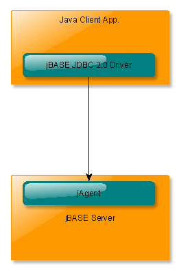
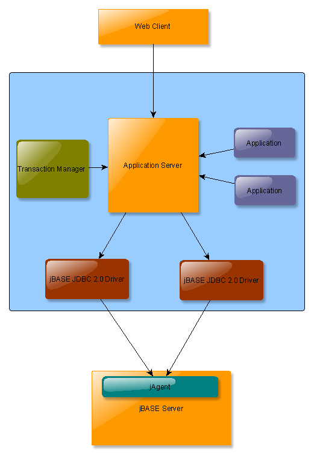

# Introduction to jODBC

<PageHeader />

## Introduction

This user guide provides detailed instructions for the configuration and deployment of the jBASE **jDBC 2.0 Driver**.

The **jBASE jDBC 2.0 Driver** is a jBASE component implementing the JDBC API. The JDBC API is part of the JavaTM 2 Platform Standard Edition 5.0 (J2SETM).

The following diagrams show two of the most common deployment scenarios. In both cases, the JDBC API implemented by the jBASE JDBC 2.0 Driver provides client applications with the ability to perform SQL queries against a jBASE server.

**Two-tier model**:

This model represents deployment scenarios where a Java Client Application has the responsibility to create and manage connection, transaction and security resource.

****

**Three-tier model:**

A three-tier deployment scenario would often involve an application server hosting different application components as e.g EJBs, servlets, etc. Deploying the jBASE JDBC Driver on a J2EE application server does not only allow those applications to perform SQL queries against jBASE, but also allows the application server to manage its connections, transactions and security aspects.



## Assumptions

This document describes many concepts and methodologies that are highly technical in nature, and as such prerequisite knowledge of the following is considered essential:

- Java Standard Edition
- Java Enterprise Edition
- SQL
- jBASE
- Secure Sockets Layer (SSL) protocol

## Deploying the jDBC driver

The jBASE JDBC Driver is packaged as a Java Archive (jar) file.

To use the JDBC Driver from a **non-managed** client application, it necessary to place this archive inside your CLASSPATH.

To deploy this archive on a **managed**environment it is necessary to configure a deployment descriptor specific to the application server.

## JBoss deployment

The following deployment descriptor is used by JBoss to load the jBASE JDBC Driver, as specified by “driver-class”. This file should be modified according to deployment requirements.

**[jbasejdbc-ds.xml](jbasejdbc-ds.xml)**

``` xml
<?xml version="1.0" encoding="UTF-8"?>
<!--========================================================================== -->
<!--                                                                           -->
<!--  JBoss deployment descriptor for jBASE JDBC Data Sources                  -->
<!--                                                                           -->
<!-- ========================================================================= -->
<datasources>
    <!—jBASE JDBC Data Source -->
    <local-tx-datasource>
        <jndi-name>jdbc/jBaseJdbcDS</jndi-name>
        <connection-url>
            jdbc:jbase:thin:@127.0.0.1:20002/mytestaccount
        </connection-url>
        <driver-class>
            com.jbase.jdbc.driver.JBaseJDBCDriver
        </driver-class>
        <user-name>test</user-name>
        <password>test</password>
    </local-tx-datasource>
</datasources>
```

After configuring the deployment descriptor, follow the steps below to deploy the jBASE JDBC driver:

- Copy the jBASE JDBC Driver (jbasejdbc.jar) archive to the *lib* directory of the JBoss *default* configuration.
- Copy the JBoss deployment descriptor to the *deploy* directory of the JBoss *default* configuration.

## Developers Guide

The following section provides a detailed guide on how to connect and access the jBASE server.

## jAgent

jBASE jAgent is a server-side jBASE component which must be listening on a user-defined TCP port on the remote jBASE instance. It accepts socket connections to process incoming requests from the JDBC Driver. Please refer to the jBASE jAgent user guide for more information on how to configure and start jAgent.

## Connecting to jBASE

JDBC provides two mechanisms to establish a connection to a data source:

- *DriverManager*:  This class requires an application to load the specific JDBC driver which in our case would be the jBASE JDBC Driver. This interface is typically used on a **non-managed** two-tier deployment scenario where a java naming service is not available.
- *DataSource*:       This interface is preferred on **managed** scenarios because JNDI is typically used to lookup a data source. The advantages of having a data source managed by the application are e.g. connection pooling, security and distributed transaction processing for XA-compliant JDBC drivers as is the jBASE JDBC driver.

*DataSource* and *DriverManager* provide the following methods to create a new connection.

For more information on these methods, please read the JDBC API documentation.

- *getConnection(String url)*
  - Obtain a new connection for the specified connection string. Connection properties must be specified inside the connection string.
- *getConnection(String url, String user, String password)*
  - Obtain a new connection for the specified connection string. Connection properties, except user and password must be specified inside the connection string.

*DriverManager* provides an additional method:

- *getConnection(String url, **Properties info**)*
  - Obtain a new connection for the specified connection string. The second parameter specifies the connection properties.

### Authentication

jAgent will attempt to authenticate a user given the user credentials provided to the *getConnection()* method.

The jBASE JDBC Driver implements the following connection properties to provide user credentials:

- **user**           Specifies the user to be authenticated
- **password**       Specifies the user’s password

### Encryption

jAgent can be configured to use SSL encrypted connections for deployment scenarios which require enhanced security.

The jBASE JDBC Driver implements the following connection properties:

- **SSL** [Default value:  **false**]
  - Specifies whether the connection should use SSL encryption. SSL should only be used if the jAgent instance running on the jBASE server has also been configured to accept SSL connections.
- **enableNaiveTrustManager**[Default value:  **false**]
  - This property forces the JDBC Driver to trust all server certificates.

### Example using the *DataSource* interface

``` java
Connection cx = null;
try {
    InitialContext ic = new InitialContext();
    Object cxfObj = ic.lookup("java:comp/env/jdbc/jBaseDB");
    DataSource cxf = (DataSource) cxfObj;
    cx = (Connection) cxf.getConnection();
} catch(NamingException e) {
    // error
}
```

### Example 1 using the *DriverManager* interface

``` java
//Load jBASE JDBC Driver
Class.forName("com.jbase.jdbc.driver.JBaseJDBCDriver");
//Set connection properties and request a new connection
String url = "jdbc:jbase:thin:@127.0.0.1:20002";
Properties cxProps = new Properties();
cxProps.setProperty("user", "test");
cxProps.setProperty("password", "newpassword");
cxProps.setProperty("SSL", "true");                  //Enable SSL
cxProps.setProperty("NaiveTrustManager", "true");
Connection cx = DriverManager.getConnection(url, cxProps);
```

### Example 2 using the *DriverManager* interface

``` java
//Load jBASE JDBC Driver
Class.forName("com.jbase.jdbc.driver.JBaseJDBCDriver");
//Set connection properties and request a new connection
String url = "jdbc:jbase:thin:@127.0.0.1:20002/MyTestAccount?user=test&password=newpassword&SSL=true&NaiveTrustManager=true";
Connection cx = DriverManager.getConnection(url);
```

## Closing a connection

After finishing with the connection, it must be closed:

``` java
cx.close();
```

## jDBC API reference

The jBASE jDBC 2.0 Driver implements a subset of the jDBC 2.0 API.

Please read the jDBC specification documentation or refer to the JDBC API javadoc documentation for further information.

The following example shows how a client application executing an SQL SELECT query and display the obtained result set:

``` java
Statement stat = null;
try {
    //Create an SQL statement and perform a SQL SELECT query
    stat = cx.createStatement();
    ResultSet rs = stat.executeQuery("SELECT NAME FROM MYTABLE");
    //Obtain the meta data associated to the result set to print the no. of columns
    ResultSetMetaData rsMetaData = rs.getMetaData();
    System.out.println("Number of columns: " + rsMetaData.getColumnCount());
    //Fetch all rows and display the first column
    while(rs.next()) {
        System.out.println("NAME: " + rs.getString("NAME"));
    }
} catch(SQLException e) {
    throw e;
} finally {
    closeDB(stat);
}
```

<PageFooter />
