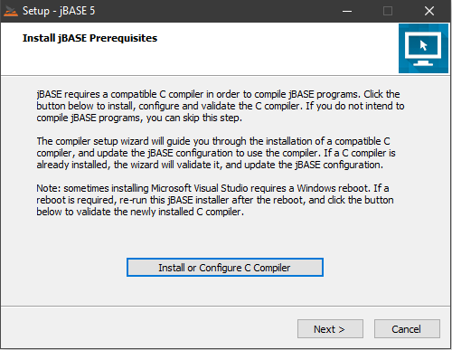
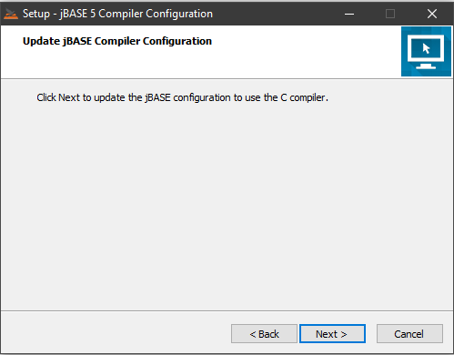
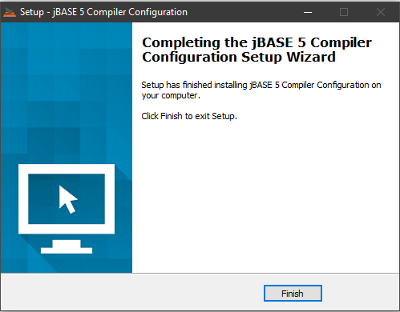

# Notes on Environment Variables for the jBASE compiler

<PageHeader />

**Tags:**
<badge text='path' vertical='middle' />
<badge text='windows' vertical='middle' />
<badge text='compiler' vertical='middle' />
<badge text='environment variables' vertical='middle' />

Due to the deprecation of the Windows SDK for Windows 7 compiler, jBASE is now utilizing the C compiler for Visual Studio 2017 and more recently Visual Studio 2019.

One of the issues that users have encountered is a warning that PATH is too long and has been truncated.

If the "redundant" entries are removed from your PATH, together with the INCLUDE entries, that will help cut down on the size.

Depending on how you installed Visual Studio and/or the BuildTools, the “BuildTools” string may be replaced by “Professional”, for instance.

The “C:\Windows\system32\config\systemprofile\AppData\Local\Microsoft\WindowsApps” setting may be added to the Path in the user variables, but does not always exist.

Please also be aware that the Environment Variable settings for the Visual Studio 2017/2019 Build Tools are not 100% reliable, as the folders contain build version numbers which are liable to change over time as Microsoft issues updates.

To that end, there is an [update in jBASE 5.7.7 onwards](#jbase-5-7-7-and-later) which moves these settings to the jBASE "system.properties" file.  

## Up-to-date notes on the jBASE 5.7.7 Install

> For a jBASE upgrade, if you wish to retain your existing PATH. INCLUDE and LIB settings, install jBASE as usual and ignore the prompt to "Install or Configure C Compiler and just run the normal upgrade process.
>
> For a jBASE upgrade where you wish to take advantage of a "clean" PATH and not have to worry about INCLUDE and LIB, first remove all of the VS 2017/2019 settings from PATH and delete the INCLUDE and LIB entries before starting the upgrade process.
> Then, when starting the upgrade process, click on the "Install or Configure C Compiler" button:
> .  
>
> The Installer will then perform several steps culminating in the following screen:  
>  
>   
>  
> After a short while, the Compiler Configuration will complete and the following screen will appear:  
> .  
> Click on the Finish button and complete the upgrade as usual. The system.properties file will now contain the necessary setting to enable you to compile and catalog programs -  [See jBASE 5.7.7 onwards](#jbase-5-7-7-and-later)  
>
> For a new jBASE installation, just follow the prompts to install the compiler and then jBASE, as per the [installation guides](./../../administration/installation-guides/jbase-5.6-windows-installation-guide/README.md) and the system.properties file will automatically be updated for you.

* * *

## VS2017

### Note

>As of this writing, 'MSVCRT.lib' currently resides in “C:\Program Files (x86)\Microsoft Visual Studio\2017\BuildTools\VC\Tools\MSVC\14.15.27023\lib\x64”.
>
>That folder was previously “..\MSVC\14.15.27023\lib\x64” and "..\MSVC\14.15.26726\lib\x64”.
>
>There have been similar changes for one of the “LIB” and “INCLUDE” folders

Below are the PATH and INCLUDE Environment Variables that can be adjusted.

The "PATH" System Environment C variables that are installed by the jBASE compiler installer for **VS2017** , [VS2019](#vs2019) have:

```
C:\Program Files (x86)\Microsoft Visual Studio\2017\BuildTools\VC\Tools\MSVC\14.15.27023\bin\HostX64\x64;
C:\Program Files (x86)\Microsoft Visual Studio\2017\BuildTools\Common7\IDE\CommonExtensions\Microsoft\TestWindow;
C:\Program Files (x86)\Microsoft Visual Studio\2017\BuildTools\MSBuild\15.0\bin\Roslyn;
C:\Program Files (x86)\Windows Kits\10\bin\10.0.17763.0\x64;
C:\Program Files (x86)\Windows Kits\10\bin\x64;
C:\Program Files(x86)\Microsoft Visual Studio\2017\BuildTools\\MSBuild\15.0\bin;
C:\Windows\Microsoft.NET\Framework64\v4.0.30319; C:\Program Files (x86)\Microsoft Visual Studio\2017\BuildTools\Common7\IDE\;
C:\Program Files (x86)\Microsoft Visual Studio\2017\BuildTools\Common7\Tools\
```

jBASE requires:

```
C:\Program Files (x86)\Microsoft Visual Studio\2017\BuildTools\VC\Tools\MSVC\14.15.27023\bin\HostX64\x64;
C:\Program Files (x86)\Microsoft Visual Studio\2017\BuildTools\MSBuild\15.0\bin;
C:\Program Files (x86)\Microsoft Visual Studio\2017\BuildTools\Common7\IDE\;
C:\Program Files (x86)\Windows Kits\10\bin\10.0.17763.0\x64
```

The "INCLUDE" that are installed have:

```
C:\Program Files (x86)\Microsoft Visual Studio\2017\BuildTools\VC\Tools\MSVC\14.15.27023\include;
C:\Program Files (x86)\Windows Kits\10\include\10.0.17763.0\ucrt;
C:\Program Files (x86)\Windows Kits\10\include\10.0.17763.0\shared;
C:\Program Files (x86)\Windows Kits\10\include\10.0.17763.0\um;
C:\Program Files (x86)\Windows Kits\10\include\10.0.17763.0\winrt;
C:\Program Files (x86)\Windows Kits\10\include\10.0.17763.0\cppwinrt
```

jBASE requires:

```
C:\Program Files (x86)\Microsoft Visual Studio\2017\BuildTools\VC\Tools\MSVC\14.15.27023\include;
C:\Program Files (x86)\Windows Kits\10\include\10.0.17763.0\ucrt;
C:\Program Files (x86)\Windows Kits\10\include\10.0.17763.0\shared;
C:\Program Files (x86)\Windows Kits\10\include\10.0.17763.0\um;
```

The "LIB" should be:

```
C:\Program Files (x86)\Microsoft Visual Studio\2017\BuildTools\VC\Tools\MSVC\14.15.27023\lib\x64;
C:\Program Files (x86)\Windows Kits\10\lib\10.0.17763.0\ucrt\x64;
C:\Program Files (x86)\Windows Kits\10\lib\10.0.17763.0\um\x64;
```

* * *

## VS2019

The required environment variables for VS2019 are as follows:

"PATH"

```
C:\Program Files (x86)\Microsoft Visual Studio\2019\BuildTools\VC\Tools\MSVC\14.25.28610\bin\HostX64\x64;
C:\Program Files (x86)\Microsoft Visual Studio\2019\BuildTools\MSBuild\Current\bin;
C:\Program Files (x86)\Microsoft Visual Studio\2019\BuildTools\Common7\IDE\;
C:\Program Files (x86)\Windows Kits\10\bin\10.0.18362.0\x64
```

"INCLUDE"

```
C:\Program Files (x86)\Microsoft Visual Studio\2019\BuildTools\VC\Tools\MSVC\14.25.28610\include;
C:\Program Files (x86)\Windows Kits\10\include\10.0.18362.0\ucrt;
C:\Program Files (x86)\Windows Kits\10\include\10.0.18362.0\shared;
C:\Program Files (x86)\Windows Kits\10\include\10.0.18362.0\shared;
```

"LIB"

```
C:\Program Files (x86)\Microsoft Visual Studio\2019\BuildTools\VC\Tools\MSVC\14.15.27023\lib\x64;
C:\Program Files (x86)\Windows Kits\10\lib\10.0.18362.0\ucrt\x64;
C:\Program Files (x86)\Windows Kits\10\lib\10.0.18362.0\um\x64;
```

## jBASE 5.7.7 and later

In jBASE 5.7.7, the compiler settings are kept in the %JBCRELEASEDIR%\config\system.properties file, in the "JCOMPILE PROPERTIES" section, i.e.:

```
jcompile.cc.path=C:\\Program Files (x86)\\Microsoft Visual Studio\\2019\\BuildTools\\VC\\Tools\\MSVC\\14.25.28610\\bin\\HostX64\\x64;C:\\Program Files (x86)\\Microsoft Visual Studio\\2019\\BuildTools\\Common7\\IDE\\CommonExtensions\\Microsoft\\TestWindow;C:\\Program Files (x86)\\Microsoft Visual Studio\\2019\\BuildTools\\MSBuild\\Current\\bin\\Roslyn;C:\\Program Files (x86)\\Windows Kits\\10\\bin\\10.0.18362.0\\x64;C:\\Program Files (x86)\\Windows Kits\\10\\bin\\x64;C:\\Program Files (x86)\\Microsoft Visual Studio\\2019\\BuildTools\\\\MSBuild\\Current\\Bin;C:\\Windows\\Microsoft.NET\\Framework64\\v4.0.30319;C:\\Program Files (x86)\\Microsoft Visual Studio\\2019\\BuildTools\\Common7\\IDE\\;C:\\Program Files (x86)\\Microsoft Visual Studio\\2019\\BuildTools\\Common7\\Tools\\;;C:\\Program Files (x86)\\Microsoft Visual Studio\\2019\\BuildTools\\Common7\\IDE\\CommonExtensions\\Microsoft\\CMake\\CMake\\bin;C:\\Program Files (x86)\\Microsoft Visual Studio\\2019\\BuildTools\\Common7\\IDE\\CommonExtensions\\Microsoft\\CMake\\Ninja
jcompile.cc.include=C:\\Program Files (x86)\\Microsoft Visual Studio\\2019\\BuildTools\\VC\\Tools\\MSVC\\14.25.28610\\include;C:\\Program Files (x86)\\Windows Kits\\10\\include\\10.0.18362.0\\ucrt;C:\\Program Files (x86)\\Windows Kits\\10\\include\\10.0.18362.0\\shared;C:\\Program Files (x86)\\Windows Kits\\10\\include\\10.0.18362.0\\um;C:\\Program Files (x86)\\Windows Kits\\10\\include\\10.0.18362.0\\winrt;C:\\Program Files (x86)\\Windows Kits\\10\\include\\10.0.18362.0\\cppwinrt
jcompile.cc.lib=C:\\Program Files (x86)\\Microsoft Visual Studio\\2019\\BuildTools\\VC\\Tools\\MSVC\\14.25.28610\\lib\\x64;C:\\Program Files (x86)\\Windows Kits\\10\\lib\\10.0.18362.0\\ucrt\\x64;C:\\Program Files (x86)\\Windows Kits\\10\\lib\\10.0.18362.0\\um\\x64
```

All of this can, however, be pared  down to the following:

```
jcompile.cc.path=C:\\Program Files (x86)\\Microsoft Visual Studio\\2019\\BuildTools\\VC\\Tools\\MSVC\\14.25.28610\\bin\\HostX64\\x64;C:\\Program Files (x86)\\Windows Kits\\10\\bin\\10.0.18362.0\\x64;C:\\Program Files (x86)\\Windows Kits\\10\\bin\\x64;C:\\Program Files (x86)\\Microsoft Visual Studio\\2019\\BuildTools\\\\MSBuild\\Current\\Bin;C:\\Program Files (x86)\\Microsoft Visual Studio\\2019\\BuildTools\\Common7\\IDE\\;C:\\Program Files (x86)\\Microsoft Visual Studio\\2019\\BuildTools\\Common7\\IDE\\CommonExtensions\\Microsoft\\CMake\\CMake\\bin
jcompile.cc.include=C:\\Program Files (x86)\\Microsoft Visual Studio\\2019\\BuildTools\\VC\\Tools\\MSVC\\14.25.28610\\include;C:\\Program Files (x86)\\Windows Kits\\10\\include\\10.0.18362.0\\ucrt;C:\\Program Files (x86)\\Windows Kits\\10\\include\\10.0.18362.0\\shared;C:\\Program Files (x86)\\Windows Kits\\10\\include\\10.0.18362.0\\um
jcompile.cc.lib=C:\\Program Files (x86)\\Microsoft Visual Studio\\2019\\BuildTools\\VC\\Tools\\MSVC\\14.25.28610\\lib\\x64;C:\\Program Files (x86)\\Windows Kits\\10\\lib\\10.0.18362.0\\ucrt\\x64;C:\\Program Files (x86)\\Windows Kits\\10\\lib\\10.0.18362.0\\um\\x64
```

This results in a much shorter PATH setting in the System Environment variables.  

Back to [Environment Variables](./../README.md)

<PageFooter />
