# Restoring data from a Linux Veeam backup  

When a Veeam Linux backup is made, the backup files can be inspected in File Explorer:

To restore data from this backup, you can either double-click on the .vbk file, which brings up the following screen and may lead to a rather unsatisfactory experience, as it does not appear to be possible to make any selection:

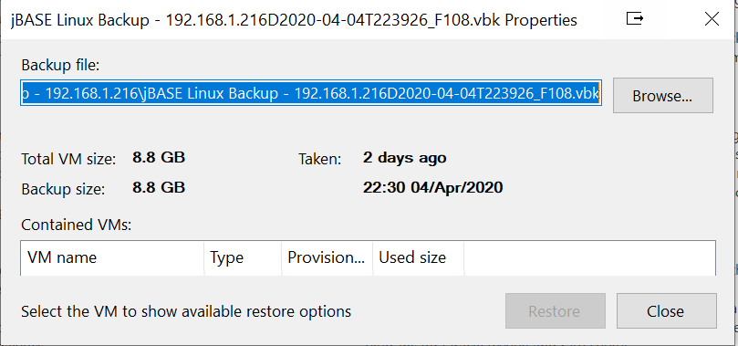

Alternatively, navigate to "Inventory -> Computer Tools -> Restore -> Agent ":

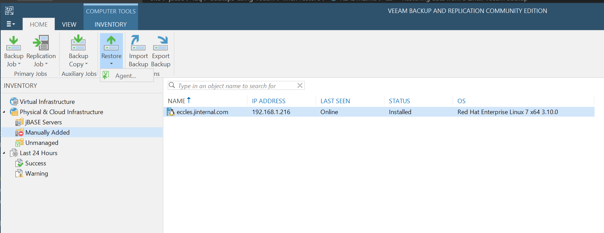

Which results in this form being displayed:

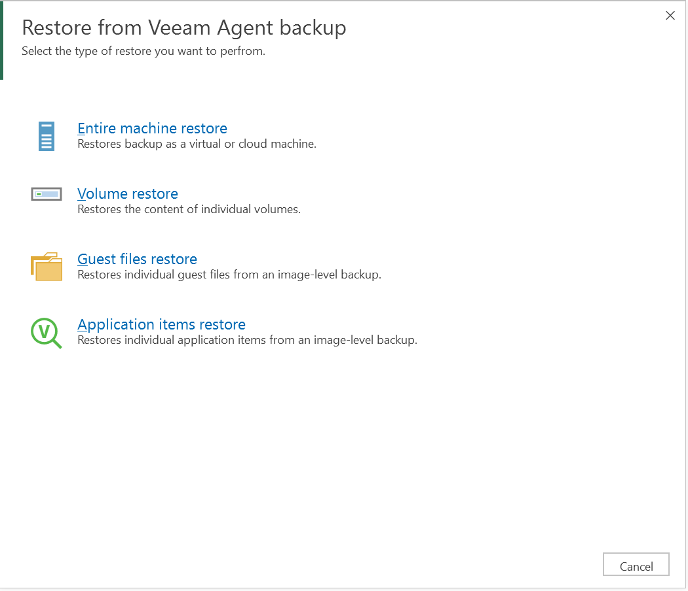

Assuming that individual files are required here, select "Guest files restore".

Then "Linux and other":

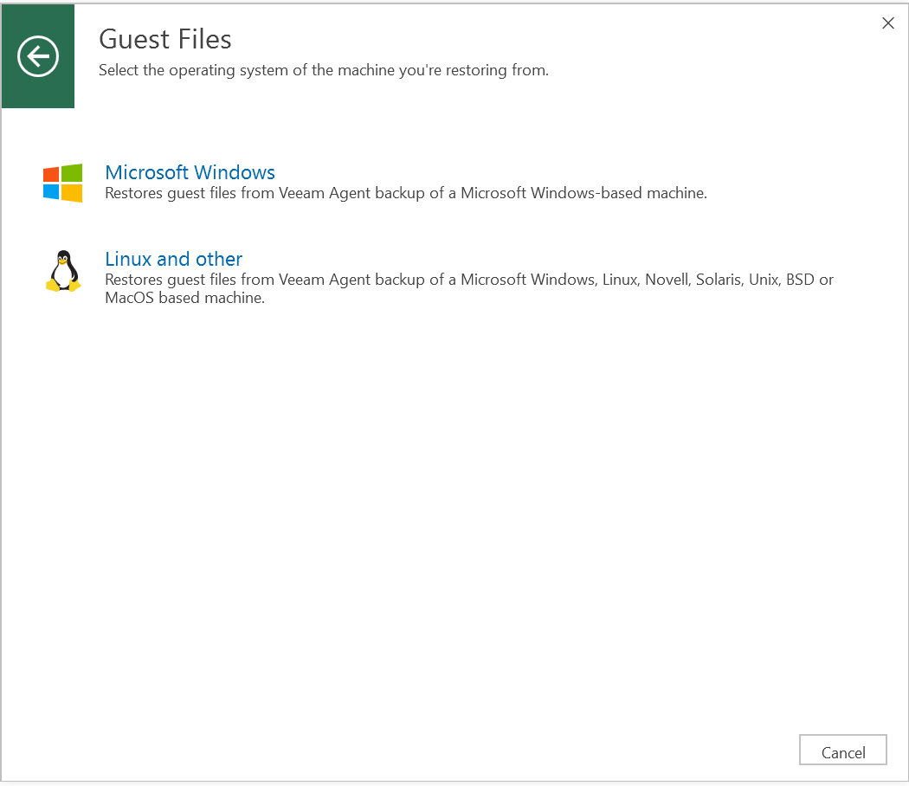

Which bring up the Guest File Restore Wizard.

Expand the tree and select the VM backup from which you wish to restore:

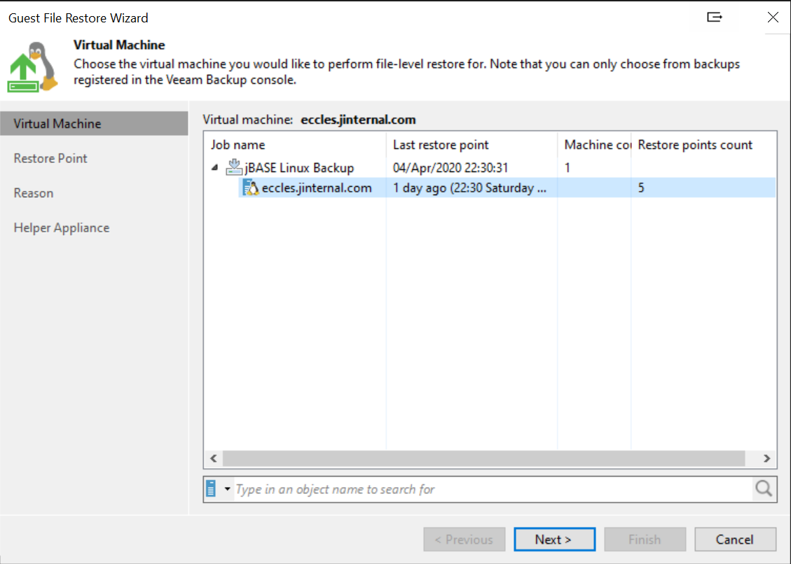

Select the Restore Point:

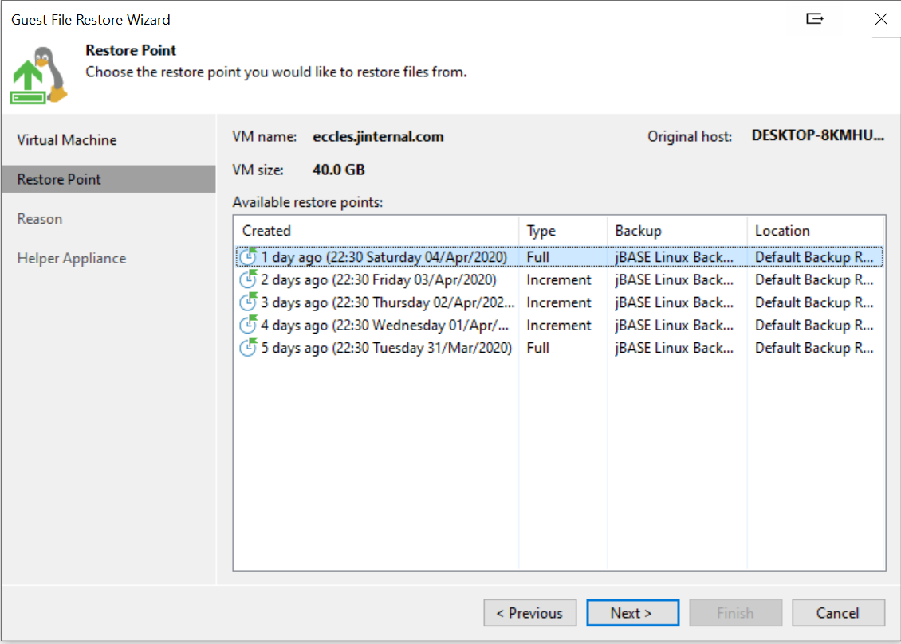

For audit purposes, enter the reason for the restore. It is also possible to elect to skip this page:

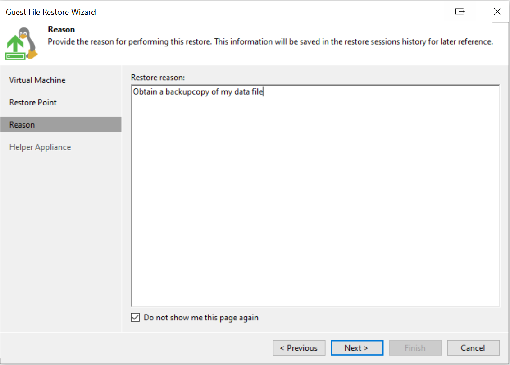

In order to be able to achieve a file level restore an Esxi server needs to be available as a File Level Restore helper appliance (FLR): 

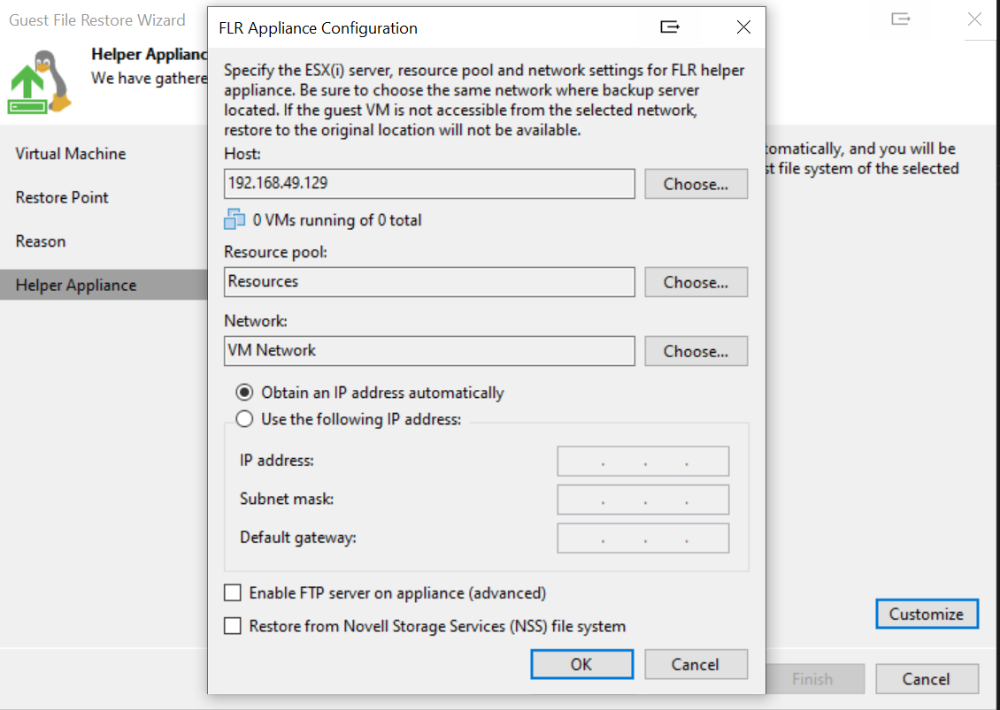

And "Finish"

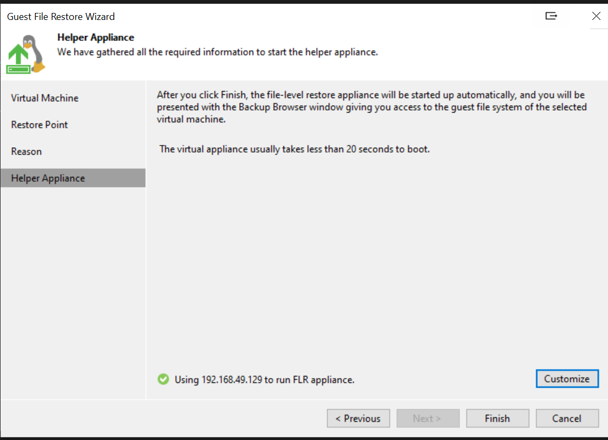

You are then presented with the layout of the Linux volume with the complete file system:

from which to select the file(s) to be restored:

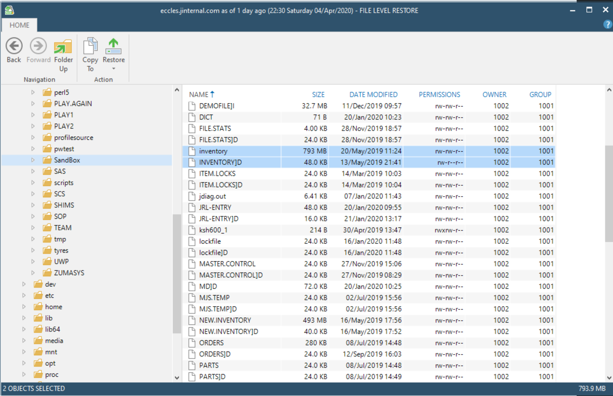

It is possible to elect for the files to be copied to a local drive, then proceed with a manual restore to the server itself at a convenient time, i.e. via ftp:

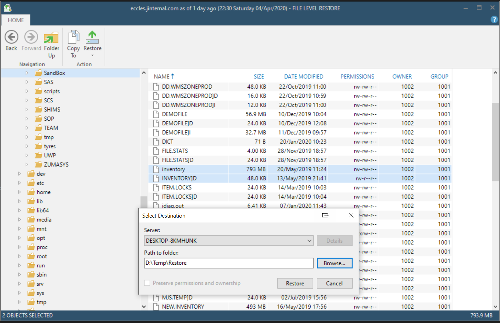

In progress:

or to restore to the original VM with either "Keep" or "Overwrite"  option, which, as with the Windows version seems to be a slow and error prone process:

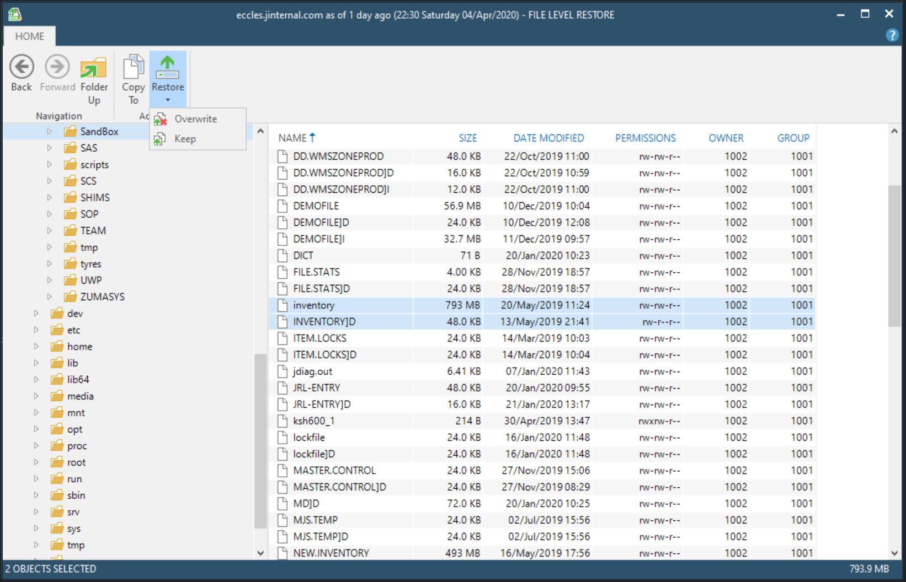

## To be completed

Back to [Veeam](./../README.md)
