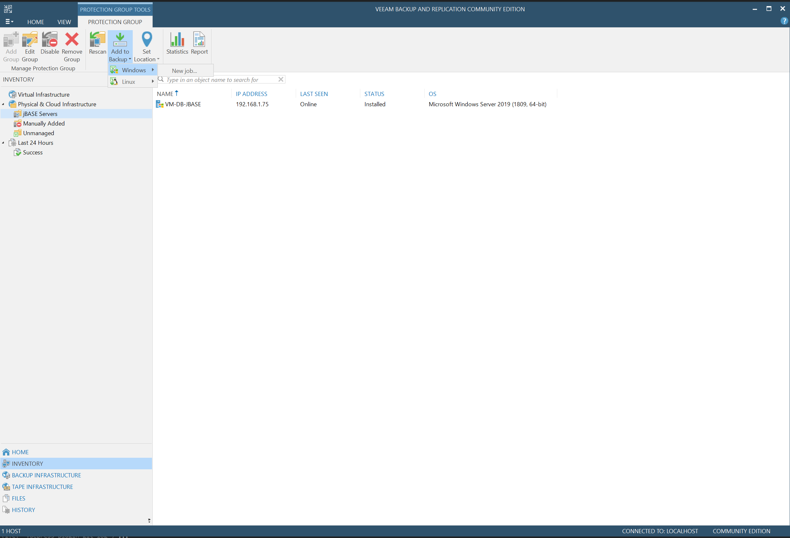
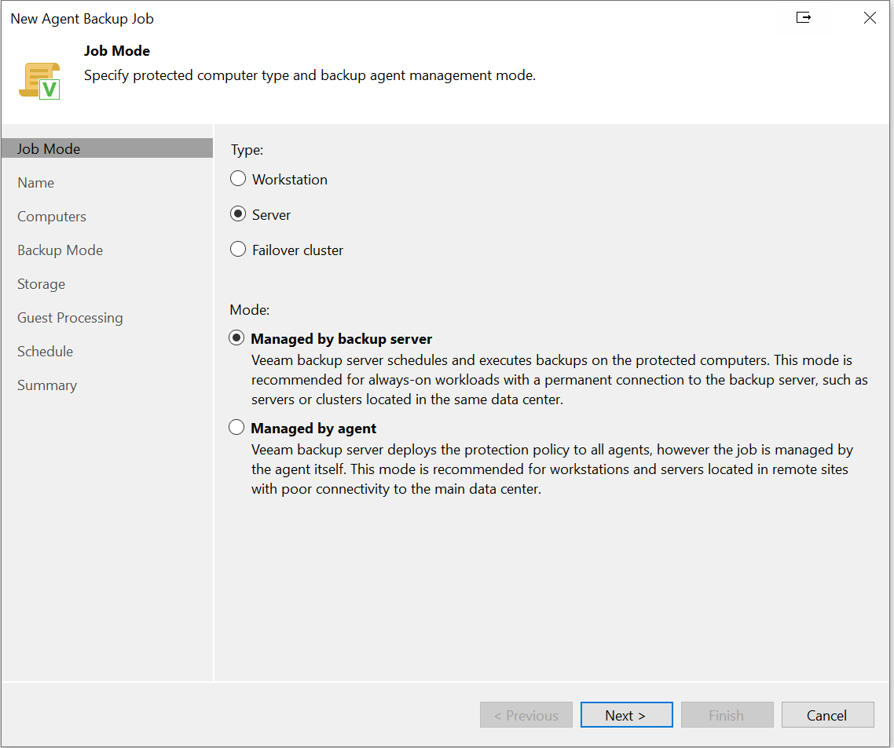
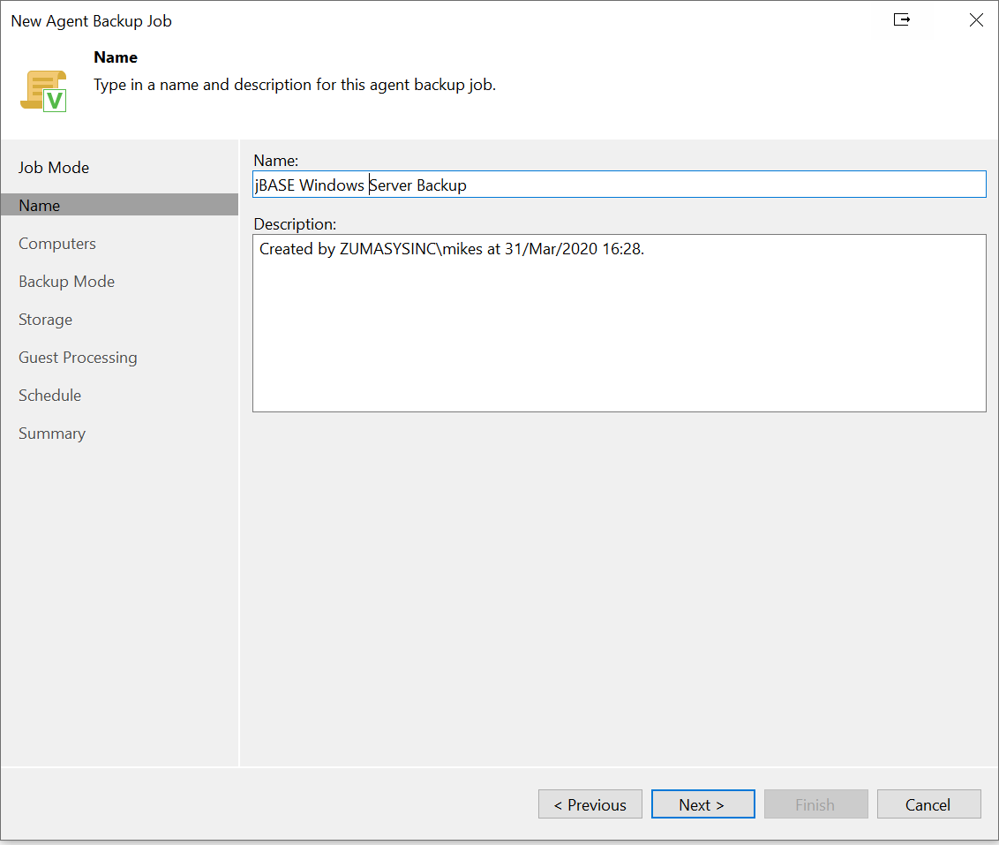
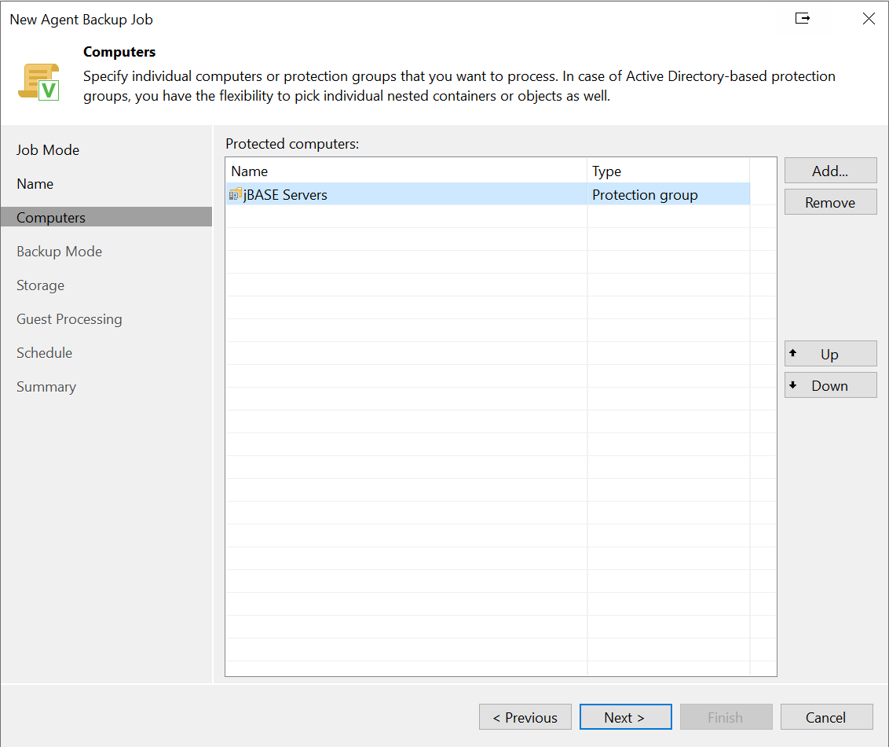
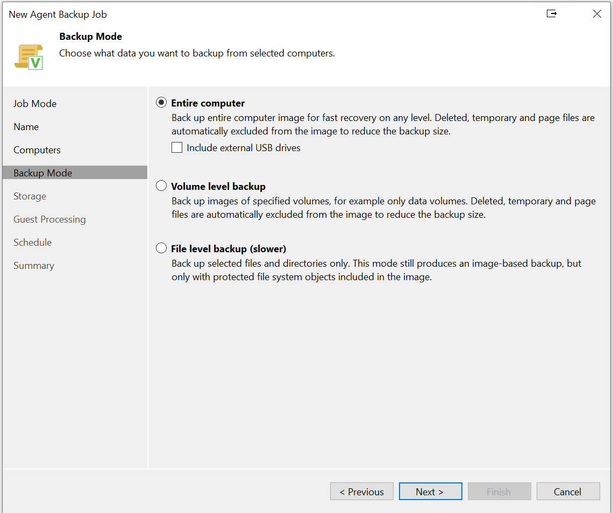
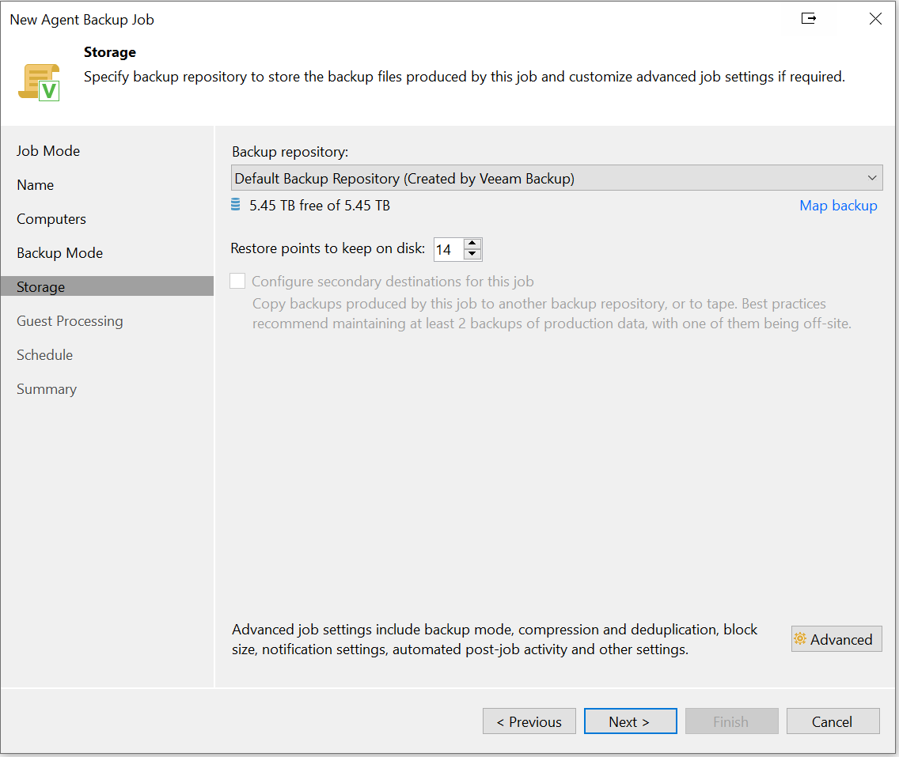
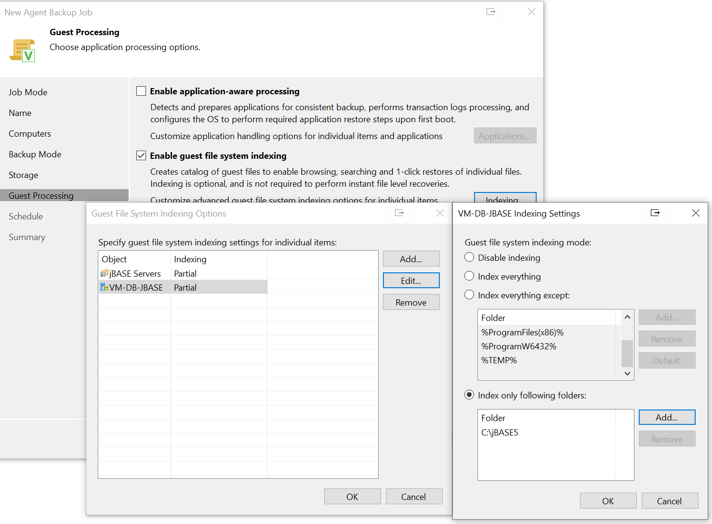
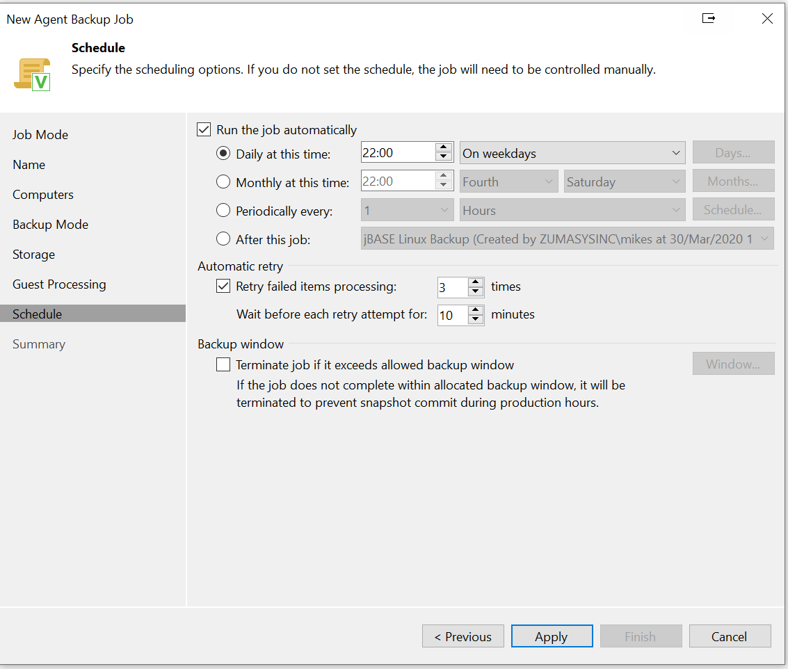
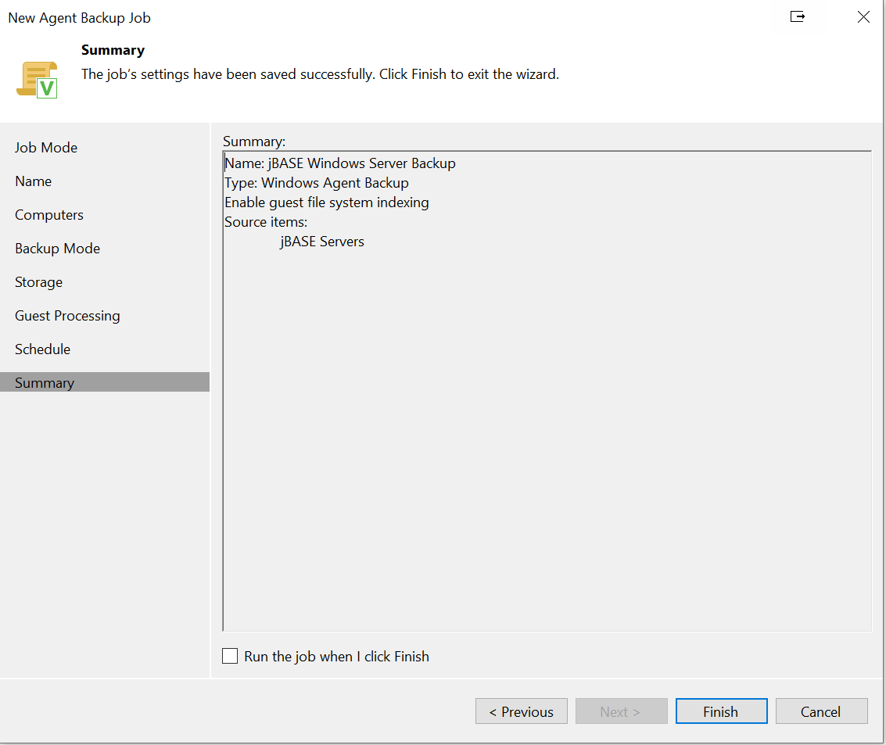

# Configuring a Full Backup for a Windows Server Protection Group

Navigate to "Inventory -> Protection Group -> Add to bacup -> Windows -> New job":

Select the appropriate Job Mode:  

Assign a meaningful name:  

Select the Protection Group(s) or Individual Servers you wish to back-up:  

Select the appropriate Backup Mode:  

Select a storage location with adequate space to store these full backups:  

Select any Guest Processing that needs to be done in order to facilitate restores:  

Set a schedule for when the backups should be run:  

Then "Apply" and "Finish":  

Back to [Veeam](./../README.md)
