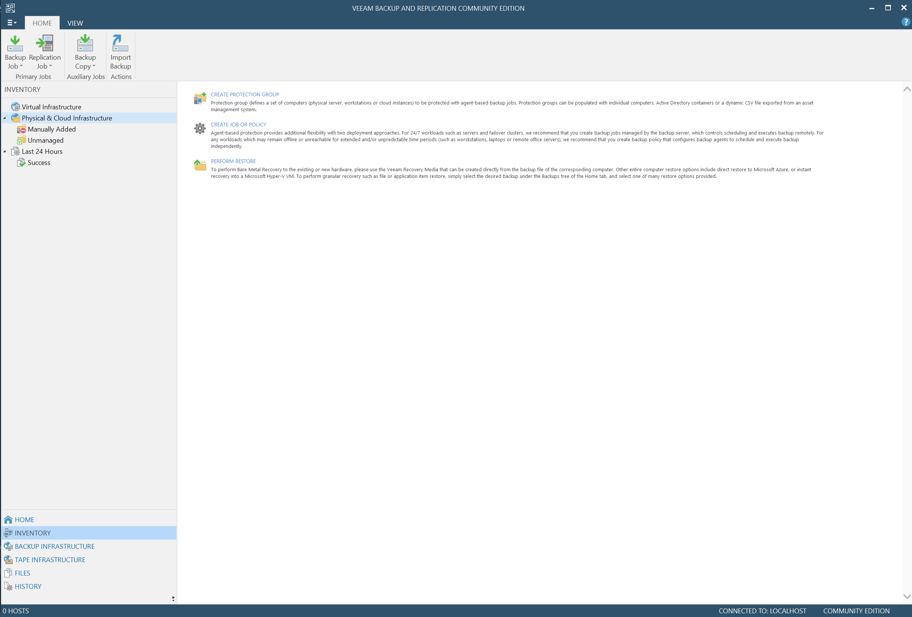
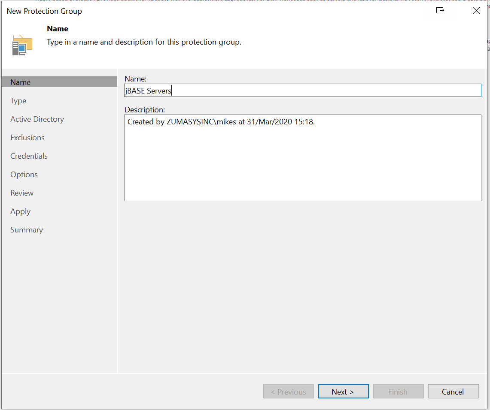
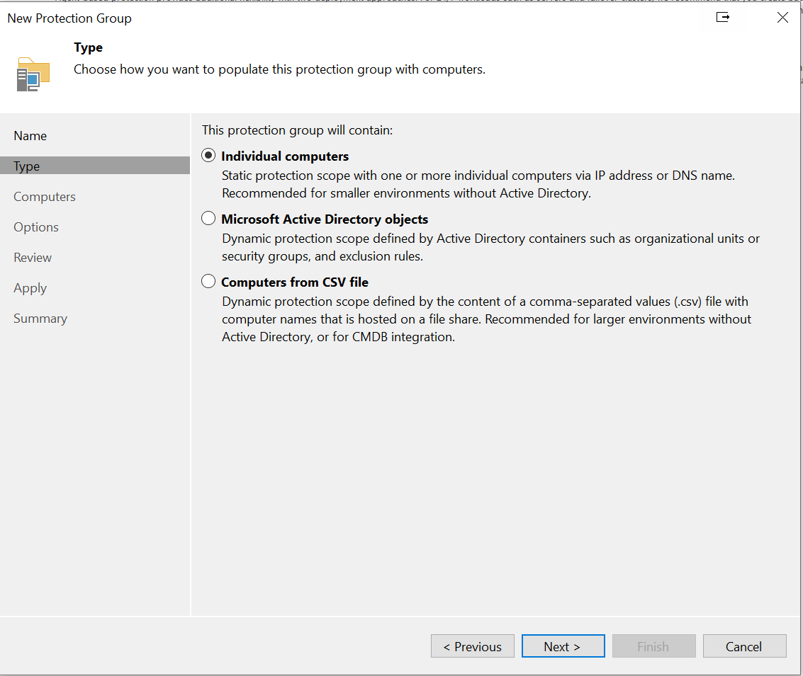
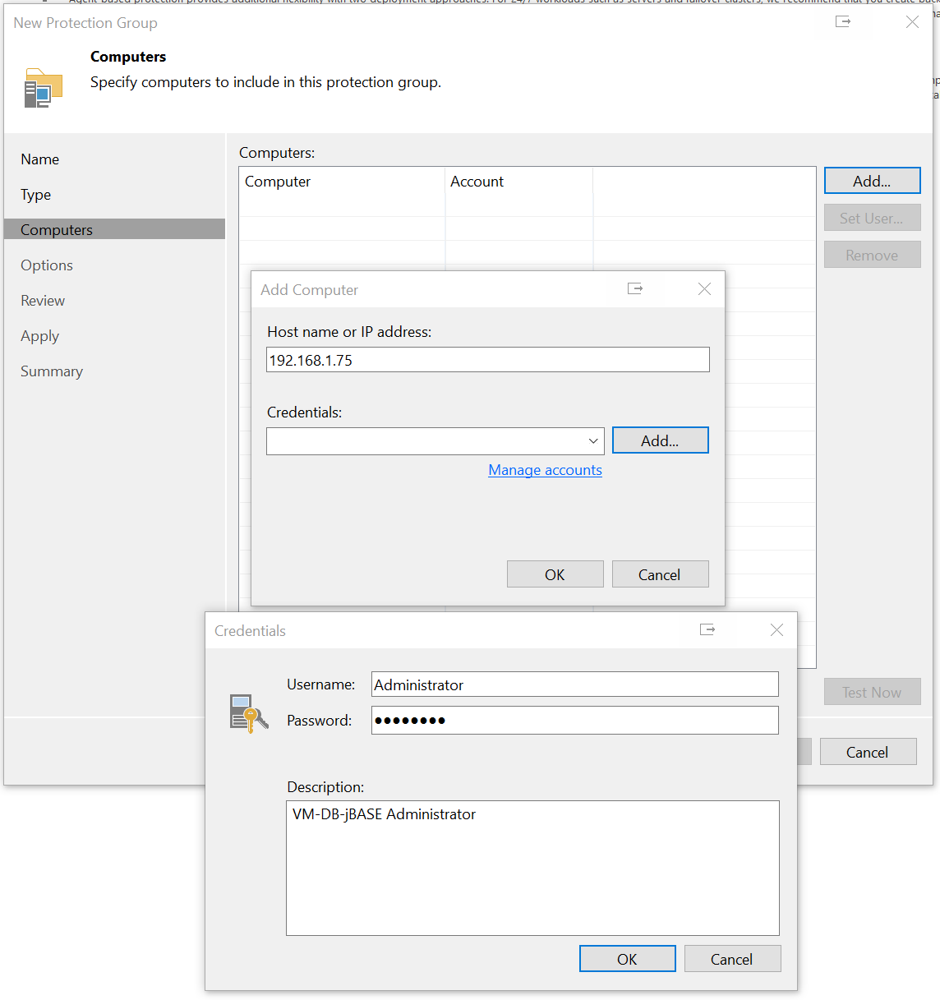
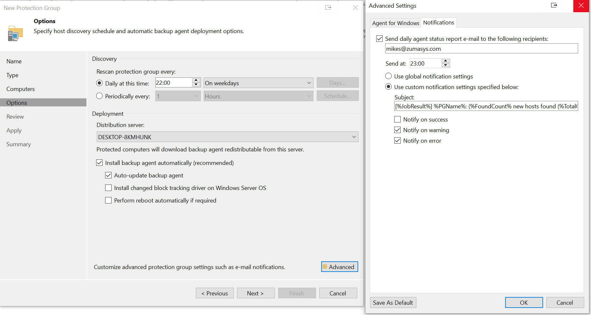
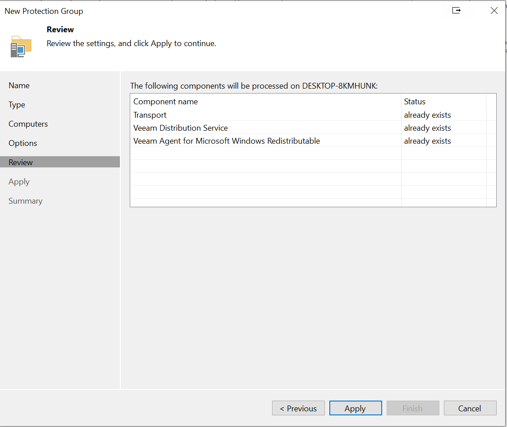
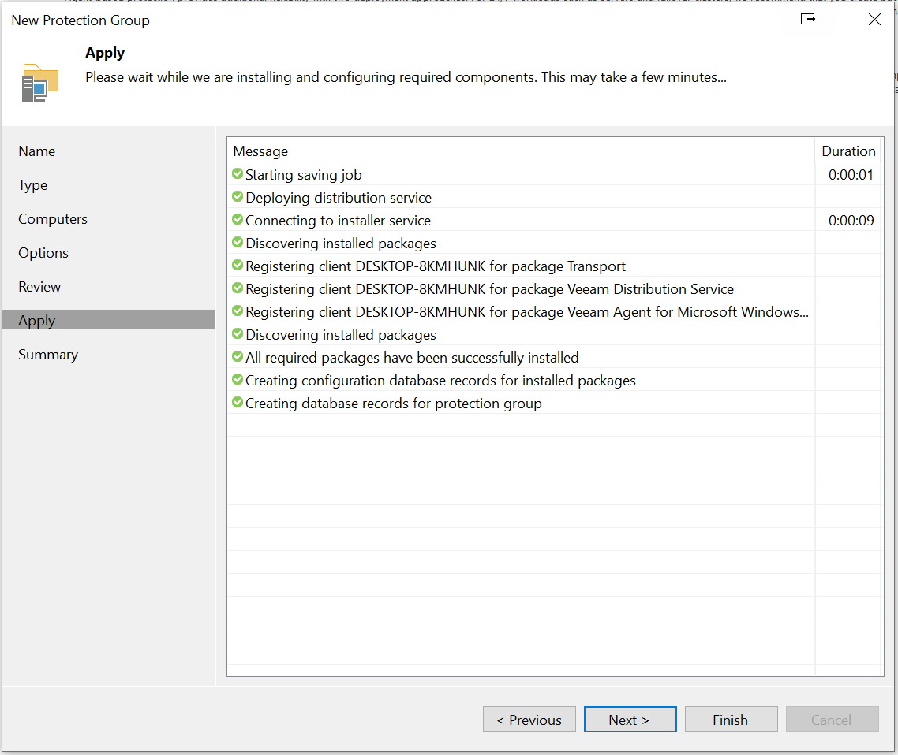
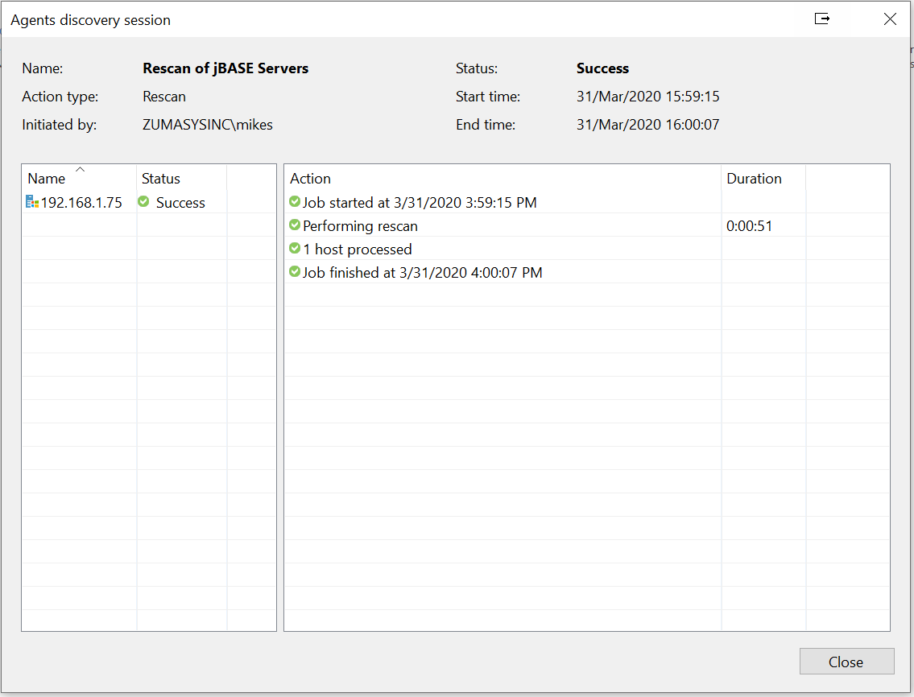

# Configuring a Protection Group for a Windows jBASE server  

<PageHeader />

From the Veeam console, select "Home -> Inventory -> Physical & Cloud Infrastructure -> Create Protection Group":

Assign a meaningful name:

Define type of computers to back up:

Add details of a server to be backed-up:

Select regular and Advanced options as required:

Review:

and Apply:

At the "Finish", the server(s) are rescanned

Back to [Veeam](./../README.md)

<PageFooter />
