# Restoring data from a Windows Veeam backup

<PageHeader />

When a Veeam Windows backup is made, the backup files can be inspected in File Explorer:

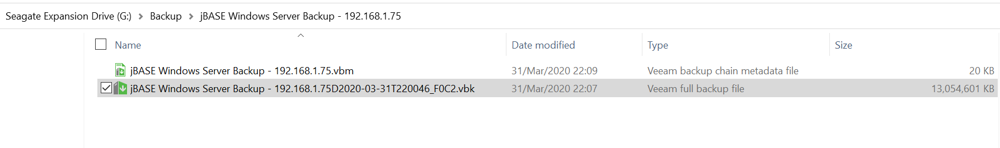

To restore data from this backup, you can either double-click on the .vbk file, which brings up the following screen and may lead to a rather unsatisfactory experience, as it does not appear to be possible to make any selection:

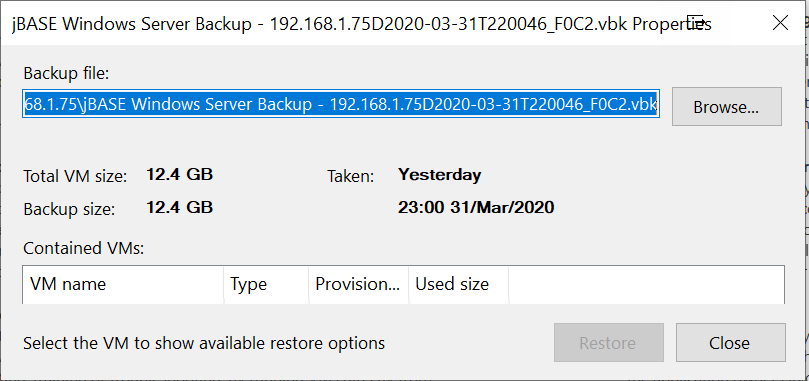

Alternatively, navigate to "Inventory -> Physical & Cloud Infrastructure -> Perform Restore":

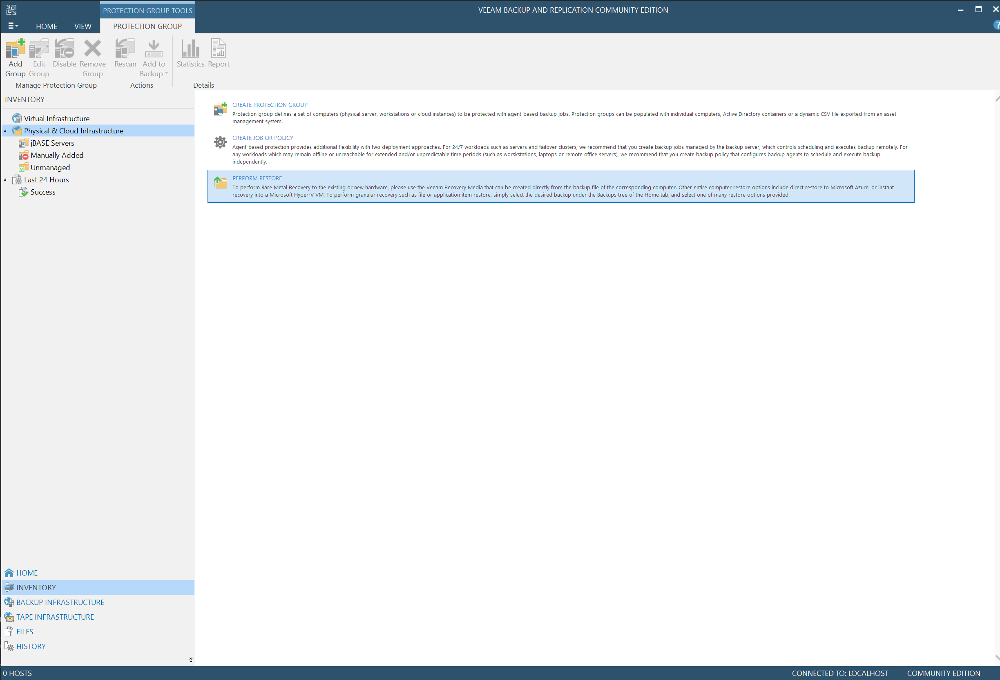

You can the select the Windows server from which to restore data:

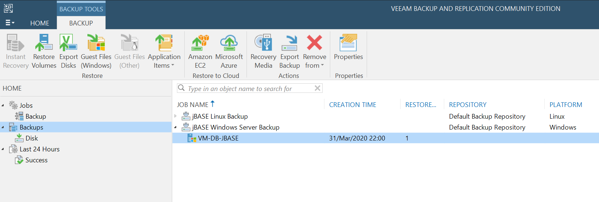

Select the "Guest Files (Windows) Restore" option and the Restore Point:

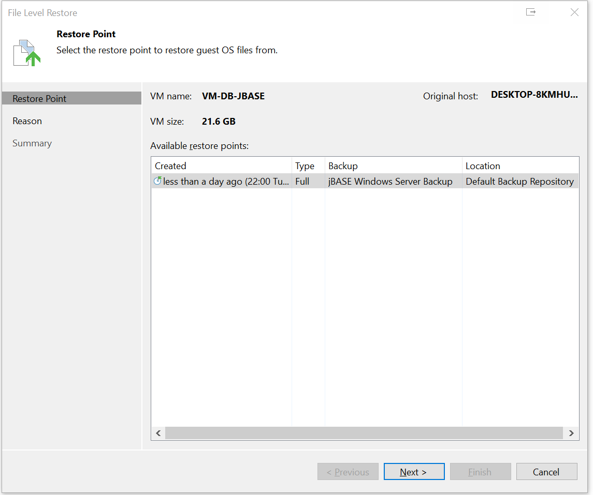

For audit purposes, enter the reason for the restore. It is also possible to elect to skip this page:

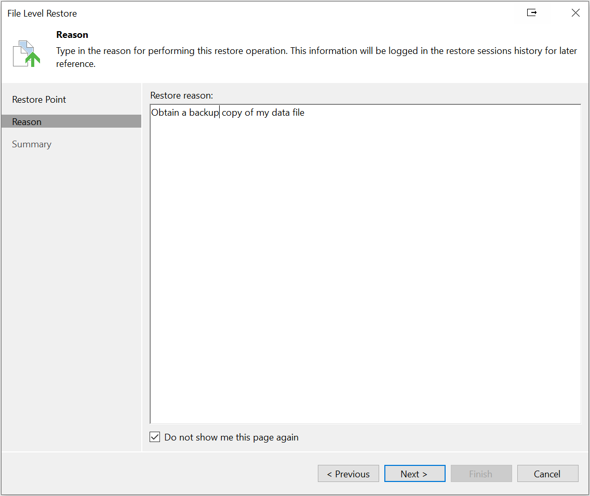

and Finish:

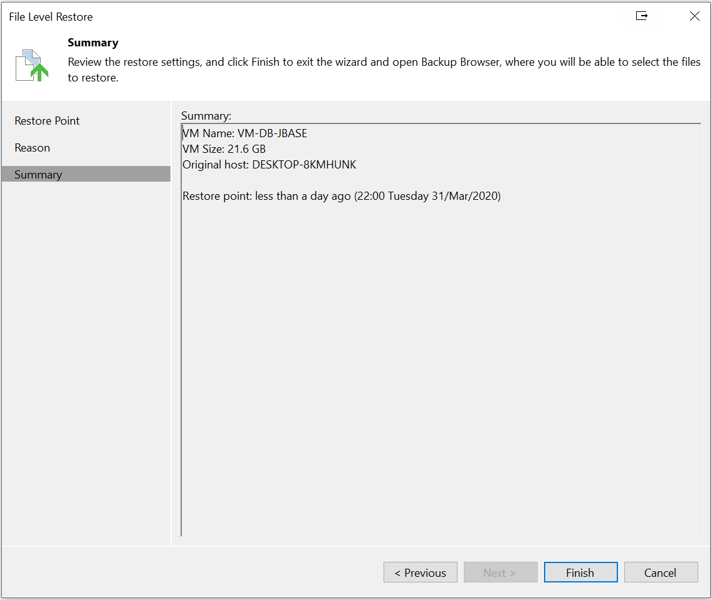

This results in a Restore Session being started:

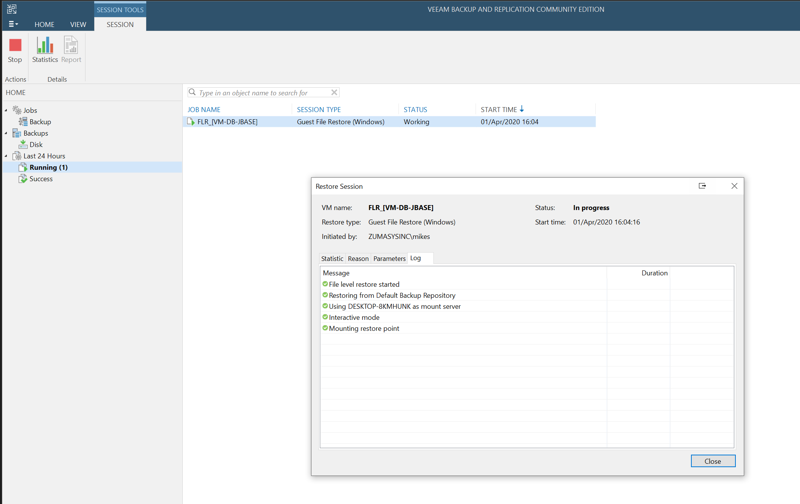

and a folder listing being presented:

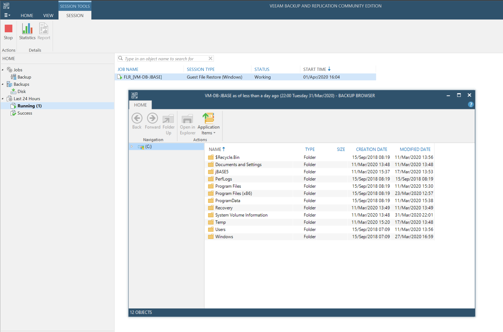

The appropriate folder can be opened and the required files selected:

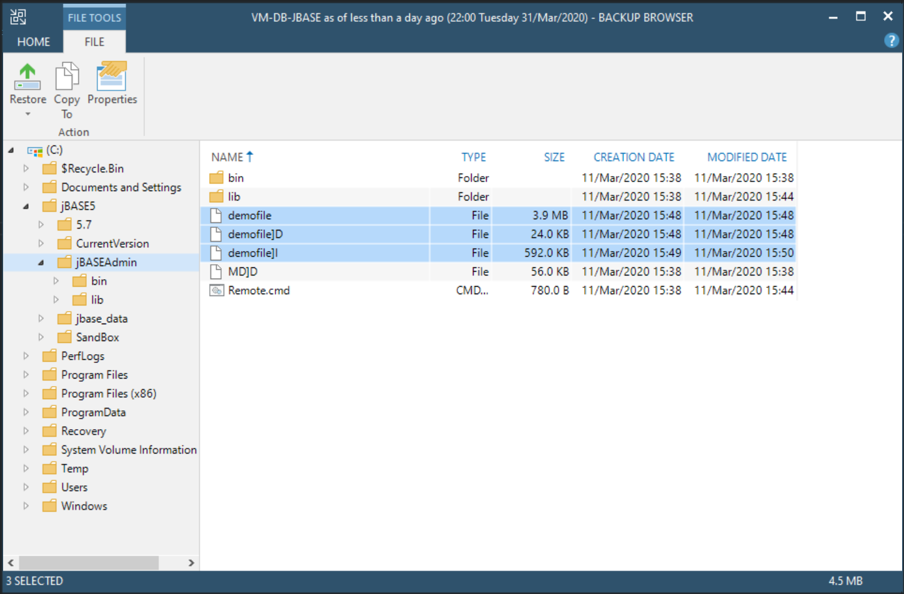

You can elect to restore to the server and either keep or overwrite, which currently seems to be a slow and error prone process:

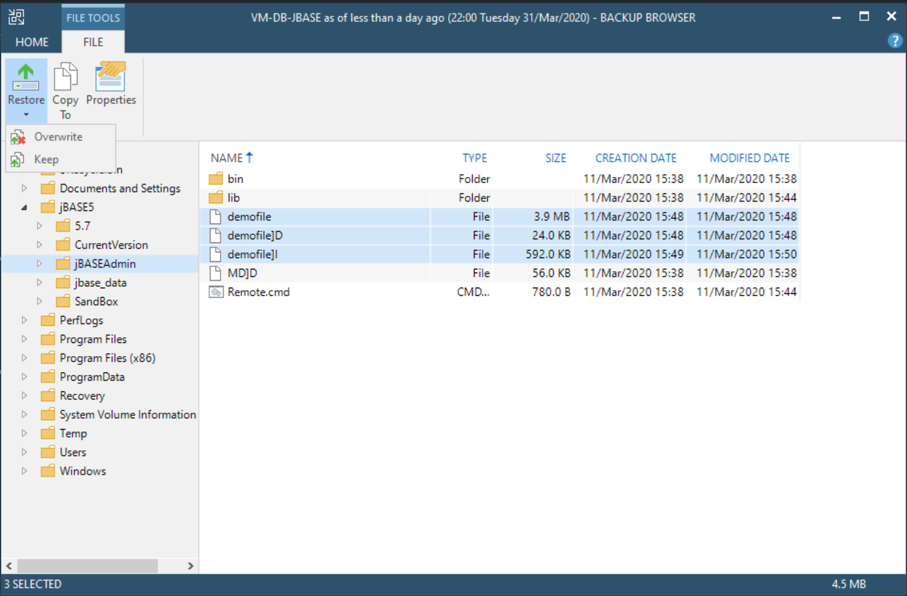

Or elect to browse to and restore into a folder on a local drive, then proceed with a manual restore to the server itself at a convenient time:

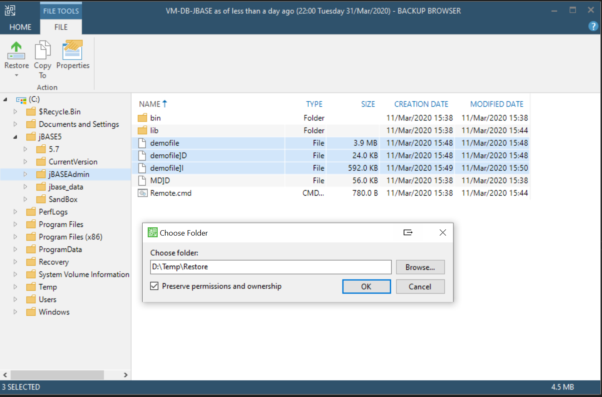

Back to [Veeam](./../README.md)
