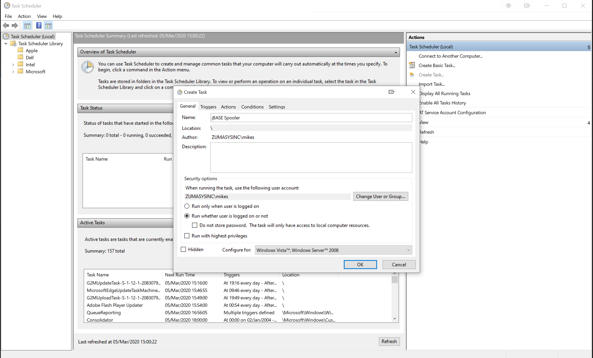
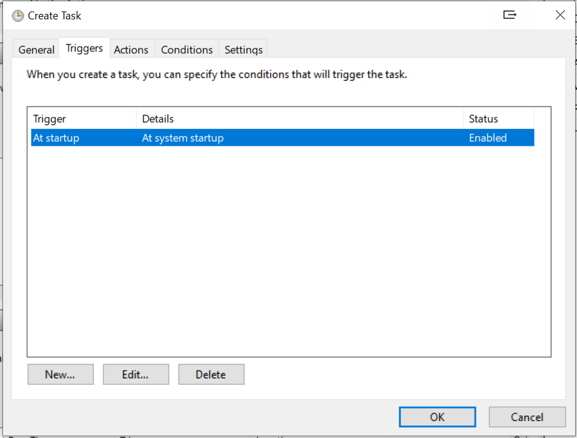
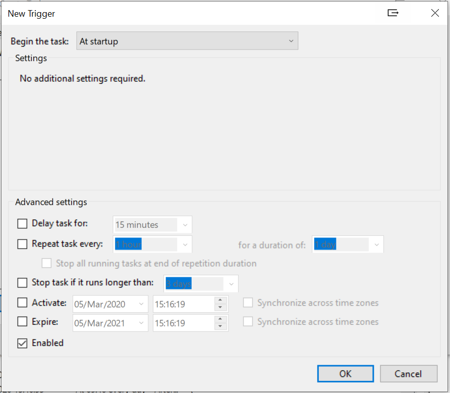
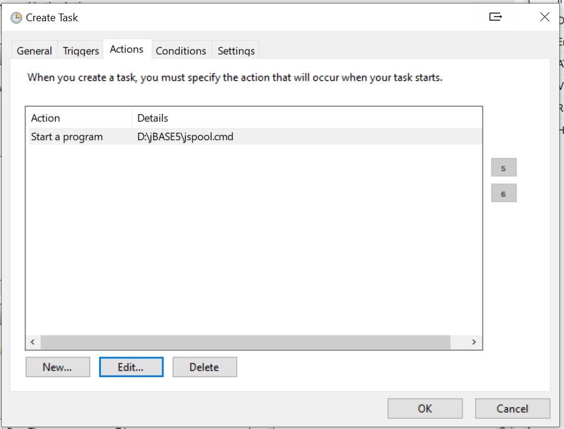
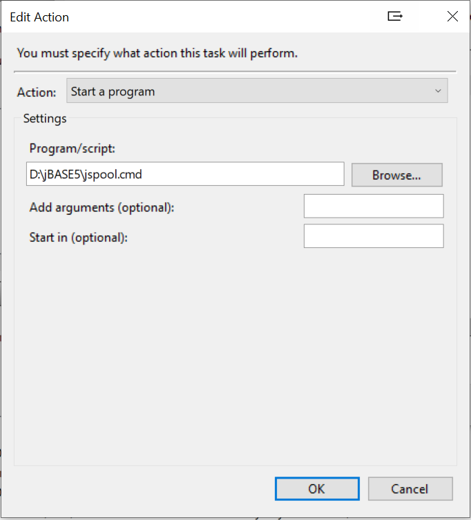
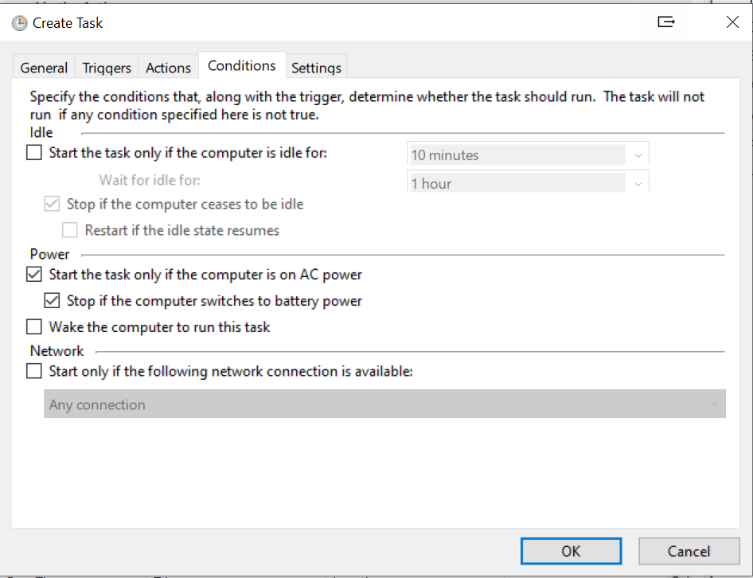
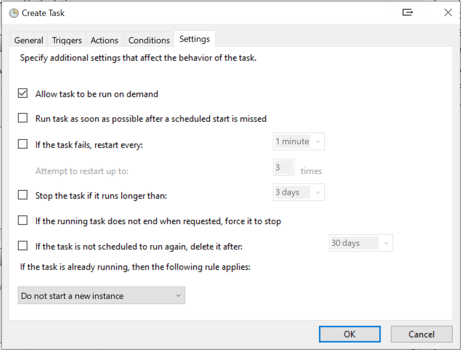
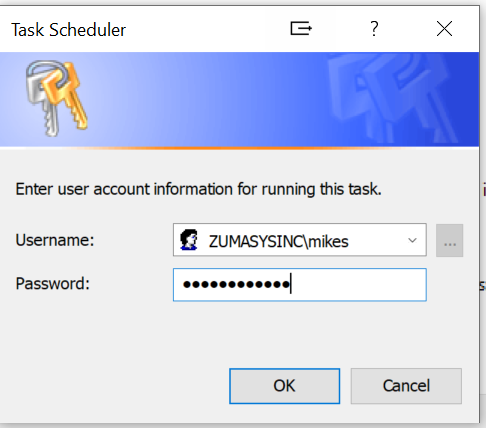

# jSPOOL Script and Scheduled Task

<PageHeader />

Script to restart the jBASE Spooler on Windows:

``` cmd
@echo off
set JBCRELEASEDIR=C:\jbase55
set JBCGLOBALDIR=%JBCRELEASEDIR%
set PATH=%JBCRELEASEDIR%\bin;%PATH%
set JBCSPOOLERDIR=D:\jbase\jspooler
set JBCPORTNO=500-999
set JBC_DESPOOLSLEEP=10
%JBCRELEASEDIR%\bin\rest-spooler.exe >nul 2>&1
```

## Configuration of the Scheduled Task

Everything must be just right in order for this to work correctly. It may be necessart to un-check some of the defaults that Windows provides.

### Navigate to the Task Scheduler and Create a New Task



### Add/Edit a new task



### Define the Trigger



### Define the Action



### Provide details of the action to be performed



### Define the conditions



### Define any specific settings



### Add User credentials for the Task



### Note

> It is also possible to start a phantom process in much the same way  
> Define the environment that the process needs; essentially:

```
JBCRELEASEDIR
HOME
JBCEMULATE
PATH
JBCOBJECTIST
JEDIFILEPATH
```

> and then run the PROC using the jBASE 'jpq' command, i.e.

```
jpq MD\<procname>
```

> Note procs are not directly executable so they need to be invoked using the 'jpq' PROC processor.

[Back to FAQ](./../README.md)

  
<PageFooter />
